# App Connect with MQ NativeHA

[Return to App Connect labs page](../../index.md)

---

# Table of Contents
- [1. Introduction](#introduction)
- [2. PreRequisite](#pre-req)
	* [2a. Create Queues](#create-queues)
- [3. Download ccdt_nativeha.json](#ccdt)
- [4. App Connect Toolkit](#ace-toolkit)
	* [4a. Create Policy Project and Policy](#mqpolicy)
	* [4b. Create Application and Message Flow](#ace-msgflow)
- [5. Deployment](#deploy)
- [6. Testing](#testing)
	* [6a. amqsphac](#amqsphac)
	* [6b. amqsghac](#amqsghac)
- [7. HA Failover Testing](#ha-failover-testing)
- [8. Summary](#summary)

---

# 1. Introduction <a name="introduction"></a>
In this lab, you will build a very simple App Connect Toolkit Message flow to work with MQ NativeHA Queue Manager. <br>

Lab diagram<br>
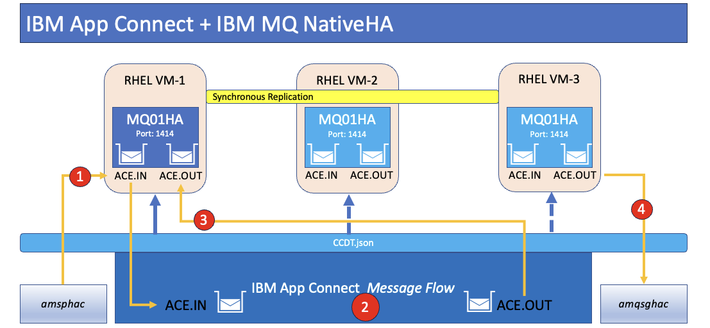

<br>


# 2. PreRequisite <a name="pre-req"></a>
You need to finish MQ NativeHA lab before continuing with this lab. 

<a href="https://pages.github.ibm.com/americas-integration/MQ-Advanced-pot/nativeha-rhel" target="_default"> https://pages.github.ibm.com/americas-integration/MQ-Advanced-pot/nativeha-rhel </a>

<br>

## 2a. Create Queues <a name="create-queues"></a>

Run the following commands on the Node where the Queue Manager (MQ01HA) is "Running". <br>

```
echo "def qlocal(ACE.NATIVEHA.IN) DEFPSIST(YES)" | runmqsc MQ01HA
echo "def qlocal(ACE.NATIVEHA.OUT) DEFPSIST(YES)" | runmqsc MQ01HA
```

<br>

# 3. Download ccdt_nativeha.json <a name="ccdt"></a>

**Download ccdt_nativeha.json** from [<b><u>here</u></b>](./resources/ccdt_nativeha.json)

<br>

# 4. App Connect Toolkit  <a name="ace-toolkit"></a>

Open IBM App Connect Toolkit, and workspace C:\Users\techzone\IBM\ACET13\workspace\ace-workshop. <br>


If are greeted with Welcome page, then close it. <br>
<br>

## 4a. Create Policy Project and Policy  <a name="mqpolicy"></a>

Create a New Policy Project. <br>

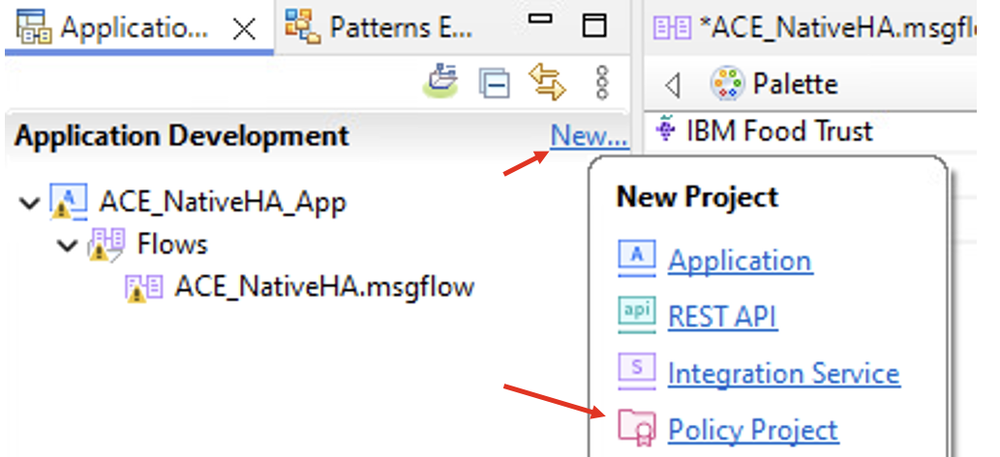

Name it MyPolicies and click \<Finish\>. <br>

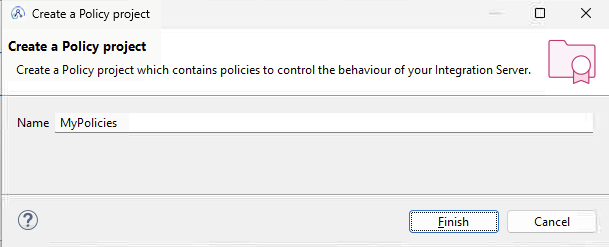

Now, create a new Policy. <br>
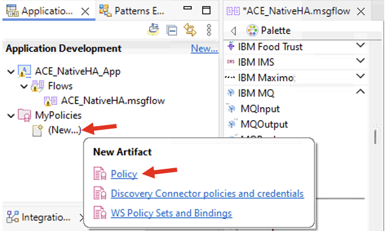

Name the Policy as "MQPolicy". <br>
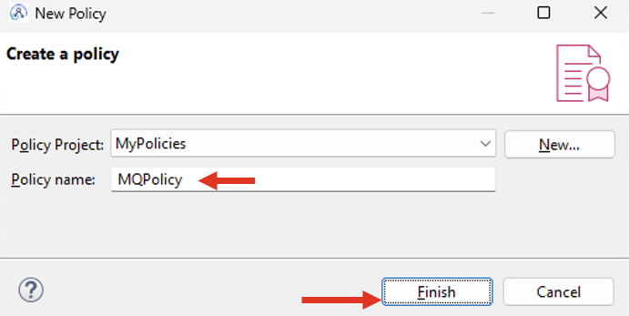

<br>
Select MQEndpoint Policy and define configurations as below. <br>
Type: MQEndpoint <br>
Template: MQEndpoint <br>
Connection: CCDT <br>
Queue manager name: MQ01HA <br>
Location of client channel definition table: C:\Users\techzone\Downloads\ccdt_nativeha.json <br>
Client reconnection option: Enabled <br>

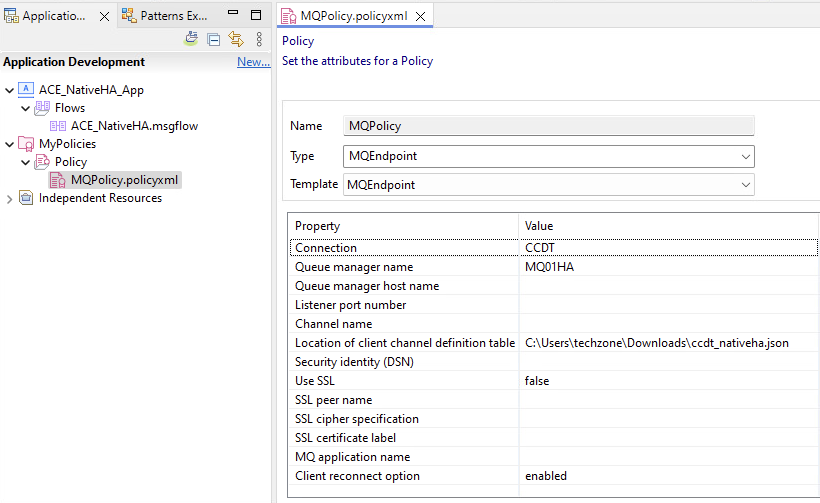

Save the Policy. <br><br>


## 4b. Create Application and Message Flow <a name="ace-msgflow"></a>

Create Application, name it ACE_NativeHA_App. <br>

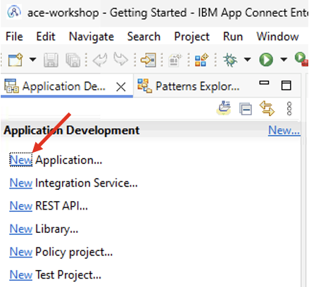

Create Flow. <br>

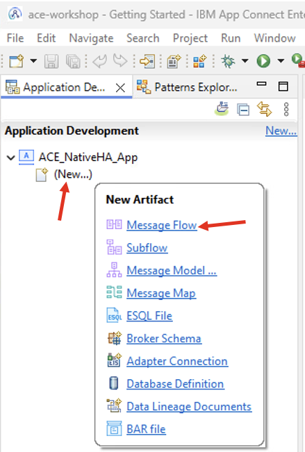

Name it "ACE_NativeHA". <br>

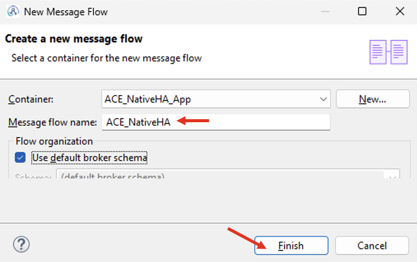

Drag MQInput and MQOutput nodes into the message flow canvas and wire them as below. <br>

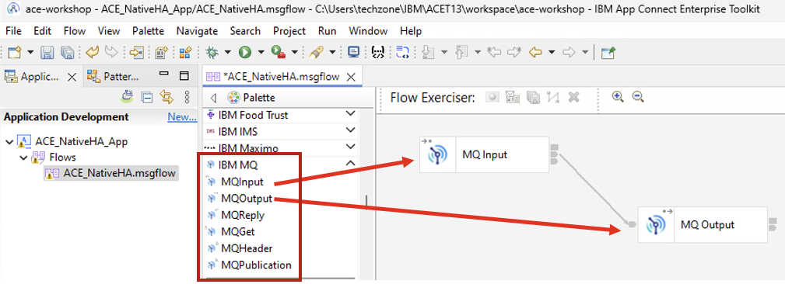

**MQInput Node configuration** <br>

**Basic** tab. <br>
Set "Queue name" as "ACE.NATIVEHA.IN". <br>

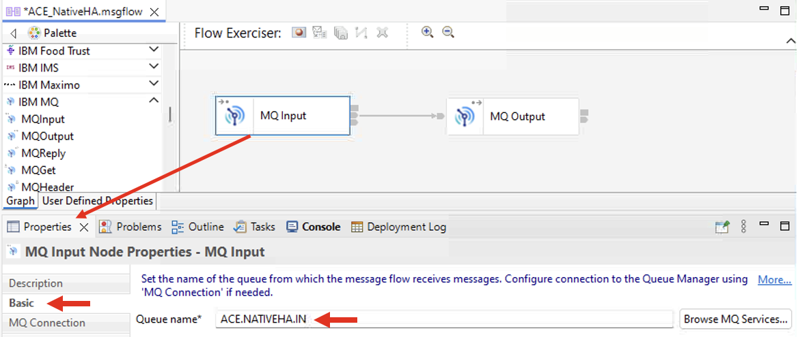

**MQ Connection** tab. <br>
Select "Client channel definition table" as Connection, and "MQ01HA" as the "Destination queue manager name". <br>

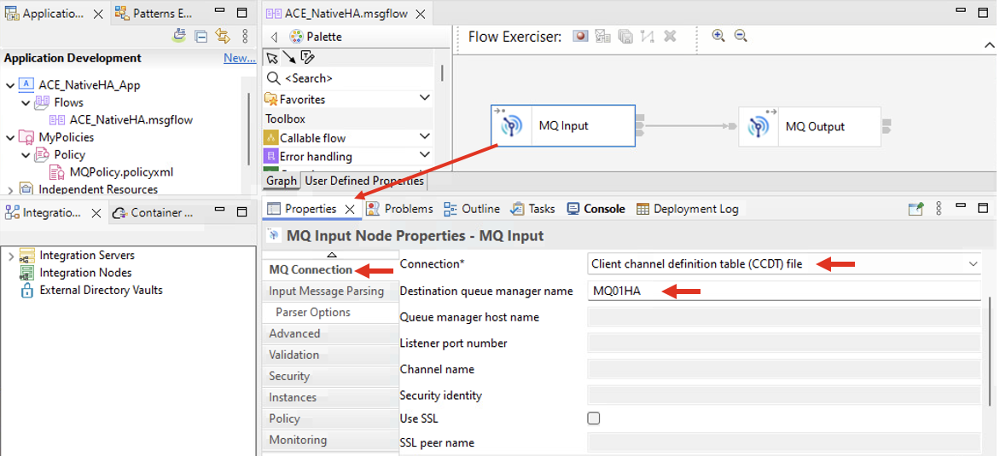

**Policy** tab. <br>
Click \<Browse\>, and select MQPolicy that you created above. <br>

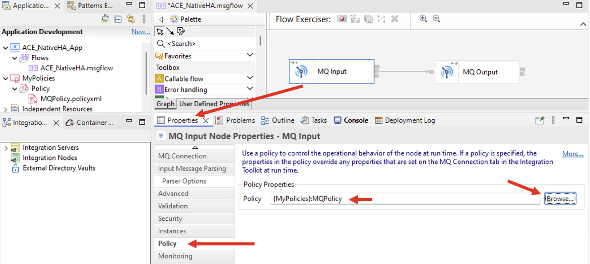
<br><br>

**MQOutput Node configuration** <br>

**Basic** tab. <br>
Set "Queue name" as "ACE.NATIVEHA.OUT". <br>

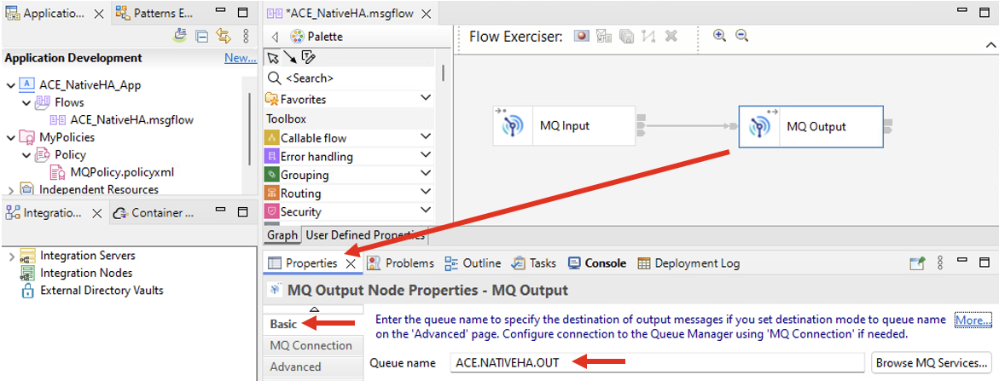

**MQ Connection** tab. <br>
Select "Client channel definition table" as Connection, and "MQ01HA" as the "Destination queue manager name". <br>

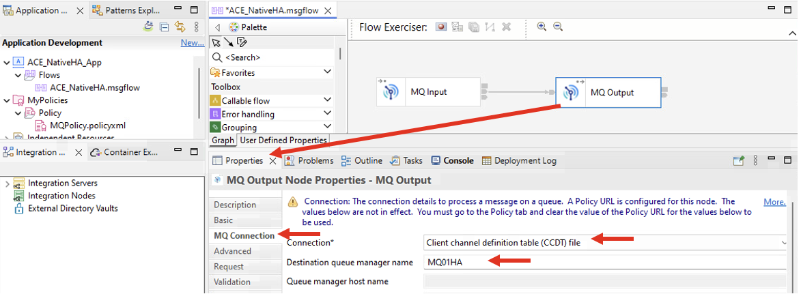

**Policy** tab. <br>
Click \<Browse\>, and select MQPolicy that you created above. <br>

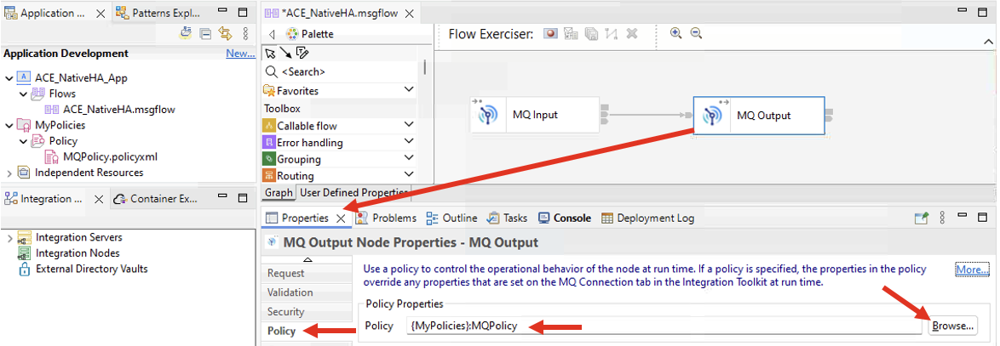

<br>


# 5. Deployment <a name="deploy"></a>

Create a local integration server TEST_SERVER. <br>

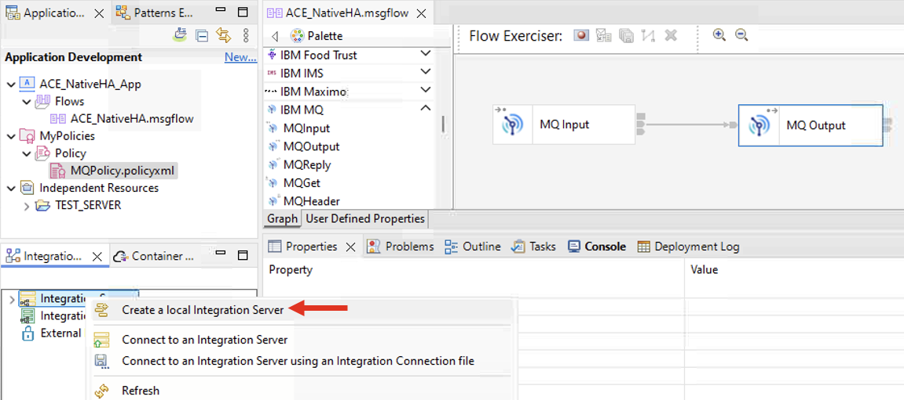

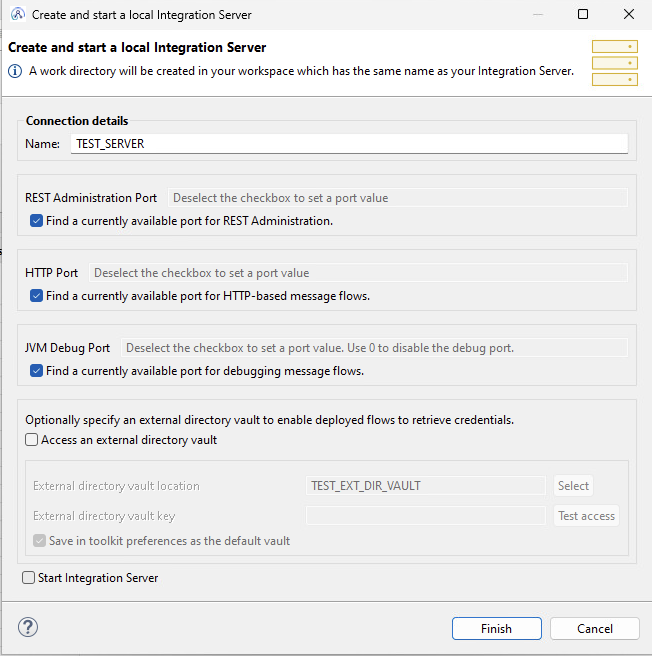

Right click, and then start the TEST_SERVER. <br>

Deploy the flow MyPolicies Policy Project (drag and drop). <br>

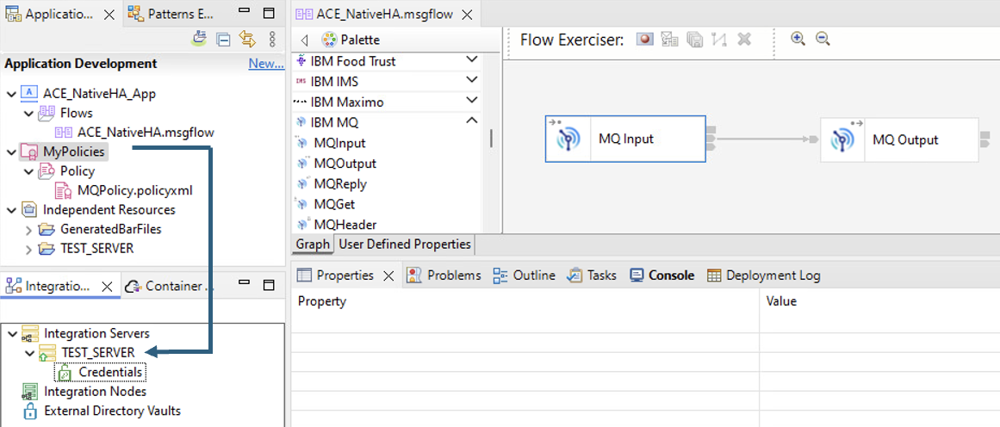

Deploy the flow ACE_NativeHA_App Application (drag and drop). <br>

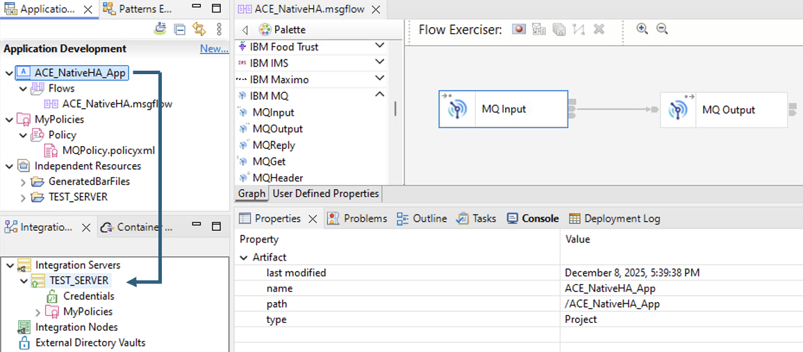

<br><br>


# 6. Testing <a name="testing"></a>

Let's put/get messages using amqsphac and amqsghac MQ HA programs. <br>

Open Command Prompts, from the Windows VM's taskbar. <br>


## 6a. amqsphac <a name="amqsphac"></a>
Open Command Prompt. Run the following commands. <br>

```
SET MQCCDTURL=C:\Users\techzone\Downloads\ccdt_nativeha.json
amqsphac ACE.NATIVEHA.IN MQ01HA
```

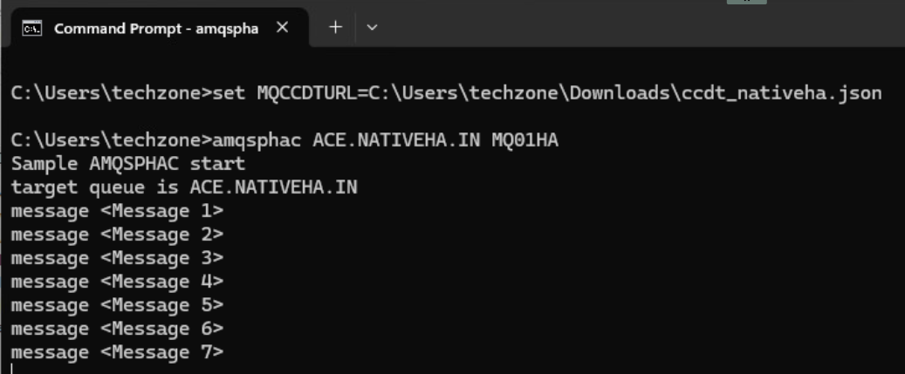

If the message flow is successfully deployed and operating without any problems, it should process the sample messages generated earlier and output them to the ACE.NATIVEHA.OUT queue. <br>
<br>

## 6b. amqsghac <a name="amqsphac"></a>

Open second Command Prompt, then run the following commands. <br>

```
SET MQCCDTURL=C:\Users\techzone\Downloads\ccdt_nativeha.json
amqsghac ACE.NATIVEHA.OUT MQ01HA
```

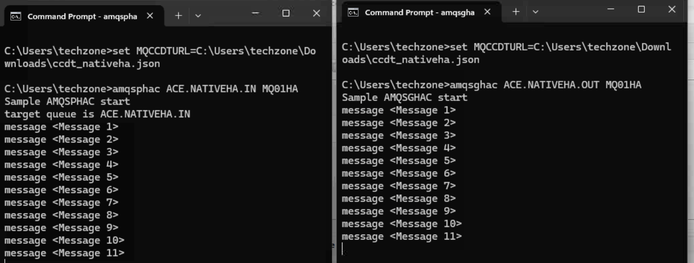

<br>


# 7. HA Failover Testing <a name="ha-failover-testing"></a>

Let the put/get programs running, and let's failover the Active Queue Manager to a Replica Node. <br>

On acemq1, 2, 3, run dspmq command and check the Status "Running" or "Replica". <br>
```
dspmq
```
On the "Running" Node, execute the following command to initiate a failover of the Queue Manager. <br>

```
sudo systemctl restart mqmonitor@MQ01HA
```

You may observe a disconnection with the put/get programs as indicated below; subsequently, it should swiftly reconnect to the Replica/Standby Queue Manager and continue the process of putting and getting messages.
 <br>

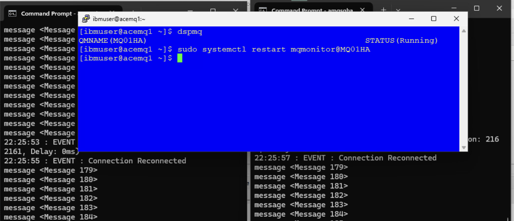

<br>
<br>


# 8. Summary <a name="summary"></a>

Congratulations! You have successfully established the MQ NativeHA Queue Manager, followed by the creation of an App Connected Message flow utilizing MQInput and MQOutput nodes. Subsequently, you transitioned the Queue Manager from an Active node to a Replica node. Ultimately, you observed that the App Connect Message flow was capable of reconnecting to the Queue Manager and commenced processing messages. <br>


# 9. Reference 

**Project Interchange** [<b><u>here</u></b>](./resources/ACE_NATIVEHA.zip)

<br>

[Go to Top](#introduction)

<br>

[Return to App Connect labs page](../../index.md)