# Introduction to Context Trees

[Return to App Connect labs page](../../index.md)

---

# Table of Contents
- [1. Introduction](#introduction)
- [2. Workshop Environment](#lab-env)
- [3. App Connect Toolkit](#ace-toolkit)
	* [3a. Import Tutorials](#import-tutorial)
	* [3b. Create Integration Server ](#is-create)
- [4. Deploy Backend Rest APIs ](#deploy)
- [5. Build DemoContextTree Message Flow](#build-demo-msgflow)
	* [aa. Create Application](#create-app)
	* [5b. Create Message Flow ](#create-msgflow)
	* [5c. Configure Message Flow ](#config-msgflow)
- [6. Testing](#testing)
	* [6a. Flow Exerciser)](#flow-exerciser)
	* [6b.Trace Output](#trace-output)
- [7. Summary](#summary)
- [8. References](#references)
- [9. Project Interchange](#pi)

---

# 1. Introduction <a name="introduction"></a>

A new feature in IBM App Connect Enterprise (ACE) version 13 enables users to retrieve information regarding various components of a message flow through a Context tree. This Context tree has been incorporated into the Message Assembly. <br>

A Message Assembly is a logical representation of a message being handled by the message flow at a particular point. The flow in the below picture shows the physical XML message that was sent into the message flow and the physical JSON message that was returned. <br>

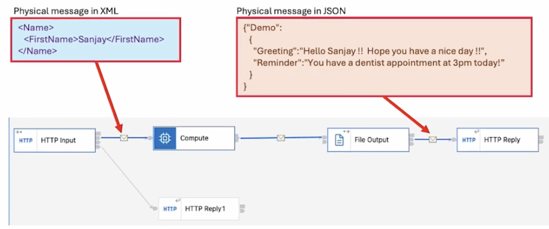

Each of these XML, and JSON messages have a logicial representation called a Message Assembly. <br>

In App ACE version 13.0.3.0 and earlier, the Message Assembly was made up of four trees as below. <br>
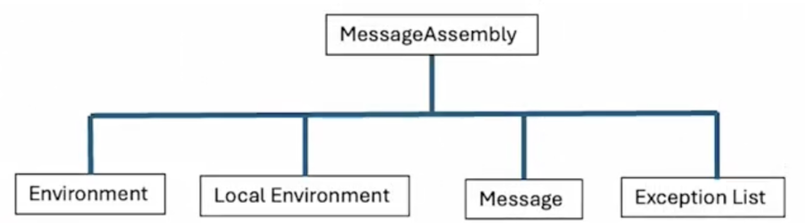

The Message Tree contains Properties, Message Headers (MQMD), Message Body as below. <br>
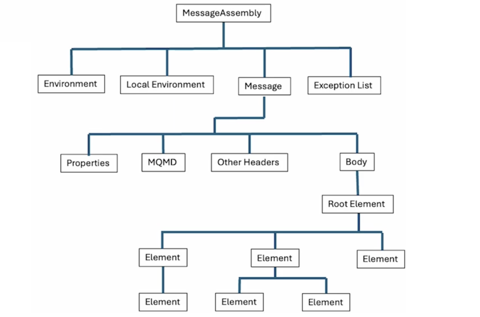 

Since ACE version 13.0.4.0, we now have added a fifth tree called the Context tree as below. <br>

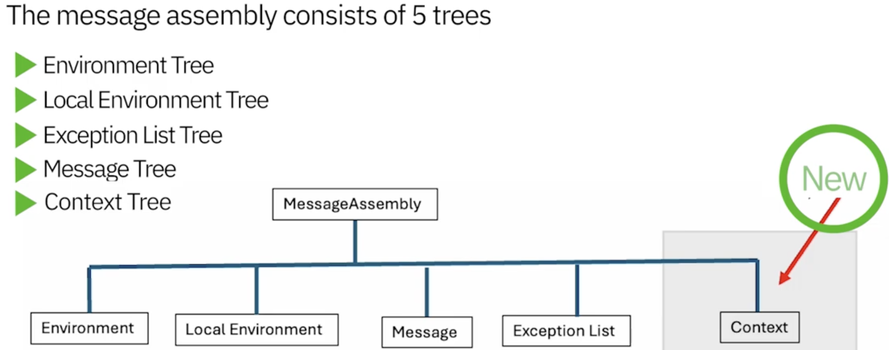

Previously, you might have utilized the Environment tree, the Global Cache, or an ESQL Shared variable to retrieve data from earlier nodes within the message flow. However, with the introduction of the Context tree, those methods are no longer necessary. <br>


The Context tree is not captured by default. The Context tree is only made available when it's referenced in the message flow. The Context tree can be accessed using the ESQL Compute node, the Java Compute node, and using a Trace node. <br>
Example accessing Context tree using ESQL below. <br>
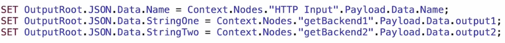

In addition to ESQL, Java Compute, Trace nodes, the Discovery Connector nodes use the Context tree when mapping inputs. <br>

The context tree contains information regarding the invocation of the message flow and the contextual details from each node in the flow that preceded it, including payload details. <br>


Reference: <a href>https://www.ibm.com/docs/en/app-connect/13.0.x?topic=assembly-context-tree</href>

<br>


# 2. Workshop Environment <a name="lab-env"></a>

You will be doing this lab from the Windows VM. <br>


<br>


# 3. App Connect Toolkit  <a name="ace-toolkit"></a>

Open IBM App Connect Toolkit, and workspace C:\Users\techzone\IBM\ACET13\workspace\ace-workshop. <br>


If are greeted with Welcome page, then close it. <br>
<br>


## 3a. Import Tutorials <a name="import-tutorial"></a>

Let's import REST tutorial which contains two REST APIs. <br>

Open Tutorials gallery. <br>
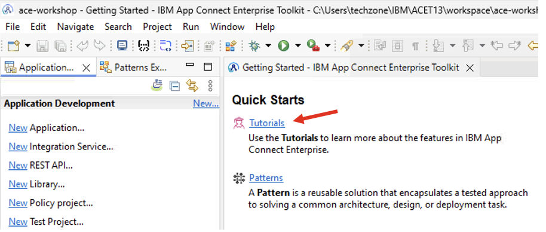

Search for REST and scroll down, and locate "Aggregation nodes using RESTAsyncRequest nodes with backend services" tutorial. <br>

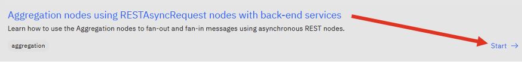

Click on \<Start\>, read through, then click \<import\> the tutorial. <br>

You will observe three REST APIs, two of which are backend REST APIs. <br>


## 3b. Create Integration Server  <a name="is-create"></a>

Create a New Local integration server. <br>
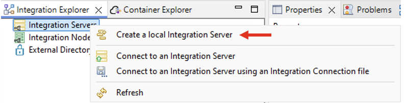

Create TEST_SERVER. <br>
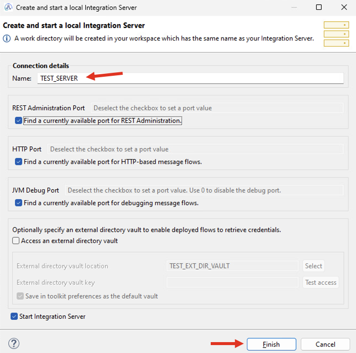

<br>

# 4. Deploy Backend Rest APIs <a name="deploy"></a>

Deploy the two backend REST APIs. <br>

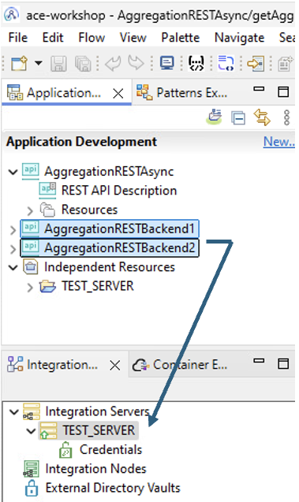

<br>

# 5. Build DemoContextTree Message Flow <a name="build-demo-msgflow"></a>


## 5a. Create Application <a name="create-app"></a>

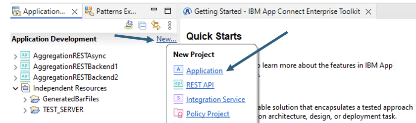

Name it "DemoContextTreeApp". <br>

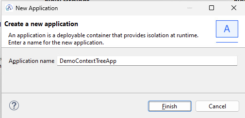

<br>

## 5b. Create Message Flow <a name="create-msgflow"></a>

Create a New Message Flow. <br>

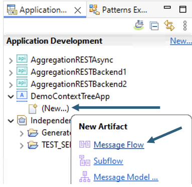

Name the Message Flow "DemoContextTree". <br>

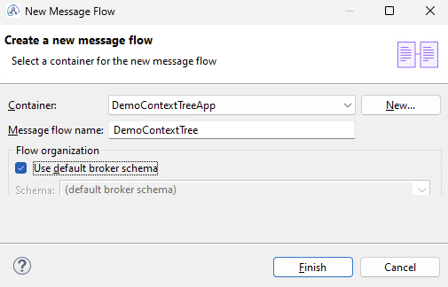

Drag "HTTP Input", "HTTP Reply", "Compute", "Trace" nodes from the pallete into the message flow canvas as below. <br>

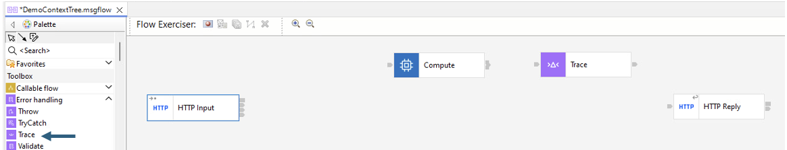

Drag RestRequest node into the canvas. <br>


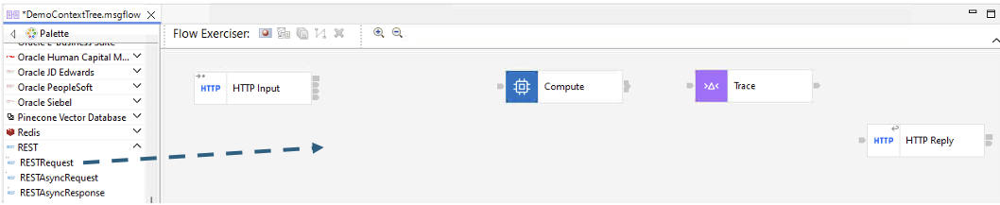

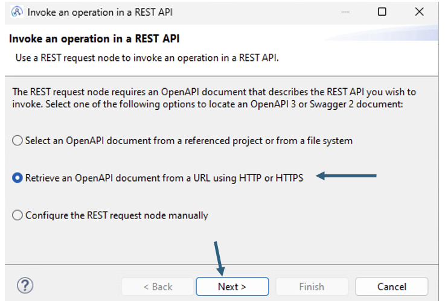 

```
http://localhost:7800/aggregationrestbackend1/v1/swagger.json
```
Note: You can capture the OpenAPI Document URLs for both the backend services by clicking on the deployed REST API > Properties section. <br>

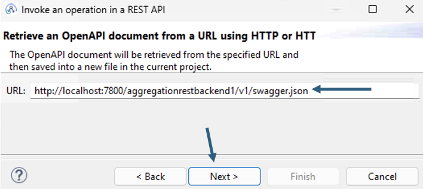

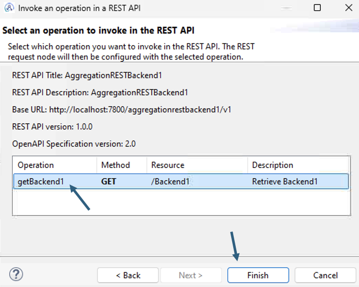

Enter "data from first rest api" to the query parameter expression. The Rest API will convert this value to uppercase. <br> 

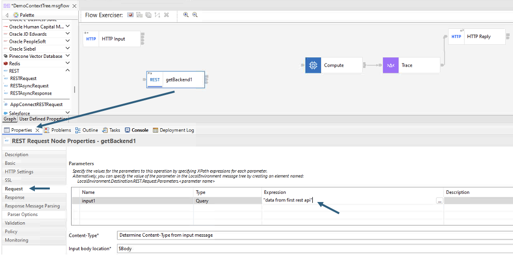


Add another RestRequest node just as above, but this time use the below OpenAPI document for backend2. <br>

```
http://localhost:7800/aggregationrestbackend2/v1/swagger.json
```
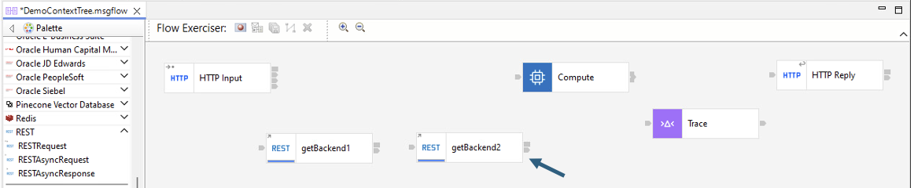

Enter "data from second rest api" to the query parameter expression. The Rest API will convert this value to uppercase. <br> 

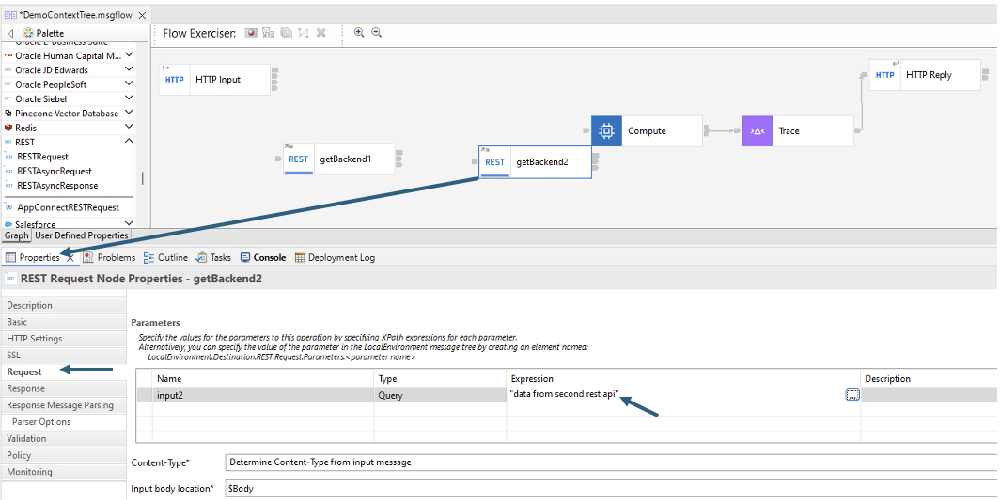

Now, let's wire the nodes as below. <br>

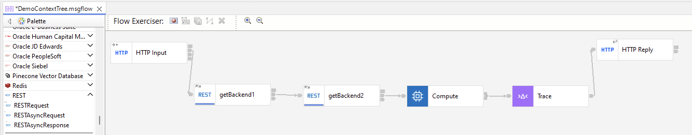

## 5c. Configure Message Flow <a name="configure-msgflow"></a>

**HTTP Input** node configuration <br>

Set "Path suffix for URL" as /contextdemo <br>

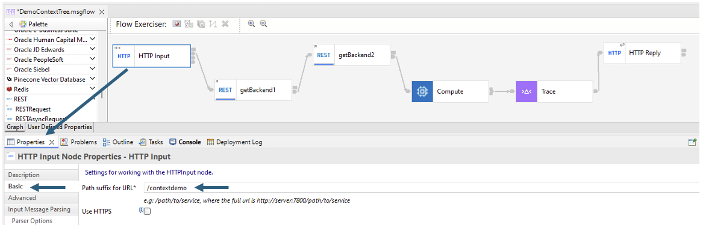

Set "Input Message Parsing" as JSON <br>

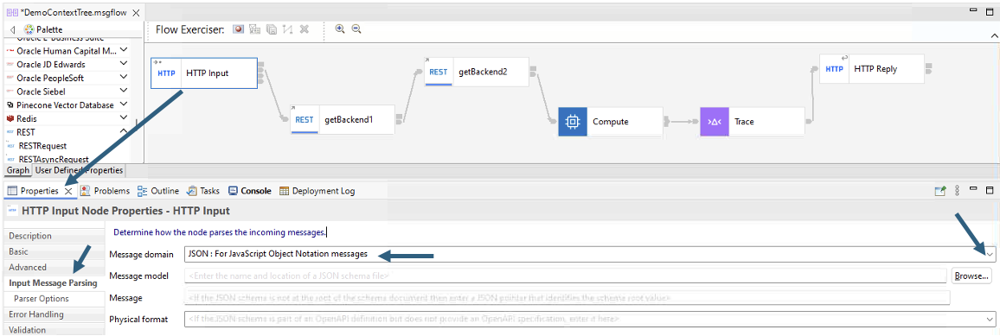

<br>

**Compute** node configuration<br>
Double click on the compute node and add the below to the Main() function. <br>

```
CREATE LASTCHILD OF OutputRoot DOMAIN 'JSON';
SET OutputRoot.JSON.Data.Name = Context.Nodes."HTTP Input".Payload.Data.Name; 
SET OutputRoot.JSON.Data.Rest1Output = Context.Nodes."getBackend1".Payload.Data.output1; 
SET OutputRoot.JSON.Data.Rest2Output = Context.Nodes."getBackend2".Payload.Data.output2;
```
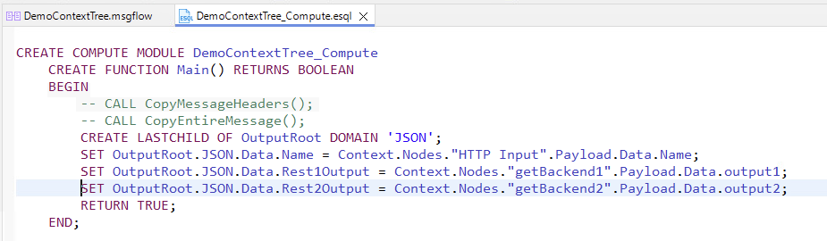

**SAVE** and **Close** the **Compute ESQL**. <br>

**SAVE** the Message Flow. <br>


**Trace** node configuration<br>
Click on the Trace node, and check Properties pane. <br>

Destination: File <br>
File Path: C:\temp\democontext_trace.out <br>
Pattern: <br>
```
+++++++++++++++++++++++++++++++++++++++++++++++++++++++
============== START \${CURRENT_TIMESTAMP} ============
ExceptionList: \${ExceptionList}
-------------------------------------------------------
LocalEnvironment: \${LocalEnvironment}
-------------------------------------------------------
ContextTree: \${Context}
-------------------------------------------------------
Root: \${Root}
============== END ====================================
```
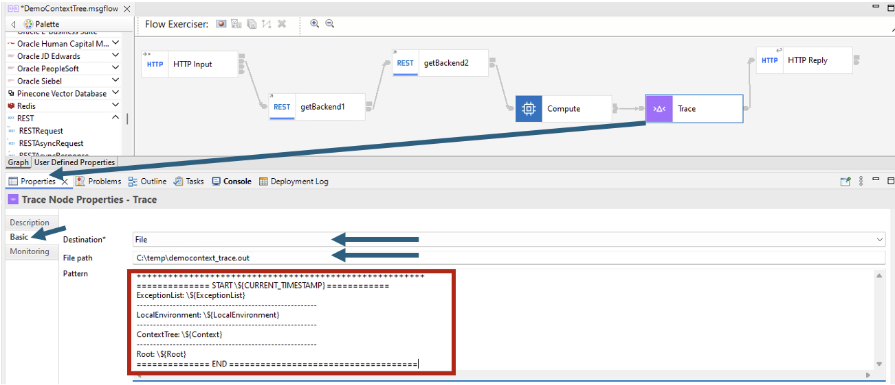


**SAVE** the Message Flow. <br><br>


# 6. Testing <a name="testing"></a>


## 6a. Flow Exerciser <a name="flow-exerciser"></a>

Start the Flow Exerciser. <br>

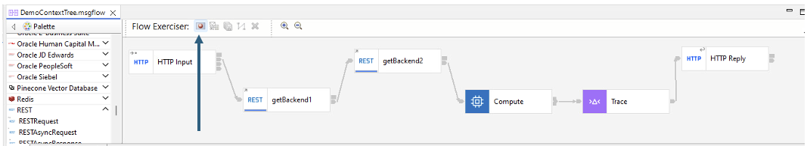

Send a message to the flow. <br>

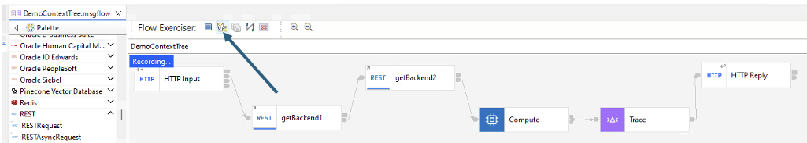

Click on \<New Message\>. <br>

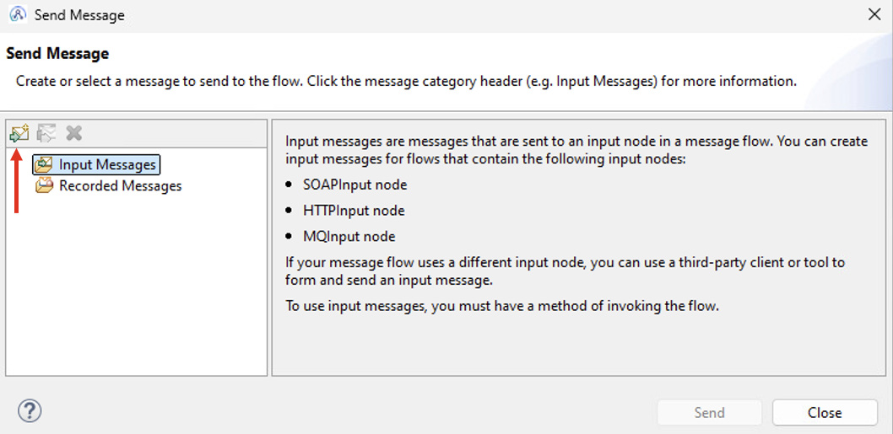

```
{"Name": "Sudhakar"}
```

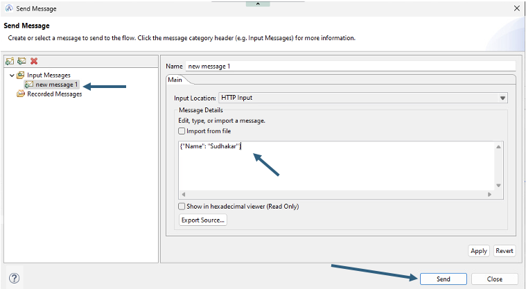

Check the HTTP Reply. If both Rest API calls are successful, you should see uppercase responses as below. <br>

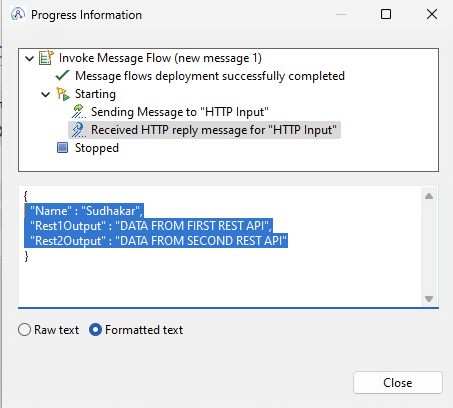


## 6b. Trace Output <a name="trace-output"></a>

Open File Explorer, navigate to C:\temp folder. Look for democontext_trace.out. <br>

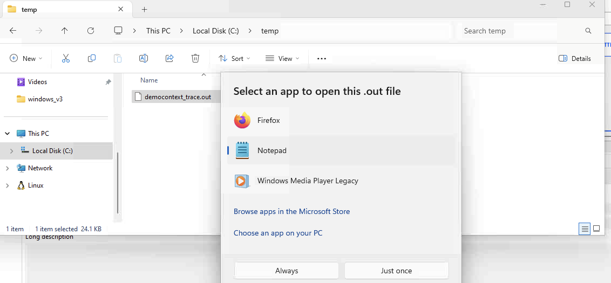

Click \<Open Once\>. Check the Context section trace. <br> 

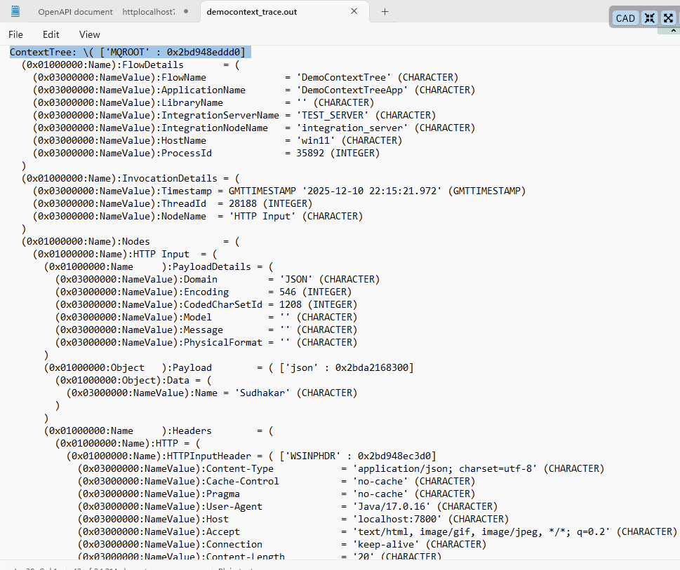

You can also see the Context Tree in the debug as well. <br>
<br>

# 7. Summary <a name="summary"></a>

Congratulations! You have successfully used Context tree feature of ACE that was released in version 13.0.4.0. <br>


# 8. References <a name="references"></a>

Video recordings by Sanjay Nagchowdhury, App Connect Enterprise Development Lead: <br>
<a href="https://www.youtube.com/watch?v=1NoZ713btqg&list=PL_4RxtD-BL5tKxx9GiR2BH146ZUC21cOp" target="_blank"> https://www.youtube.com/watch?v=1NoZ713btqg&list=PL_4RxtD-BL5tKxx9GiR2BH146ZUC21cOp </a>
<br>

Using ESQL to reference locations in a Context Tree: <br>
<a href="https://www.youtube.com/watch?v=pNkAQYEHfsM&list=PL_4RxtD-BL5tKxx9GiR2BH146ZUC21cOp" target="_blank"> https://www.youtube.com/watch?v=pNkAQYEHfsM&list=PL_4RxtD-BL5tKxx9GiR2BH146ZUC21cOp</a>
<br>

Using ESQL to reference locations in a Context Tree from nested subflows: <br>
<a href="https://www.youtube.com/watch?v=Q4wRQ6iOW5c&list=PL_4RxtD-BL5tKxx9GiR2BH146ZUC21cOp" target="_blank"> https://www.youtube.com/watch?v=Q4wRQ6iOW5c&list=PL_4RxtD-BL5tKxx9GiR2BH146ZUC21cOp</a>
<br>

Accessing the Context Tree using the Java Compute Node.<br>
<a href="https://www.youtube.com/watch?v=u86c9LiwPRY&list=PL_4RxtD-BL5tKxx9GiR2BH146ZUC21cOp" target="_blank"> https://www.youtube.com/watch?v=u86c9LiwPRY&list=PL_4RxtD-BL5tKxx9GiR2BH146ZUC21cOp </a>
<br>

Using the Java Compute Node to access the COntext Tree from a subflow. <br>
<a href="https://www.youtube.com/watch?v=cU2Jw4nPZoA&list=PL_4RxtD-BL5tKxx9GiR2BH146ZUC21cOp" target="_blank"> https://www.youtube.com/watch?v=cU2Jw4nPZoA&list=PL_4RxtD-BL5tKxx9GiR2BH146ZUC21cOp</a>
<br>

Using the Java Compute Node to reference locations in a Context Tree from nested subflows: <br>
<a href>https://www.youtube.com/watch?v=2lhdNbmtRV8&list=PL_4RxtD-BL5tKxx9GiR2BH146ZUC21cOp" target="_blank"> https://www.youtube.com/watch?v=2lhdNbmtRV8&list=PL_4RxtD-BL5tKxx9GiR2BH146ZUC21cOp</a>

<br>

# 9. Project Interchange <a name="pi"></a>
**Project Interchange** from [<b><u>here</u></b>](./resources/DemoContextTree.zip)

<br>

[Go to Top](#introduction)

<br>

[Return to App Connect labs page](../../index.md)