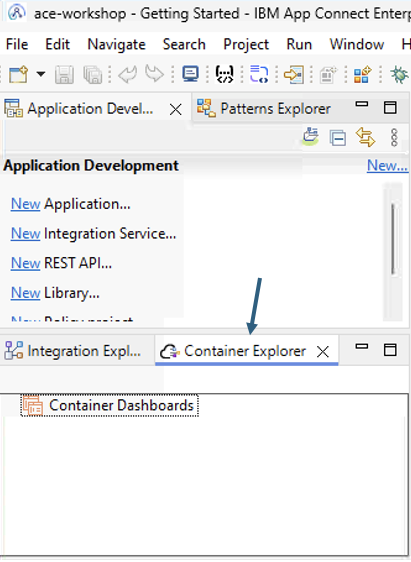
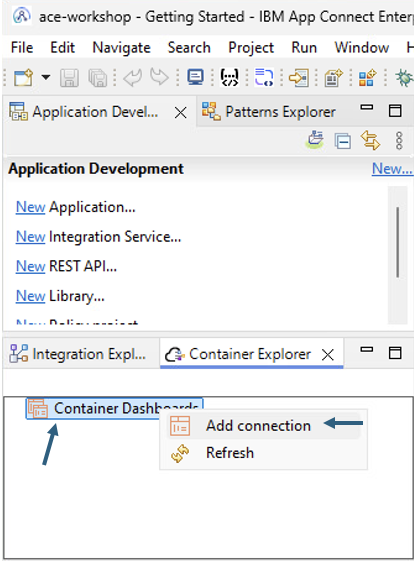
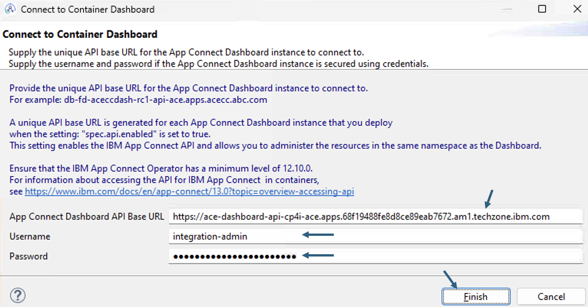
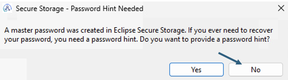
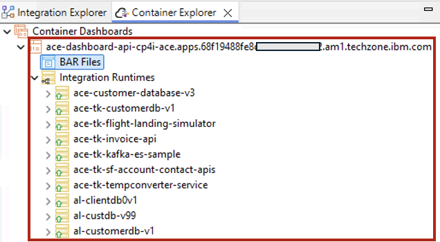
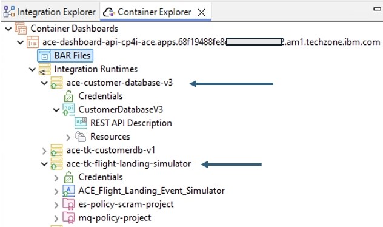
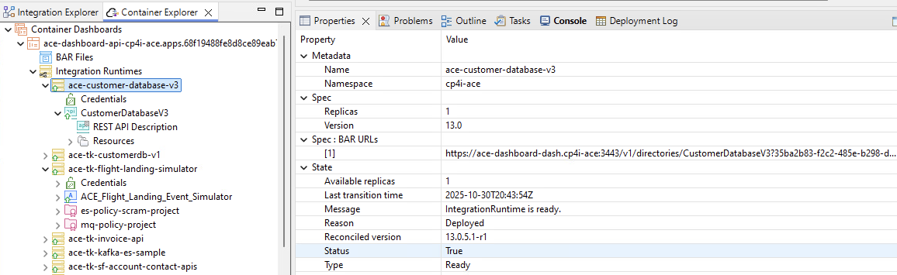
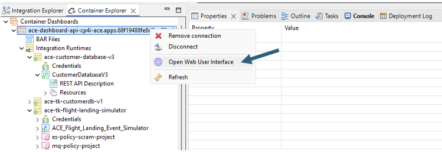
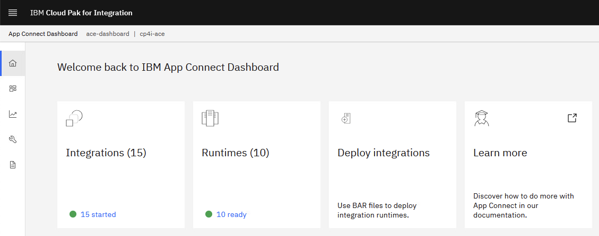
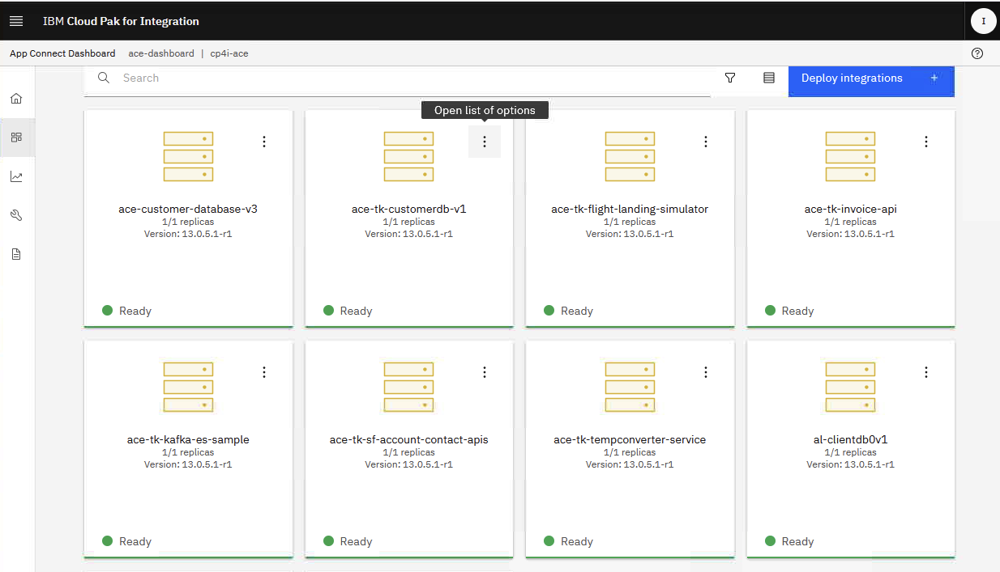

# Introduction to Container Explorer in IBM App Connect Enterprise Toolkit

[Return to App Connect labs page](../../index.md)

---

# Table of Contents
- [1. Introduction](#introduction)
- [2. PreRequisites](#prereq)
- [3. Workshop Environment](#lab-env)
- [4. App Connect Toolkit](#ace-toolkit)
	* [4a. Container Explorer](#container-explorer)
	* [4b. Add Connection to ACE Container Dashboard](#add-connection)
- [5. App Connect Dashboard Web Interface](#web-ui)
- [6. Summary](#summary)
- [8. References](#references)

---

# 1. Introduction <a name="introduction"></a>


The "Container Explorer" in IBM App Connect Enterprise (ACE) v13+ Toolkit is a new view that lets users directly connect to their ACE container dashboards (on OpenShift/Kubernetes) to manage deployed integration runtimes, upload BAR files, view artifacts, and see real-time updates, streamlining management for containerized ACE environments.

In this lab, you will explore how to use Container Explorer from App Connect Toolkit to access App Connect Container Dashboard that is deployed onto OpenShift, upload BAR files, and manage them. <br>

<br>

# 2. PreRequisites <a name="prereq"></a>

Make sure your instuctor provided App Connect Dashboard URL (Deployed on OpenShift) and credentials to access the Dashboard. <br>
**Note:** <br>
Make sure the ACE Dashboard is enabled with api/enabled: true as below. Once enabled, the operator will create ACE Dashboard API url.  <br>
```
apiVersion: appconnect.ibm.com/v1beta1
kind: Dashboard
metadata:
  name: ace-dashboard
  namespace: cp4i-ace
spec:
  api:
    enabled: true
```
<br>
Example URL: <br>
https://ace-dashboard-api-cp4i-ace.apps.68f19488fe8d8ce89eab7672.am1.techzone.ibm.com
<br><br>


# 3. Workshop Environment <a name="lab-env"></a>

You will be doing this lab from the Windows VM. <br>


<br>


# 4. App Connect Toolkit  <a name="ace-toolkit"></a>

Open IBM App Connect Toolkit, and workspace C:\Users\techzone\IBM\ACET13\workspace\ace-workshop. <br>


If are greeted with Welcome page, then close it. <br>
<br>


## 4a. Container Explorer <a name="container-explorer"></a>

Click on "Container Explorer" view. This view can be added from Window > Show View > Other > Integration Development menu as well. <br>




## 4b. Add Connection to ACE Dashboard   <a name="add-connection"></a>



<br>





You should see the Integration Runtimes, and BAR files that are already deployed. <br>




Expand the IngrationRuntime(s), and observe the runtime contents.

<br>



<br><br>

Click on Integration Runtime, and Contents to see more details about the deployed artifacts. <br>




# 5. App Connect Dashboard Web Interface <a name="web-ui"></a>

Additionally, you can open App Connect's web interface to see the deployed contents using the credentials provided. <br>





Click on Runtimes to see the Integraiton Runtimes. <br>



Explore the deployed Integration Runtimes. <br> 

Additionally, you can explore the icons on the left of the screen and observe Monitor, Configuration, and Bar files features of ACE Dashboard UI. 
<br>


<br>

# 6. Summary <a name="summary"></a>

Congratulations! You have successfully used IBM App Connect Toolkit's Container Explorer feature to discover, and manage Integration Runtimes deployed on OpenShift Kubernetes Container platform. <br><br>


# 8. References <a name="references"></a>

<a href="https://www.ibm.com/docs/en/app-connect/13.0.x?topic=aace-managing-resources-in-app-connect-enterprise-certified-container-dashboard-by-using-container-explorer-view-in-app-connect-enterprise-toolkit" target="_blank"> Managing resources in an IBM App Connect Enterprise certified container dashboard by using the Container Explorer view in the IBM App Connect Enterprise Toolkit </a>

<br>

[Go to Top](#introduction)

<br>

[Return to App Connect labs page](../../index.md)