# Introduction to FTE (File Transfer Edition aka Managed File Transfer) Nodes

[Return to App Connect labs page](../../index.md)

---

# Table of Contents
- [1. Introduction](#introduction)
- [2. Workshop Environment ](#lab-env)
- [3. MQ Managed File Transfer (MQMFT) Setup](#mqmft-setup)
- [4. Download Project Interchange ](#pi)
- [5. App Connect Toolkit](#ace-toolkit)
	* [5a. Import Project Interchange](#pi-import)
	* [5b. Review FTEInput Message Flow](#fteinput)
  * [5c. Review FTEOutput Message Flow](#fteoutput)  
  * [5d. Review MQPolicy](#mqpolicy)    
- [6. Deployment](#deploy)
	* [6a. Create Integration Server](#is-create)
	* [6b. Update overrides/server.conf.yaml ](#update-serverconf)
  * [6c. Deploy Policy Project](#deploy-policy)  
  * [6d. Restart Integration Server](#is-restart)    
  * [6e. Deploy Application](#deploy-app)  
- [7. Terminal](#terminal)
	* [7a. Open Terminal](#open-terminal)
	* [7b. Start TEST_SERVER ](#is-start)
  * [7c. Deploy Policy Project](#deploy-policy)  
- [8. Check ACE DEMOAGENT Status](#verify-agent-status)
- [9. Testing](#testing)
	* [9a. Test MFT to File (FTEInput) Message Flow](#fteinput-test)
	* [9b. Test Message to File (FTEOutput) Message Flow ](#fteoutput-test)
  * [9c. Deploy Policy Project](#deploy-policy)  
- [10. Summary](#summary)
- [11. References](#references)

---

<br>

# 1. Introduction <a name="introduction"></a>

In this lab, you will acquire knowledge on utilizing FTEInput and FTEOutput Nodes within the App Connect Toolkit Flow. Additionally, you will learn how to set up a basic MQ Managed File Transfer (MQMFT), and use it with App Connect Enterprise Flow.

<br>
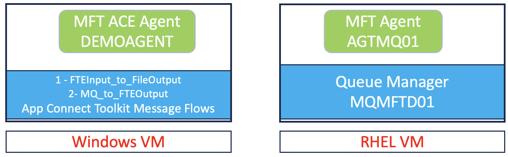


# 2. Workshop Environment <a name="lab-env"></a>

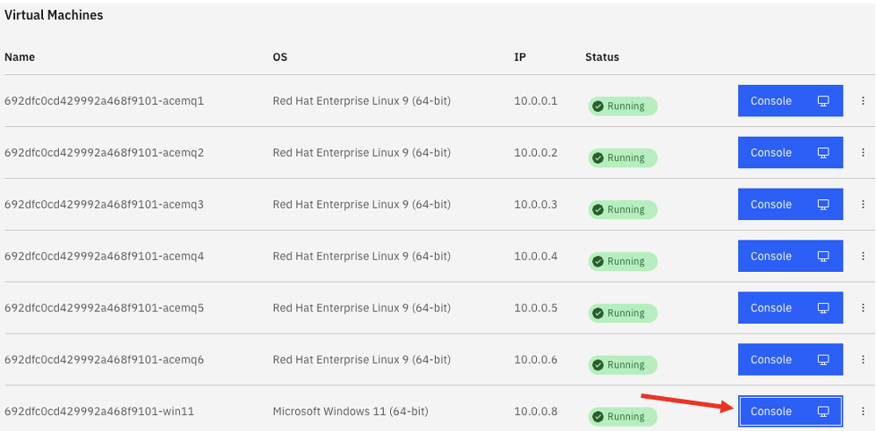

You will be doing this lab from the Windows VM. You will be using App Connect Enterprise Toolkit from the Windows VM, then you will setup MQ and MQMFT on acemq3 RHEL VM. <br>

<br>


# 3. MQ Managed File Transfer (MQMFT) Setup  <a name="mqmft-setup"></a>

You can do this section from any of the RHEL Virtual Machines, however let's use **acemq3** so that you don't have to make much changes to the lab. <br>

You will be creating a MQ Queue Manager to facilitate MQ Managed File Transfer (MQMFT) Coordination, Command, and Agent. So, for simplicity, we will just create one queue manager. However, in real-world you will be creating different Queue Managers and connect the Queue Managers via a pair of Sender/Receiver MQ Channels. <br>

<br>
Use the Putty program, and open **acemq3** RHEL Virtual Machine and login as **ibmuser/engageibm** credentials. <br>

Run the following commands. <br>

```
crtmqm MQMFTD01
strmqm MQMFTD01
```

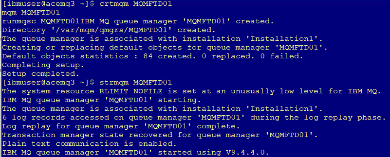

```
runmqsc MQMFTD01
```

Copy / paste the below definitions into the runmqsc shell. <br> 
```
alter qmgr chlauth(disabled)
alter qmgr connauth(' ')
refresh security (*) 

def listener(listener.1414) trptype(tcp) port(1414) control(qmgr)

start listener(listener.1414)

def channel(MFT.SVRCONN) CHLTYPE(SVRCONN) MAXMSGL(104857600)

def qlocal(PH.MQIN.FTEOUT) DEFPSIST(YES)

DEFINE QMODEL('SYSTEM.BROKER.MODEL.QUEUE') SHARE GET(ENABLED) PUT(ENABLED) DEFTYPE(TEMPDYN) DEFPSIST(NO) MAXMSGL(104857600) 

DEFINE QMODEL('SYSTEM.BROKER.CD.MODEL') SHARE DEFTYPE(PERMDYN) DEFPSIST(YES) DEFSOPT(SHARED) MAXDEPTH(10000) MAXMSGL(104857600) 

DEFINE QMODEL('SYSTEM.BROKER.FTE.MODEL') SHARE DEFTYPE(PERMDYN) DEFPSIST(YES) DEFSOPT(SHARED) MAXDEPTH(10000) MAXMSGL(104857600)

end
```
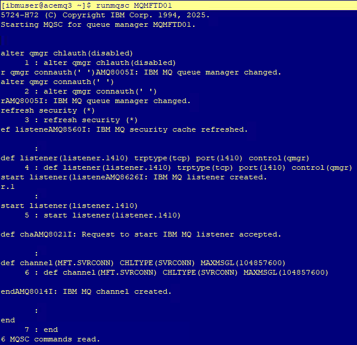


Run these commands to setup MQMFT Coordination, Command Objects. <br>

```
fteSetupCoordination -coordinationQMgr MQMFTD01 -f

runmqsc MQMFTD01 < /var/mqm/mqft/config/MQMFTD01/MQMFTD01.mqsc

fteSetupCommands -connectionQMgr MQMFTD01 -f -p MQMFTD01
```

Let's create an MFT Agent, we will use this agent as an source agent. <br>

```
fteCreateAgent -agentname AGTMQ01 -agentQMgr MQMFTD01 -p MQMFTD01 -f
```
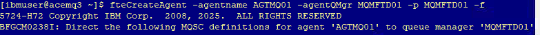
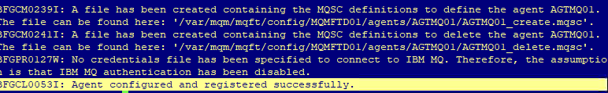


```
runmqsc MQMFTD01 < /var/mqm/mqft/config/MQMFTD01/agents/AGTMQ01/AGTMQ01_create.mqsc
```
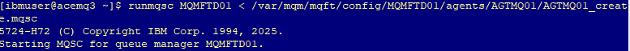

Start the Agent. <br>

```
fteStartAgent AGTMQ01

fteListAgents
```

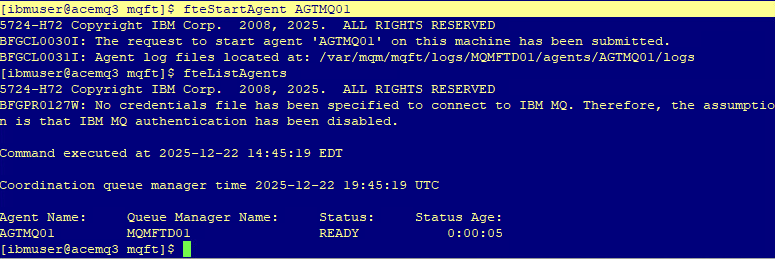

Let's create ACE DEMOAGENT FTE queues. <br>
```
fteDefine -t agent DEMOAGENT | runmqsc MQMFTD01 
```

With that, we should have the MQ and MQMFT setup completed. Now, let's move down to App Connect section. <br><br>


# 4. Download Project Interchange  <a name="pi"></a>

**Download MQFTE_Nodes_Lab-PI.zip** from [<b><u>HERE</u></b>](./resources/MQFTE_Nodes_Lab-PI.zip)
<br>

# 5. App Connect Toolkit  <a name="ace-toolkit"></a>

Open App Connect Enterprise Toolkit from Windows Taskbar or from the Windows Desktop. <br>

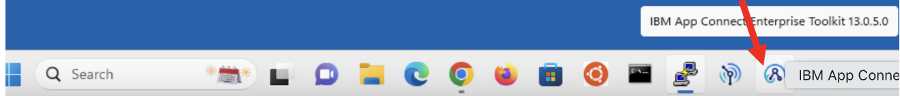


Let's use workspace name as ftenodes. <br>
C:\Users\techzone\IBM\ACET13\workspace\ftenodes <br>

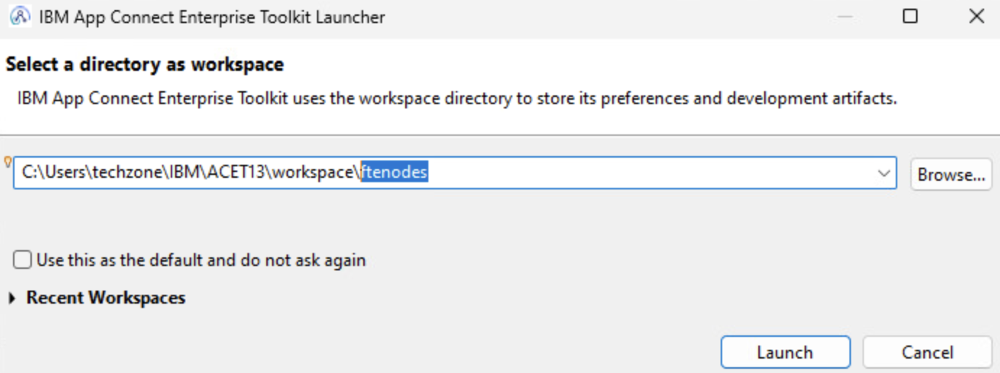

## 5a. Import Project Interchange <a name="pi-import"></a>

Import Project Interchange file. The PI contains an Application with two simple message flows, and an MQ Policy Project. <br> 

**Import procedure:** <br>
Navigate File Menu > Import > IBM Integration > Project Interchange, then select the PI downloaded above. <br>

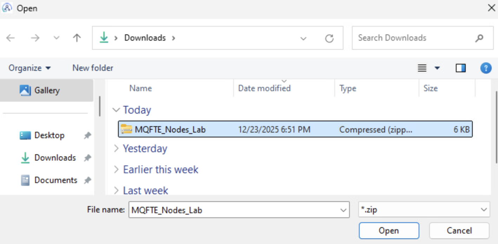

Select both projects, and click \<Finish\>. <br>

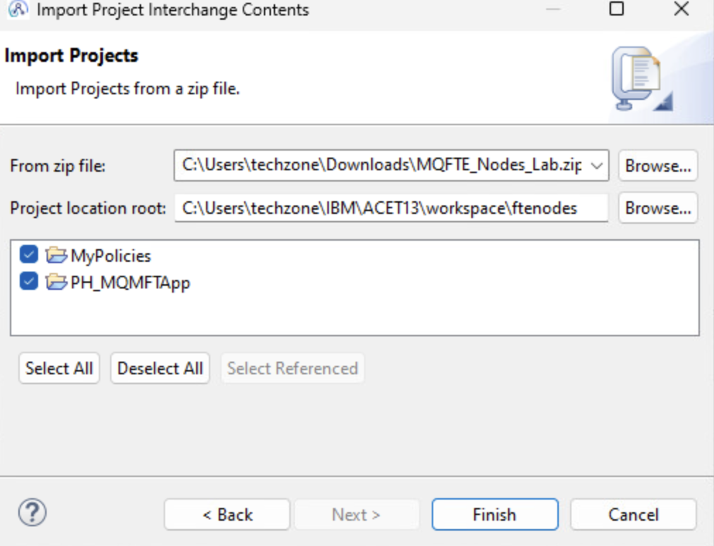

<br>


## 5b. Review FTEInput Message Flow <a name="fteinput"></a>

**FTEInput_to_File.msgflow** <br>
This flow is initiated by an FTE Transfer from a Source MFT Agent (AGTMQ01) to ACE MFT Agent (DEMOAGENT). <br>

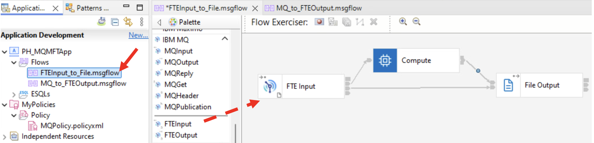

FTEInput Node Properties. <br>

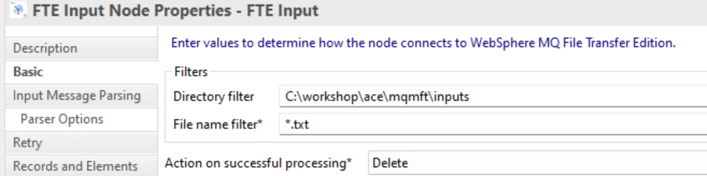

FileOutput Node Properties. <br>

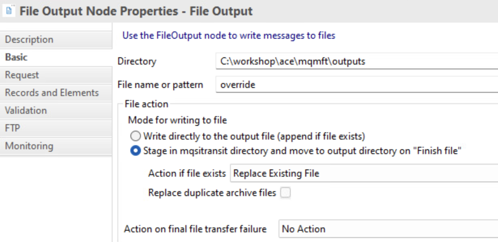

<br>

## 5c. Review FTEOutput Message Flow <a name="fteoutput"></a>

**MQ_to_FTEOutput.msgflow** <br>
This message flow is initiated by an MQInput Node that then sends files via FTEOutput Node using ACE MFT Agent (DEMOAGENT). <br>

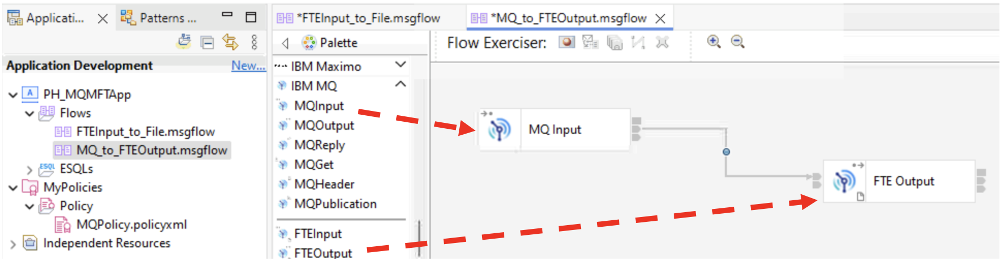

MQInput Node Properties. <br>

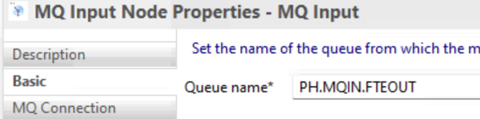

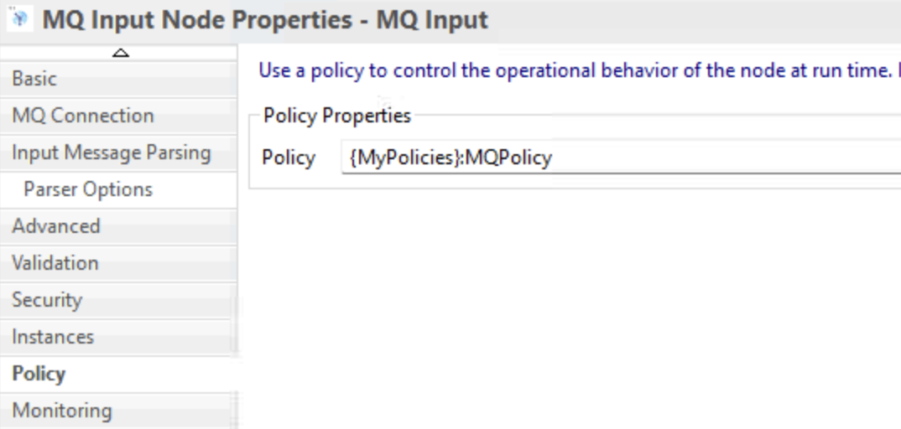

<br>
FTEOutput Node Properties. <br>

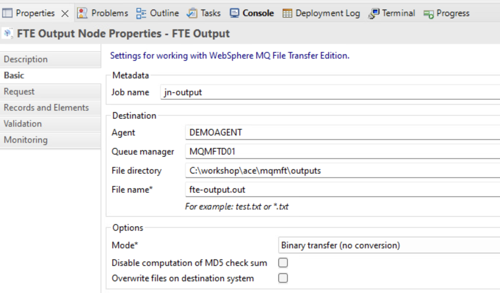

<br>

## 5d. Review MQPolicy <a name="mqpolicy"></a>

Open MQPolicy and review Queue Manager's (MQMFTD01) hostname. <br>

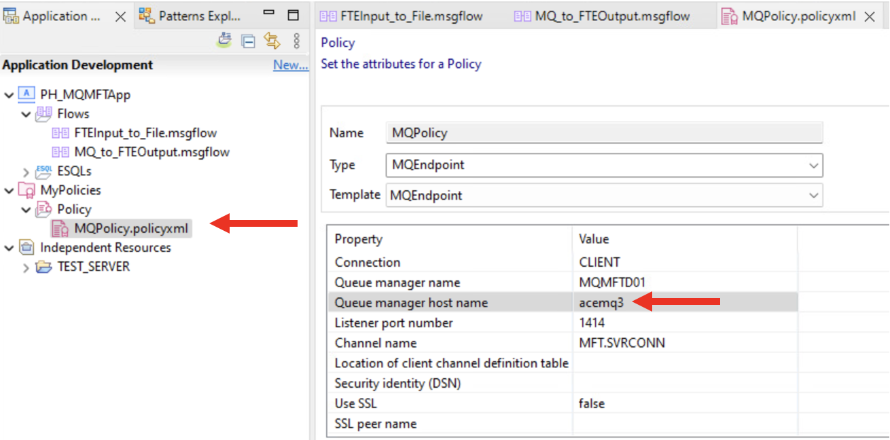

Close the Policy. <br><br>


# 6. Deployment  <a name="deploy"></a>

Let's create an Integration Server, then deploy MQ Policy Project, and the Application. <br>

## 6a. Create Integration Server <a name="is-create"></a>

Create Local Integration Server TEST_SERVER (Integration Explorer pane in the bottom left of the Toolkit). <br>

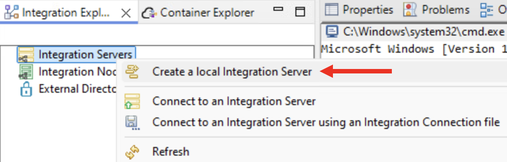

Just use the default settings, and click \<Finish\>. <br>

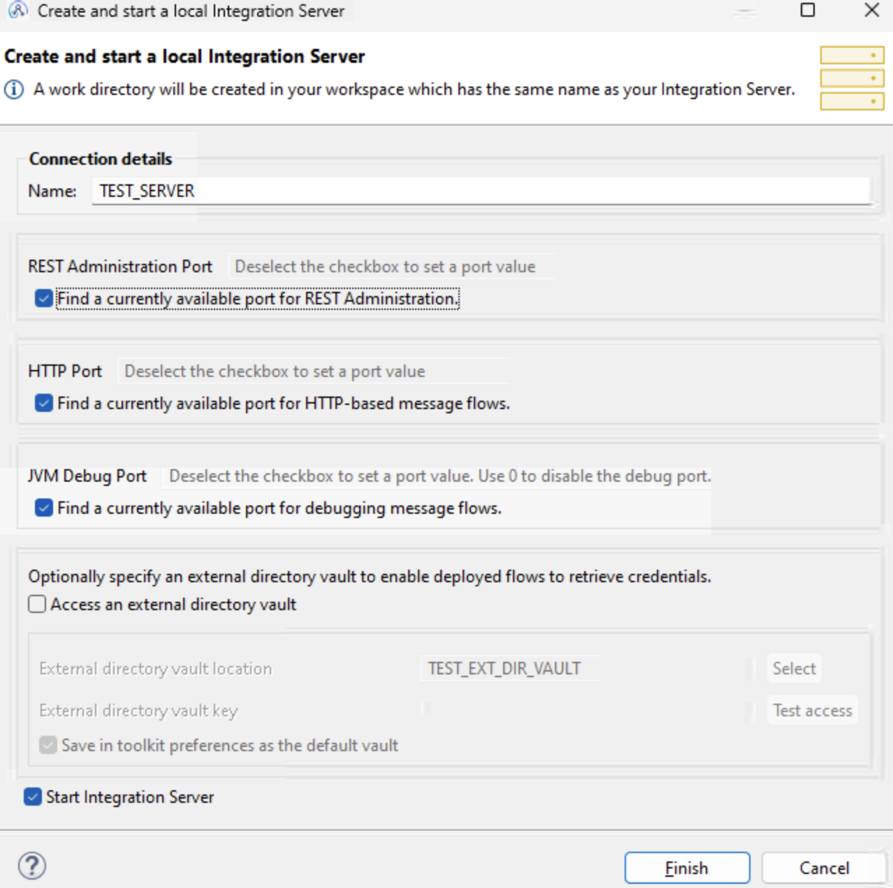

Click \<Allow\>, then click \<Yes\>, if you get "Do you want to allow public and private networks to access this app". <br>

The TEST_SERVER should be started shortly. <br>


## 6b. Update overrides/server.conf.yaml <a name="update-severconf"></a>

Open server.conf.yaml under "Independent Resources" > TEST_SERVER > overrides folder. <br>

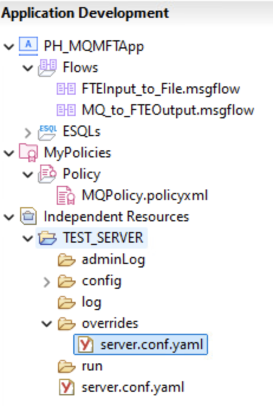

Append below section. Make sure the FTEAgent segment is aligned with JVM segment. <br>

```
  FTEAgent:
    coordinationQMgr: 'MQMFTD01'
    agentConfigurationDirectory: 'C:\workshop\ace\mqmft\agent-config'
    agentName: 'DEMOAGENT'
remoteDefaultQueueManager: '{MyPolicies}:MQPolicy'
```
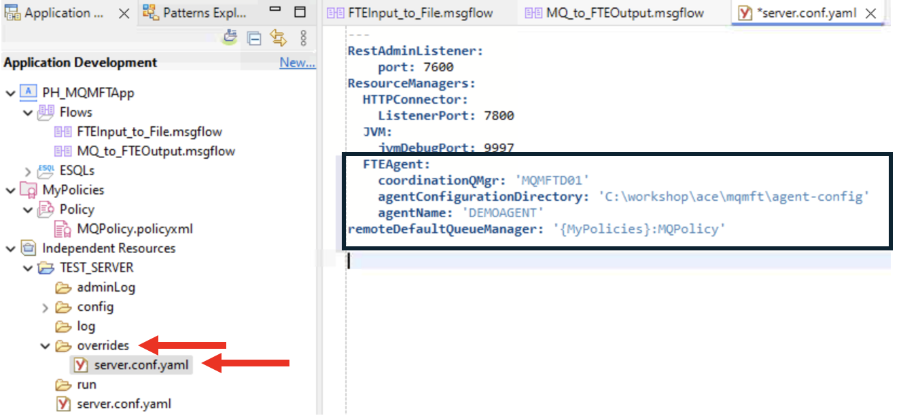

Note that agentConfigurationDirectory contains agent.properties, coordination.properties, and command.properties files. Please review them. <br>

Save and close server.conf.yaml file. <br>


## 6c. Deploy Policy Project <a name="deploy-policy"></a>

Drag-n-drop the Policy Project into TEST_SERVER. <br>

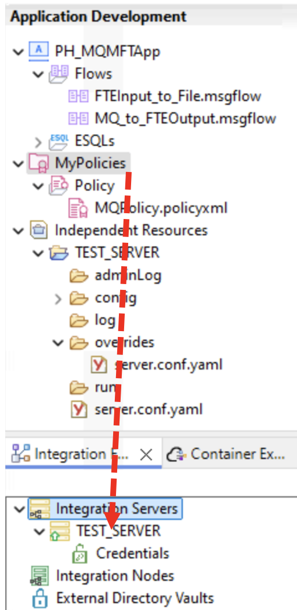


## 6d. Restart Integration Server <a name="is-restart"></a>

Restart TEST_SERVER to reload server.conf.yaml configurations. <br>

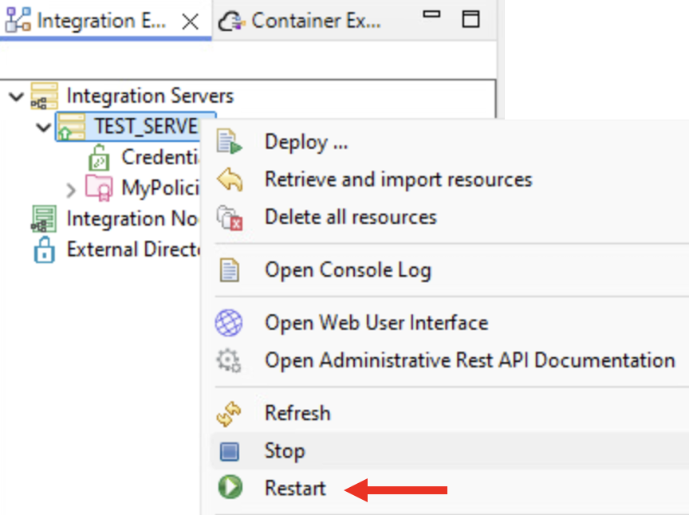


## 6e. Deploy Application <a name="deploy-app"></a>

Drag-n-drop the Application. <br>

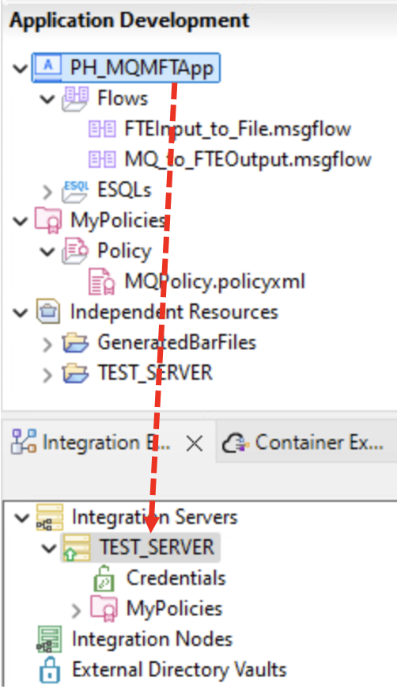

If the configurations server.conf.yaml, MQPolicy, the propery files under agent-config are correct, then the flow should be deployed successfully as below. <br>

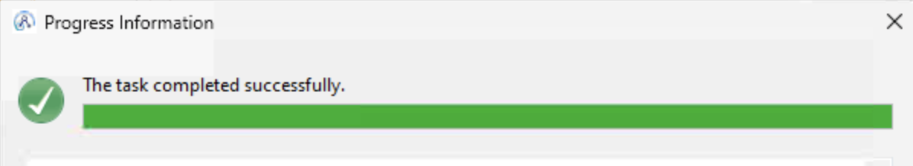

Let's stop TEST_SERVER, so that we can explore Terminal feature of ACE Toolkit. <br>

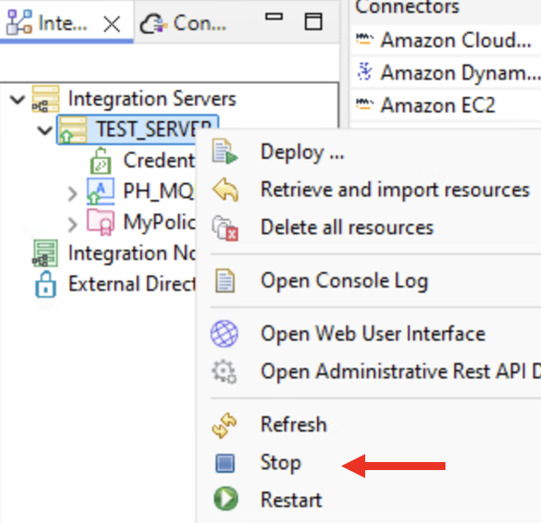

<br>


# 7. Terminal Window <a name="terminal"></a>

Let's explore the Terminal view of the Toolkit. You can use Terminal to start integration servers. <br>

## 7a. Open Terminal <a name="open-terminal"></a>

Navigate to Terminal through Window menu > Show View > Other > search for Terminal and click on it. <br>

Click on "Open a Terminal" icon. <br> 

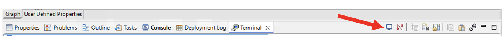

Click \<Ok\>.

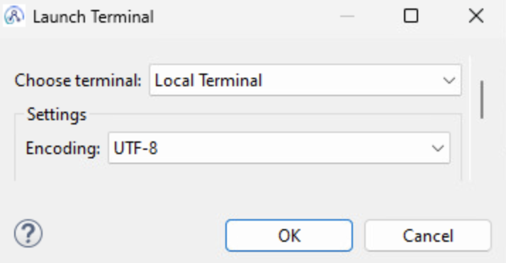


<br>

## 7b. Start TEST_SERVER  <a name="is-start"></a>

```
IntegrationServer --work-dir C:\Users\techzone\IBM\ACET13\workspace\ftenodes\TEST_SERVER
```
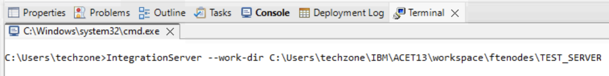

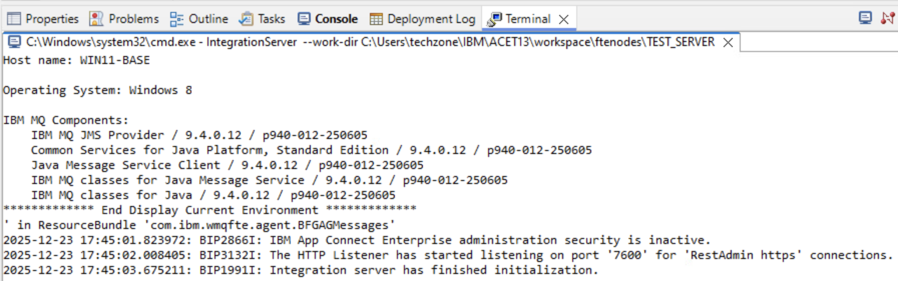


# 8. Check ACE DEMOAGENT Status <a name="verify-agent-status"></a>

Now, let's logon back to RHEL Virtual Machine (acemq3), and verify our ACE DEMOAGENT is registered and it's in Ready state. <br>

```
fteListAgents
```

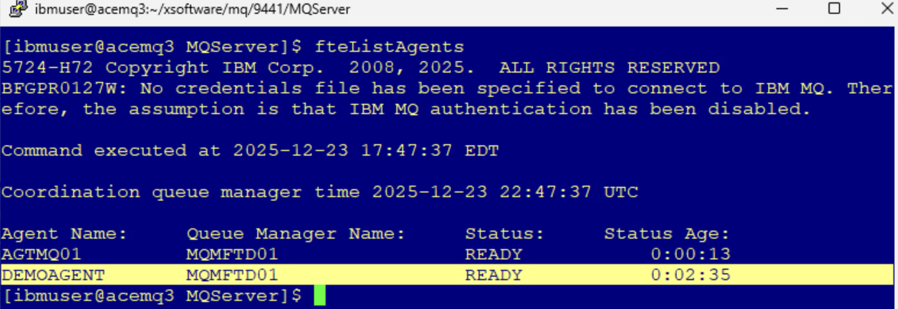

<br>


# 9. Testing  <a name="testing"></a>

Switch back to RHEL Virtual Machine (acemq3). <br>

## 9a. Test MFT to File (FTEInput) Message Flow <a name="fteinput-test"></a>

```
touch /tmp/test1.txt
fteCreateTransfer -rt -1 -jn "test" -sa AGTMQ01 -sm MQMFTD01 -da DEMOAGENT -dm MQMFTD01 -sd delete -dd "C:\workshop\ace\mqmft\inputs" "/tmp/test1.txt" -de overwrite
```
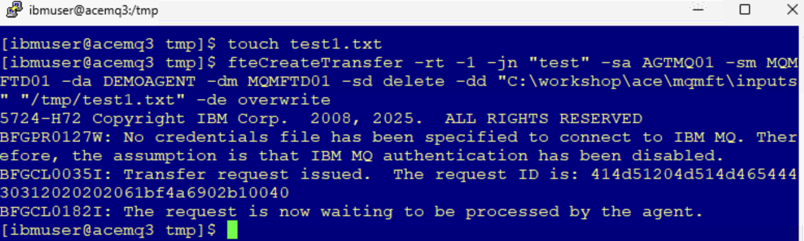


If transfer is successful, test1.txt should be created under C:\workshop\ace\mqmft\outputs folder. <br>

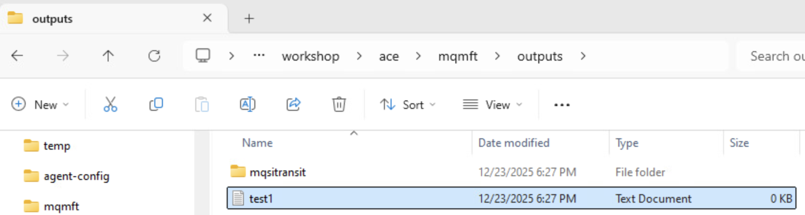


## 9b. Test Message to File (FTEOutput) Message Flow <a name="fteoutput-test"></a>

Switch back to RHEL Virtual Machine (acemq3). <br>

Let's write a test MQ message into PH.MQIN.FTEOUT queue. <br>

```
/opt/mqm/samp/bin/amqsput PH.MQIN.FTEOUT MQMFTD01
```
If the transfer is successful, you should see file(s) under the C:\workshop\ace\mqmft\outputs folder, essentially creating one file for each message. <br>

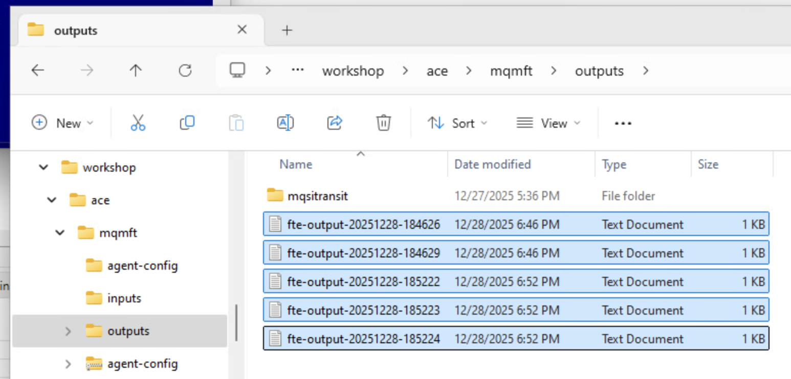


<br>

# 10. Summary <a name="summary"></a>

Congratulations! You have successfully explored configuring a simple MQ Managed File Transfer (MQMFT), then used App Connect Message flow FTEInput and FTEOutput nodes to receive files and write files via MQMFT Agents. <br><br>


# 11. References <a name="references"></a>
FTEInput Node: <br>
<a href="https://www.ibm.com/docs/en/app-connect/13.0.x?topic=nodes-fteinput-node" target="_blank"> https://www.ibm.com/docs/en/app-connect/13.0.x?topic=nodes-fteinput-node </a>

FTEOutput Node: <br>
<a href="https://www.ibm.com/docs/en/app-connect/13.0.x?topic=nodes-fteoutput-node" target="_blank"> https://www.ibm.com/docs/en/app-connect/13.0.x?topic=nodes-fteoutput-node </a>

MQ Managed File Transfer: <br>
<a href="https://www.ibm.com/docs/en/ibm-mq/9.4.x?topic=overview-managed-file-transfer" target="_blank"> https://www.ibm.com/docs/en/ibm-mq/9.4.x?topic=overview-managed-file-transfer</a>

<br>

[Go to Top](#introduction)

<br>

[Return to App Connect labs page](../../index.md)