# XML to XML data transformation using ESQL node

[Return to App Connect labs page](../../index.md)

---

# Table of Contents
- [1. Introduction](#introduction)
- [2. Workshop Environment ](#env)
- [3. App Connect Toolkit](#toolkit)
  * [3a. Open Workspace](#open-workspace)
  * [3b. Create Application ](#new-app)
  * [3c. Create Message Flow](#new-msgflow)
- [4. Create Integration Server](#is-create)
- [5. Test the flow with the Flow Exerciser](#testing)
- [6. References ](#references)

---

<br>

## 1. Introduction <a name="introduction"></a>

This tutorial illustrates a straightforward message flow that receives Customers Sale data in XML format via HTTP. The flow transforms the input XML format into an alternative output XML format utilizing a Compute node with ESQL code, and subsequently returns the altered XML in response to the HTTP request. In addition, the Compute Node transform the Currency values from Euros to Dollars using a conversion rate of $1.60c. <br>

In App Connect Enterprise, message flows can be used to transform input data structures into output data structures. Several transformation options are provided including a Compute node (which uses ESQL), a Mapping node, a JavaCompute node (which can navigate data using an App Connect Enterprise Java API or JAXB), an XSL Transform node and a .NETCompute node.

The input message comprises several Invoice segments, with each Invoice containing multiple purchased items along with the total invoice amount expressed in Euros currency. <br>

We will utilize Compute Node and ESQ: code to convert the input XML message into an alternative XML format, nd we will additionally execute Currency conversion of the Amounts from Euros to Dollars. <br>

Review the below sample XML input message format <br>
```
<?xml version="1.0" encoding="UTF-8"?>
<SaleEnvelope>
	<Header>
		<SaleListCount>1</SaleListCount>
		<TransformationType>xsl</TransformationType>
	</Header>
	<SaleList>
		<Invoice>
			<Initial>K</Initial>
			<Initial>A</Initial>
			<Surname>Braithwaite</Surname>
			<Item>
				<Code>00</Code>
				<Code>01</Code>
				<Code>02</Code>
				<Description>Twister</Description>
				<Category>Games</Category>
				<Price>00.30</Price>
				<Quantity>01</Quantity>
			</Item>
			<Item>
				<Code>02</Code>
				<Code>03</Code>
				<Code>01</Code>
				<Description>The Times Newspaper</Description>
				<Category>Books and Media</Category>
				<Price>00.20</Price>
				<Quantity>01</Quantity>
			</Item>
			<Balance>00.50</Balance>
			<Currency>Euros</Currency>
		</Invoice>
		<Invoice>
			<Initial>T</Initial>
			<Initial>J</Initial>
			<Surname>Dunnwin</Surname>
			<Item>
				<Code>04</Code>
				<Code>05</Code>
				<Code>01</Code>
				<Description>The Origin of Species</Description>
				<Category>Books and Media</Category>
				<Price>22.34</Price>
				<Quantity>02</Quantity>
			</Item>
			<Item>
				<Code>06</Code>
				<Code>07</Code>
				<Code>01</Code>
				<Description>Microscope</Description>
				<Category>Miscellaneous</Category>
				<Price>36.20</Price>
				<Quantity>01</Quantity>
			</Item>
			<Balance>80.88</Balance>
			<Currency>Euros</Currency>
		</Invoice>
	</SaleList>
	<Trailer>
		<CompletionTime>12.00.00</CompletionTime>
	</Trailer>
</SaleEnvelope>
```

Review the XML output message subsequent to the transformation of the input message by the Compute Node.

 <br>

```
<?xml version="1.0" encoding="UTF-8" standalone="no"?>
<SaleEnvelope>
  <SaleList>
    <Statement Style="Full" Type="Monthly">
      <Customer>
        <Initials>KA</Initials>
        <Name>Braithwaite</Name>
      </Customer>
      <Purchases>
        <Article>
          <Desc>Twister</Desc>
          <Cost>0.480</Cost>
          <Qty>01</Qty>
        </Article>
        <Article>
          <Desc>The Times Newspaper</Desc>
          <Cost>0.320</Cost>
          <Qty>01</Qty>
        </Article>
      </Purchases>
      <Amount Currency="Dollars">0.800</Amount>
    </Statement>
    <Statement Style="Full" Type="Monthly">
      <Customer>
        <Initials>TJ</Initials>
        <Name>Dunnwin</Name>
      </Customer>
      <Purchases>
        <Article>
          <Desc>The Origin of Species</Desc>
          <Cost>35.744</Cost>
          <Qty>02</Qty>
        </Article>
        <Article>
          <Desc>Microscope</Desc>
          <Cost>57.920</Cost>
          <Qty>01</Qty>
        </Article>
      </Purchases>
      <Amount Currency="Dollars">129.408</Amount>
    </Statement>
  </SaleList>
</SaleEnvelope>
```

Let's use App Connect Toolkit and build the Messsage Flow to transform the Input XML to Outpiut XML. <br> <br>

## 2. Workshop environment <a name="env"></a>


You will be doing this lab from the Windows VM. <br>
<br>


## 3. App Connect Toolkit <a name="toolkit"></a>

From the Windows VM, open IBM App Connect Enterprise Toolkit from the desktop. <br>


### 3a. Open Workspace <a name="open-workspace"></a>

Workspace: C:\Users\techzone\IBM\ACET13\workspace\transform-esql <br>

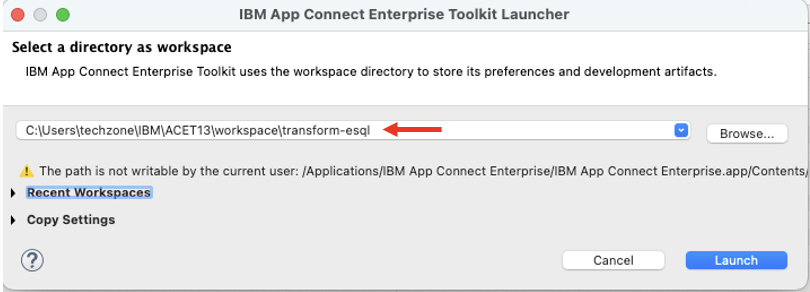


Close the welcome page. <br>


### 3b. Create Application <a name="new-app"></a>


Name the application as "Transformation_ESQL". <br>

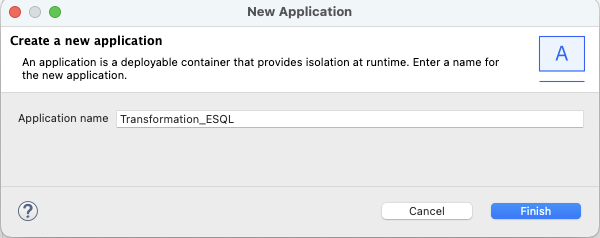


### 3c. Create Message Flow <a name="new-msgflow"></a>

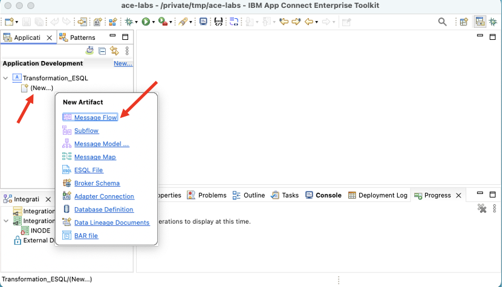

Name the Message FLow "Transformation_ESQL". <br>

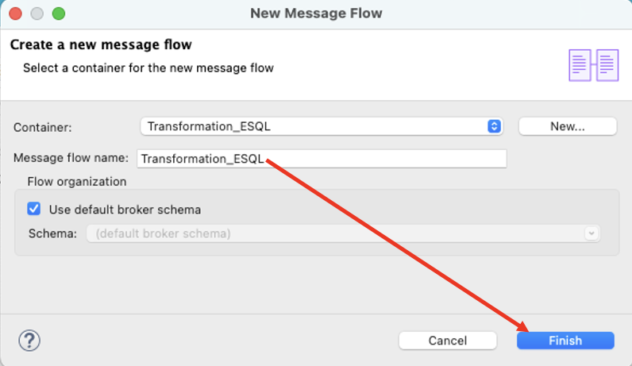


Drag and drop HTTPInput, Compute, HTTPReply nodes from the Node Palette into the Message Flow canvas, and wire them as below. <br>

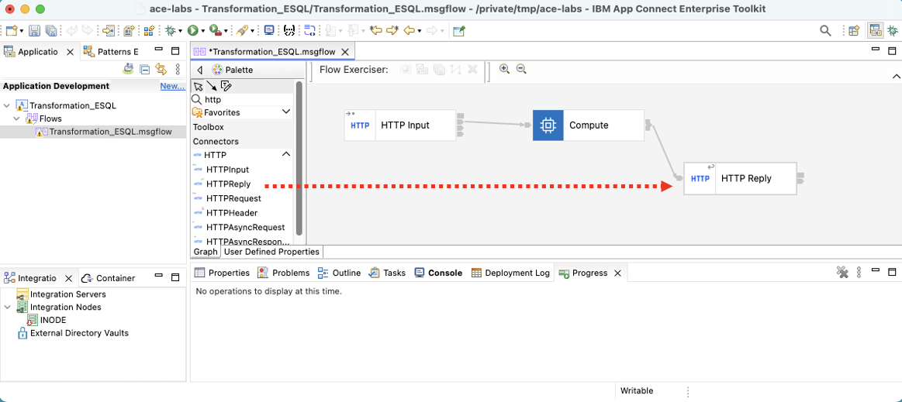

**a) Configure HTTPInput Node** <br>

Click on HTTPInput Node, then Properties > Basic Tab. <br>

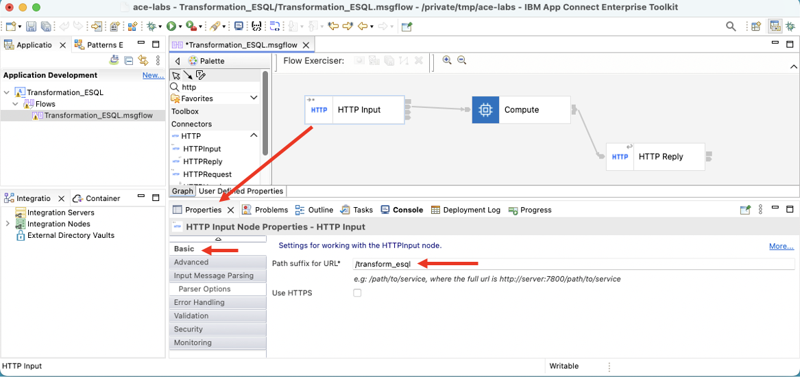

Select XMLNSC parser to parse the incoming XML message. The parsed message will be passed downstream into the Compute node. <br>

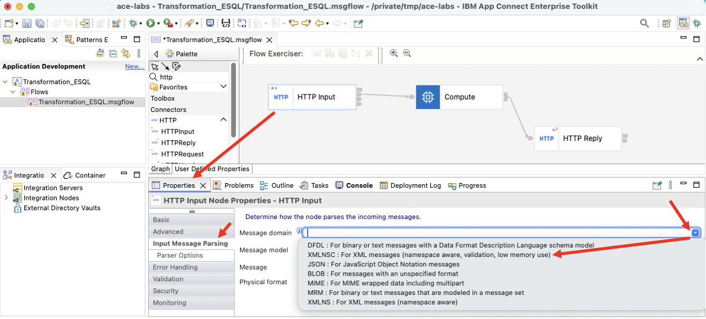


**b) Configure Compute Node** <br>

Double click on the Compute Node. <br>

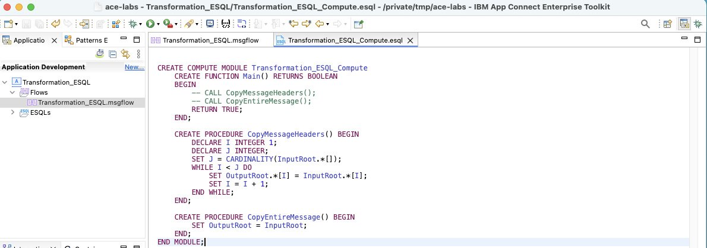

Uncomment CopyHessageHeaders function as below. <br>

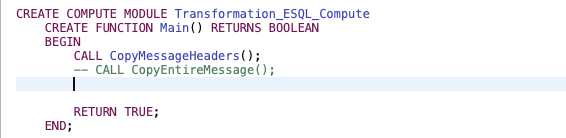

Copy and paste the below code after CopyEntireMessage function. <br>

As you can see below, the REFERENCE statements are pointers to the Input Message segments that will be used to locate the fields. <br>

```
		CREATE LASTCHILD OF OutputRoot DOMAIN 'XMLNSC';

		-- create references placeholders (the values will be changed later)
		DECLARE invoice REFERENCE TO InputRoot.XMLNSC.SaleEnvelope.SaleList.Invoice;
		DECLARE statement REFERENCE TO OutputRoot.XMLNSC.SaleEnvelope.SaleList;
		DECLARE article REFERENCE TO OutputRoot.XMLNSC.SaleEnvelope.SaleList;
		DECLARE amount REFERENCE TO OutputRoot.XMLNSC.SaleEnvelope.SaleList;
		DECLARE total DECIMAL 0;
		
		-- while invoice has next element
		WHILE LASTMOVE(invoice) DO
			-- create the new message
			CREATE LASTCHILD OF OutputRoot.XMLNSC.SaleEnvelope.SaleList AS statement Type XMLNSC.Folder Name 'Statement';
			SET statement.(XMLNSC.Attribute)Type = 'Monthly';
			SET statement.(XMLNSC.Attribute)Style = 'Full';
			
			SET statement.Customer.(XMLNSC.Field)Initials = invoice.Initial[1] || invoice.Initial[2];
			SET statement.Customer.(XMLNSC.Field)Name = invoice.Surname;
			
			SET total = 0;
			DECLARE items REFERENCE TO invoice.Item;
			-- while items has next element
			WHILE LASTMOVE(items) DO
				-- create new Article
				CREATE LASTCHILD OF statement.Purchases AS article Type XMLNSC.Folder Name 'Article';
				SET article.(XMLNSC.Field)Desc = items.Description;
				SET article.(XMLNSC.Field)Cost = CAST(items.Price AS DECIMAL) * 1.6;
				SET article.(XMLNSC.Field)Qty = items.Quantity;
				
				SET total = total + ( (CAST(items.Price AS DECIMAL) * 1.6) * CAST(items.Quantity AS INTEGER) );
				-- go to the next item
				MOVE items NEXTSIBLING NAME 'Item';
			END WHILE;
			
			SET statement.(XMLNSC.Field)Amount = total;
			-- SET statement.Amount.(XMLNSC.Attribute)Currency = invoice.Currency;
			SET statement.Amount.(XMLNSC.Attribute)Currency = 'Dollars';
			
			-- go to the next invoice
			MOVE invoice NEXTSIBLING NAME 'Invoice';
		END WHILE;
```

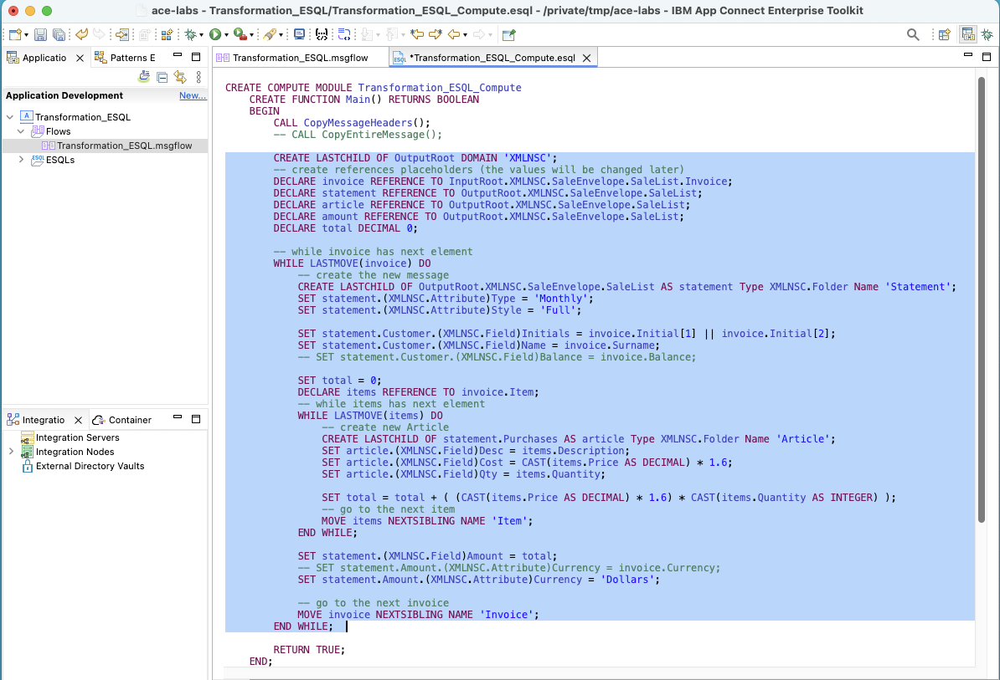

Hit Control + s to save the ESQL code. <br>


## 4. Create Integration Server  <a name="is-create"></a>

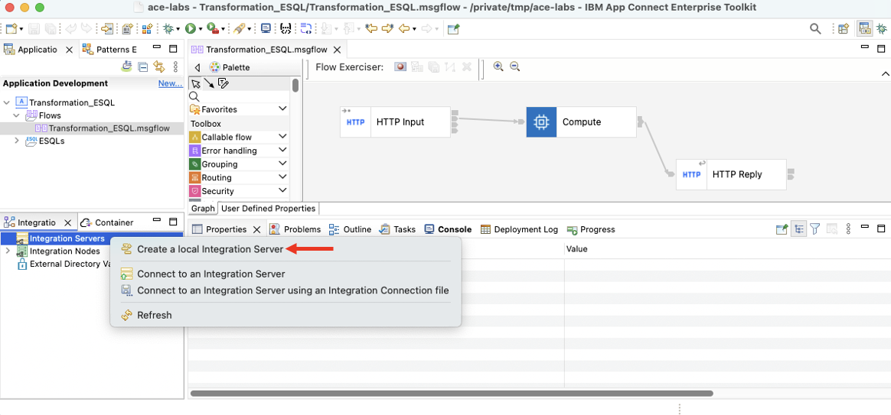

Keep the default Integration Server TEST_SERVER then click \<Finish\>.

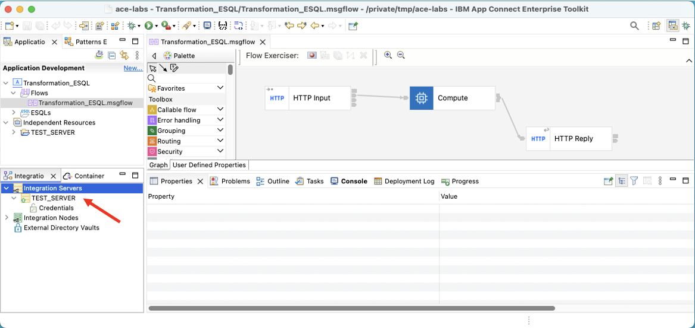


## 5. Test the flow with the Flow Exerciser   <a name="testing"></a>

Click the Flow Exerciser button. <br>

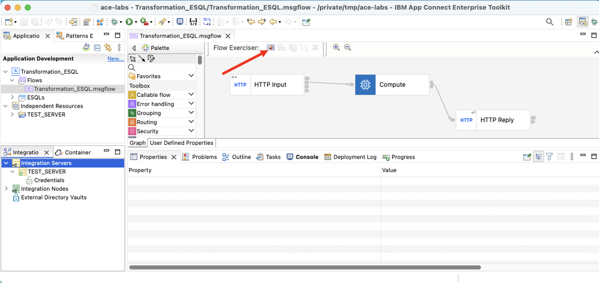

Click \<Ok\> to deploy. <br>

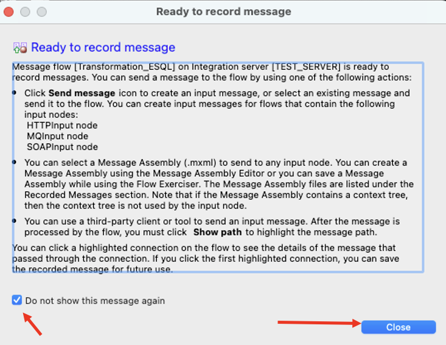

Now, click on Send Messages button. <br>

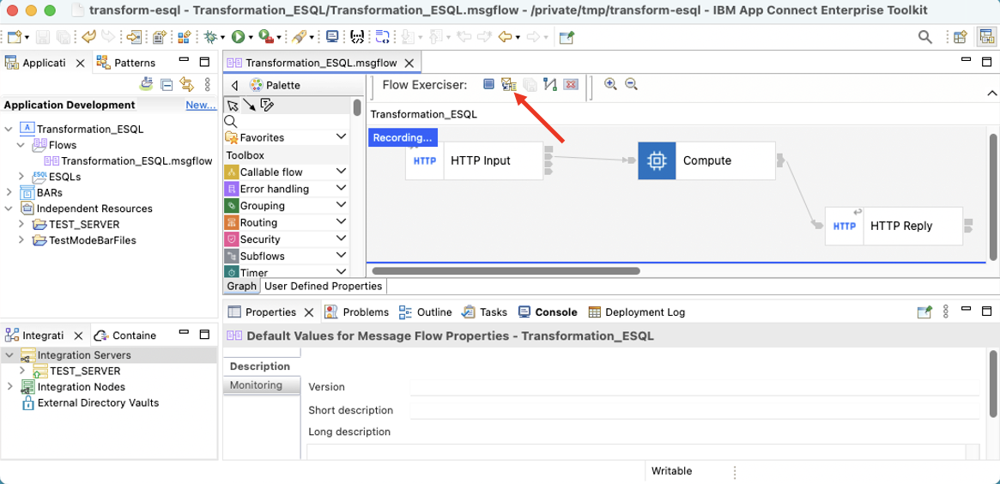

Click "New input message" button.

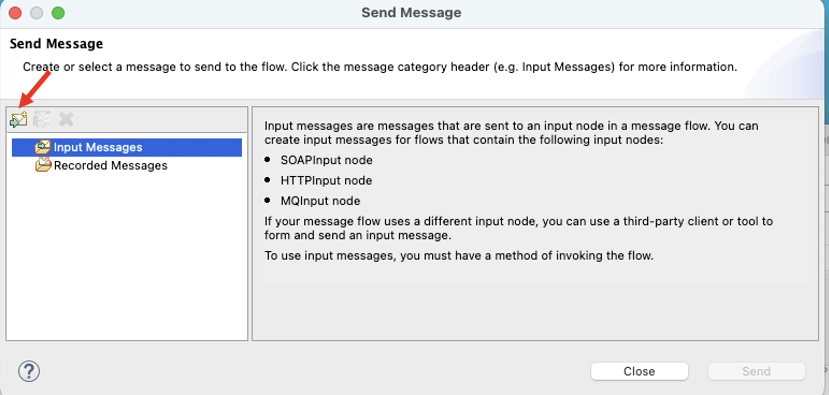

Copy and paste the below XML input message. This is the Input XML message and the format, and Compute node should transform it another XML format. <br>

```
<?xml version="1.0" encoding="UTF-8"?>
<SaleEnvelope>
	<Header>
		<SaleListCount>1</SaleListCount>
		<TransformationType>xsl</TransformationType>
	</Header>
	<SaleList>
		<Invoice>
			<Initial>K</Initial>
			<Initial>A</Initial>
			<Surname>Braithwaite</Surname>
			<Item>
				<Code>00</Code>
				<Code>01</Code>
				<Code>02</Code>
				<Description>Twister</Description>
				<Category>Games</Category>
				<Price>00.30</Price>
				<Quantity>01</Quantity>
			</Item>
			<Item>
				<Code>02</Code>
				<Code>03</Code>
				<Code>01</Code>
				<Description>The Times Newspaper</Description>
				<Category>Books and Media</Category>
				<Price>00.20</Price>
				<Quantity>01</Quantity>
			</Item>
			<Balance>00.50</Balance>
			<Currency>Sterling</Currency>
		</Invoice>
		<Invoice>
			<Initial>T</Initial>
			<Initial>J</Initial>
			<Surname>Dunnwin</Surname>
			<Item>
				<Code>04</Code>
				<Code>05</Code>
				<Code>01</Code>
				<Description>The Origin of Species</Description>
				<Category>Books and Media</Category>
				<Price>22.34</Price>
				<Quantity>02</Quantity>
			</Item>
			<Item>
				<Code>06</Code>
				<Code>07</Code>
				<Code>01</Code>
				<Description>Microscope</Description>
				<Category>Miscellaneous</Category>
				<Price>36.20</Price>
				<Quantity>01</Quantity>
			</Item>
			<Balance>80.88</Balance>
			<Currency>Euros</Currency>
		</Invoice>
	</SaleList>
	<Trailer>
		<CompletionTime>12.00.00</CompletionTime>
	</Trailer>
</SaleEnvelope>
```

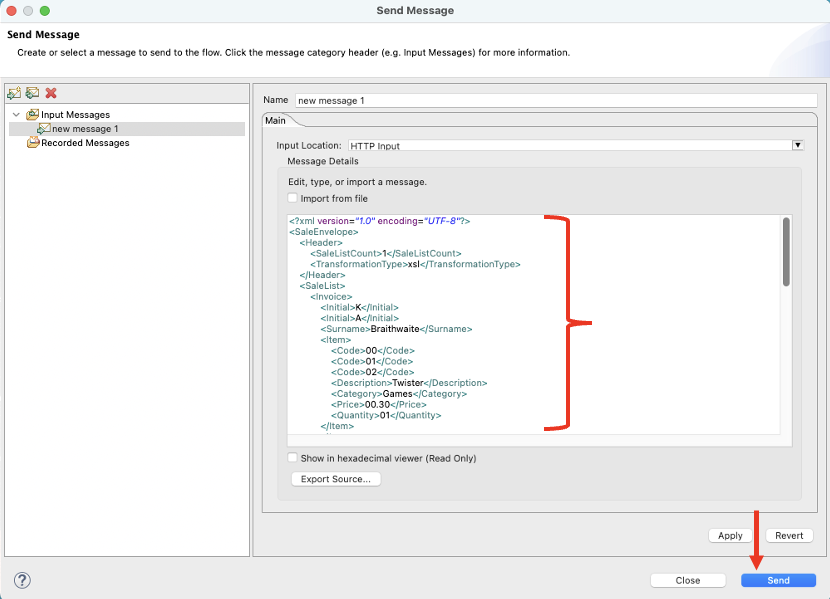


Check the reponse received. <br>
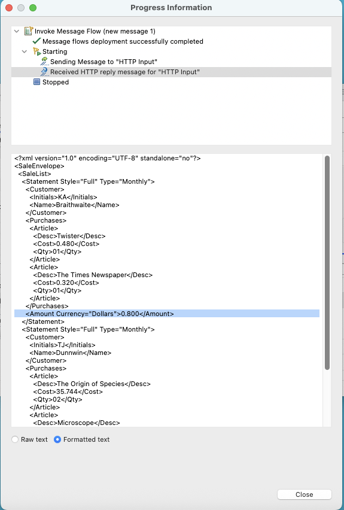

Now compare Input XML that you feed, and the Output XML that is produced. <br>


## 6. References <a name="references"></a>

There are number of Turorials that are provided. This lab is based on a tutorial. Navigate to the tutorial through Toolkit > Help > Tutorial Gallery, and search for ESQL. <br>

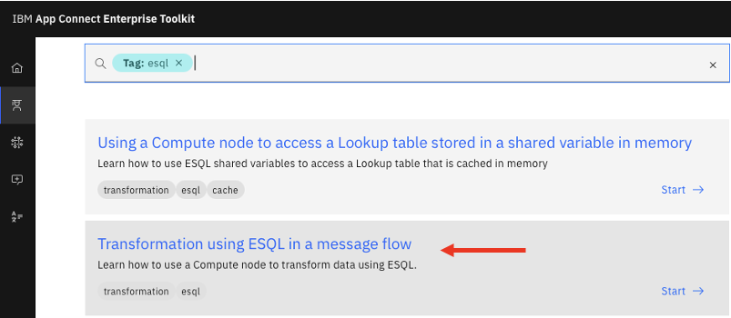

Project Interchange: <br>
**Download Project Interchange** from [<b><u>HERE</u></b>](./resources/Transformation_ESQL-PI.zip)
<br>

**Congratulations**

<br>

[Go to Top](#introduction)

<br>

[Return to App Connect labs page](../../index.md)