# XML to JSON data transformation using Mapping node

[Return to App Connect labs page](../../index.md)

---

# Table of Contents
- [1. Introduction](#introduction)
- [2. Workshop Environment ](#env)
- [3. App Connect Toolkit](#toolkit)
  * [3a. Open Workspace](#open-workspace)
  * [3b. Create Application ](#new-app)
  * [3c. Create Schemas](#create-schema)
  * [3d. Create Message Flow](#new-msgflow)
- [4. Create Integration Server](#is-create)
- [5. Test the flow with the Flow Exerciser](#testing)
- [6. References ](#references)

---

<br>

## 1. Introduction <a name="introduction"></a>

This tutorial demonstrates a straightforward message flow which receives a simple Country XML data over HTTP. The flow transforms the input XML structure into a JSON Object output structure using a Mapping node (whose behaviour is based on a graphical map), and sends this back to the HTTP request. <br>

In App Connect Enterprise, message flows can be used to transform input data structures into output data structures, or create entirely new data structures from scratch. Several transformation options are provided including a Compute node (which uses ESQL), a Mapping node (which uses a graphical user interface) and a JavaCompute node (which uses Java). This tutorial focusses on creating a JSON Object payload from scratch. Other tutorials similar to this one focus on a JSON Array payload and other transformation mechanisms.


 <br>

Review the below sample XML input message format <br>
```
<?xml version="1.0" encoding="UTF-8"?>
<Message>
  <Country>
    <Name>UK</Name>
	  <Greeting>Hello</Greeting>
  </Country>
</Message>
```

Review the XML output message subsequent to the transformation of the input message by the Compute Node.

 <br>

```
{
  "Message" : {
    "Country" : {
      "Name" : "UK",
      "Greeting" : "Hello"
    }
  }
}
```

Let's use App Connect Toolkit and build the Messsage Flow to transform the Input XML to Outpiut XML. <br> <br>

## 2. Workshop environment <a name="env"></a>

You will be doing this lab from the Windows VM. <br>


<br>


## 3. App Connect Toolkit <a name="toolkit"></a>

From the Windows VM, open IBM App Connect Enterprise Toolkit from the desktop. <br>


### 3a. Open Workspace <a name="open-workspace"></a>

Workspace: C:\Users\techzone\IBM\ACET13\workspace\transform-mapping <br>

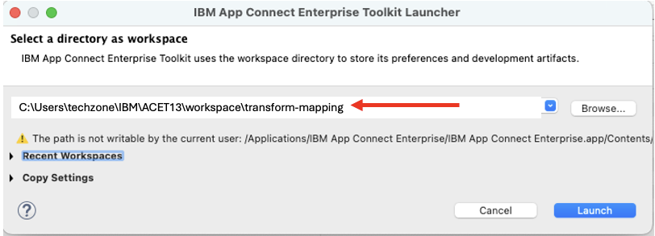


Close the welcome page. <br>


### 3b. Create Application <a name="new-app"></a>

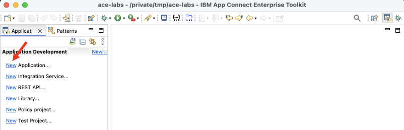

Name the application as "Transformation_Mapping". <br>
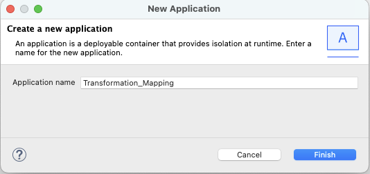


### 3c. Create Schemas <a name="create-schemas"></a>

**=======Create XML Schema=======** <br>

Let's create Country XML Schema file for our input message. <br>

Right click on the Transformation_Mapping application, then nagivate New > Other > General > File. <br>

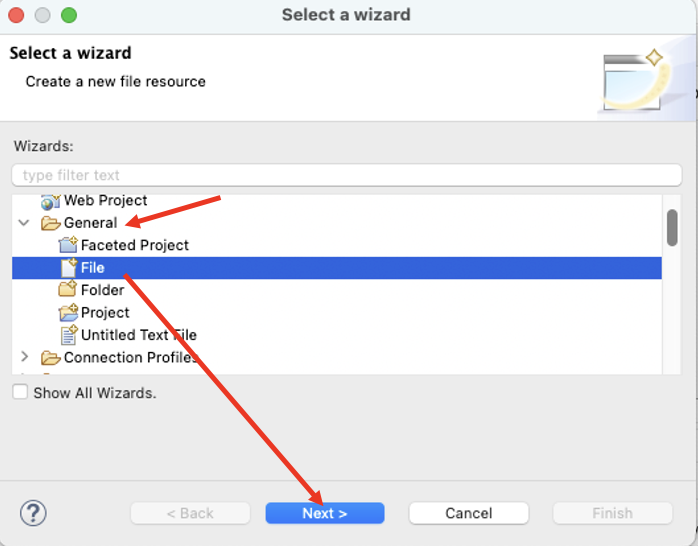

Call it CountrySchema.xsd then click Finish. <br>

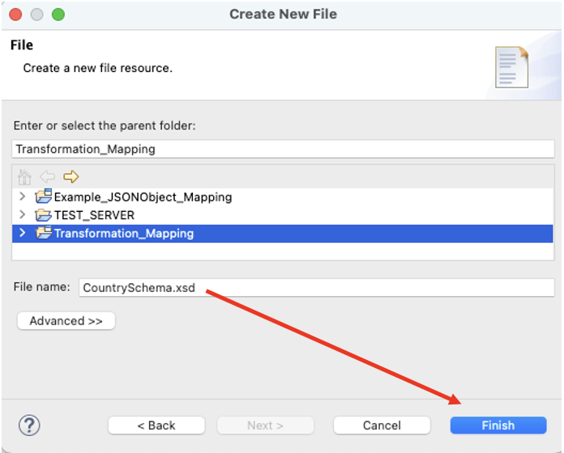

Click on the Source tab, then Copy & Paste the below XSD Schema. <br>

```
<?xml version="1.0" encoding="UTF-8"?>
<schema
    xmlns="http://www.w3.org/2001/XMLSchema" elementFormDefault="unqualified"
    xmlns:tns="http://www.ibm.com/ExampleTargetNamespace" targetNamespace="http://www.ibm.com/ExampleTargetNamespace">
    <element name="Message" type="tns:MessageType"></element>
    <complexType name="MessageType">
        <sequence>
            <element name="Country" type="tns:CountryType"></element>
        </sequence>
    </complexType>
    <complexType name="CountryType">
        <sequence>
            <element name="Name" type="string"></element>
            <element name="Greeting" type="string"></element>
        </sequence>
    </complexType>
</schema>
```

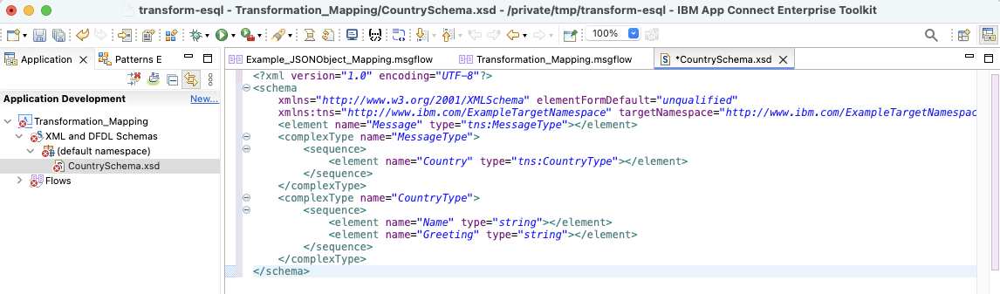

Hit Control + s to save the Schema file. <br><br>


**======Create JSON Schema=======** <br>

Same as above, let's create Country JSON Schema file for our input message. <br>

Right click on the Transformation_Mapping application, then nagivate New > Other > General > File. <br>


Call it CountrySchema.json. <br>

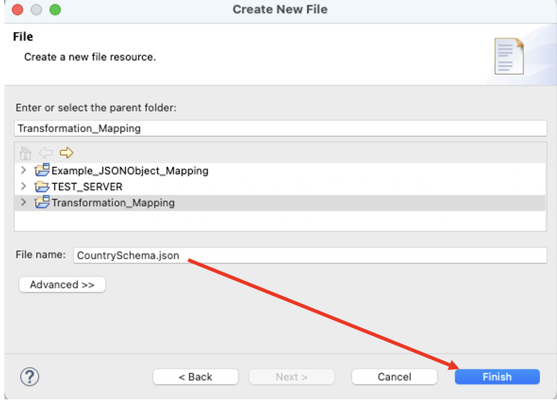

Copy & Paste the below JSON schema. <br>

```
{
  "$schema": "http://json-schema.org/draft-07/schema#",
  "title": "Generated schema for Root",
  "type": "object",
  "properties": {
    "Message": {
      "type": "object",
      "properties": {
        "Country": {
          "type": "object",
          "properties": {
            "Name": {
              "type": "string"
            },
            "Greeting": {
              "type": "string"
            }
          },
          "required": [
            "Name",
            "Greeting"
          ]
        }
      },
      "required": [
        "Country"
      ]
    }
  },
  "required": [
    "Message"
  ]
}
```
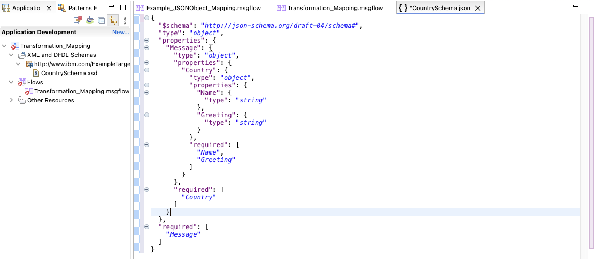

Hit Control + s to save the JSON Schema. <br><br>

Both XSD, and JSOB schemas should be ready for mapping. <br>

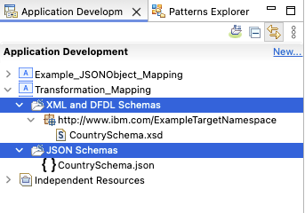

<br>


### 3d. Create Message Flow <a name="new-msgflow"></a>


Name the Message FLow "Transformation_Mapping". <br>

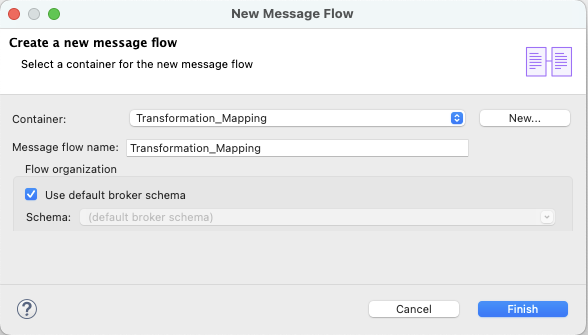

Drag and drop HTTPInput, Mapping, HTTPReply nodes from the Node Palette into the Message Flow canvas, and wire them as below. <br>

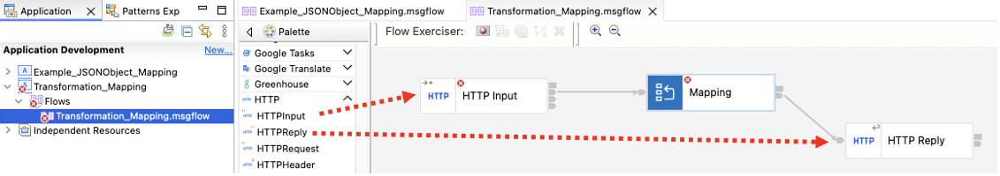


**A) Configure HTTPInput Node** <br>

Click on HTTPInput Node, then Properties > Basic Tab. <br>
Set "Path suffix for URL" as /transform_mapping. <br>

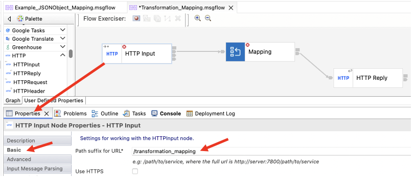

Select XMLNSC parser to parse the incoming XML message. The parsed message will be passed downstream into the Mapping node. <br>

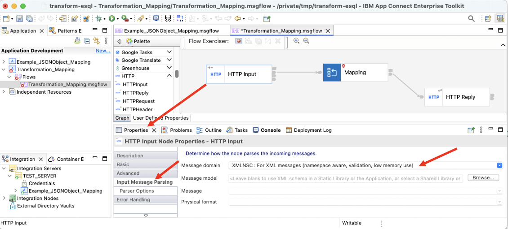


**C) Configure Mapping Node** <br>

Double click on the Mapping Node. <br>

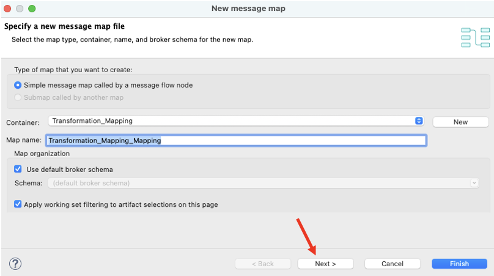

Select our source XML schema & root message, and target JSON Schema and message as below. <br>

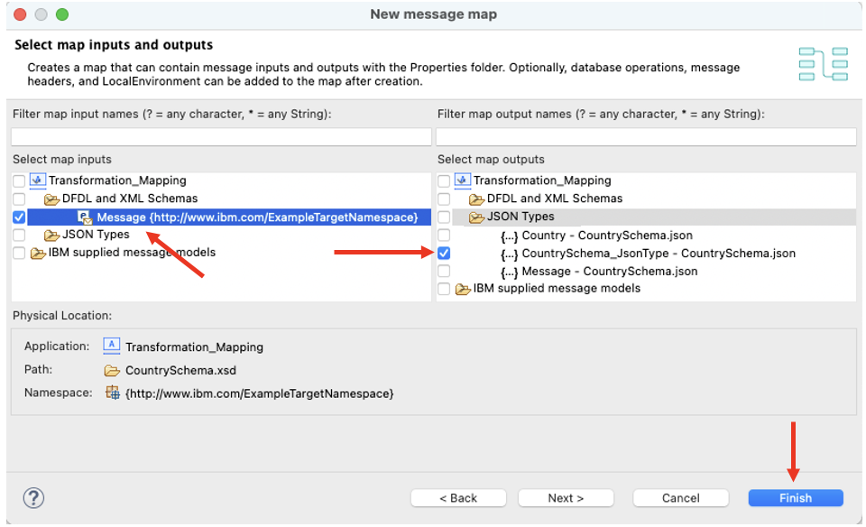

<br>

Click \<Finish\>


Mapping view. <br>

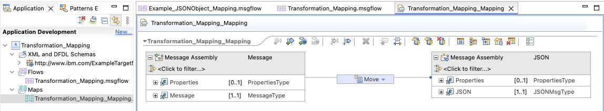

Add HttpInputHeader (Add or remove headers and folders) as below. <br>

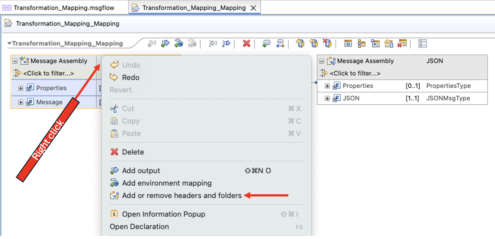

Select HTTPInputHeader. <br>

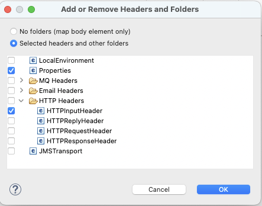

Repeat the same on the Target side. <br>

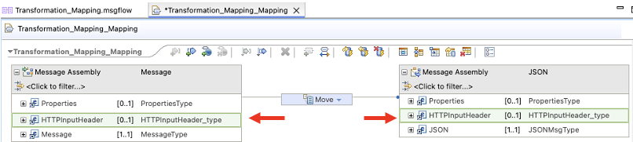

Now, wire them as below. <br>

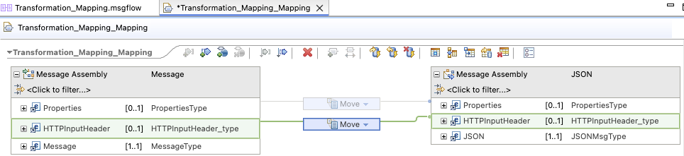


Expand the data segments. <br>

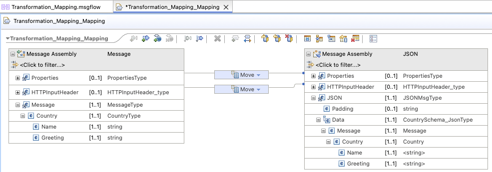

Let's use Auto Mapping feature. <br>

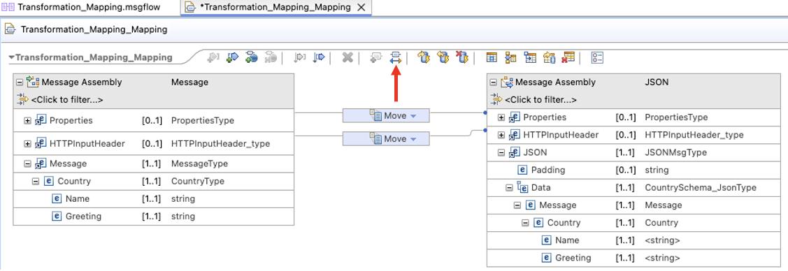

Leave the default settings, and click <\Next\>. <br>

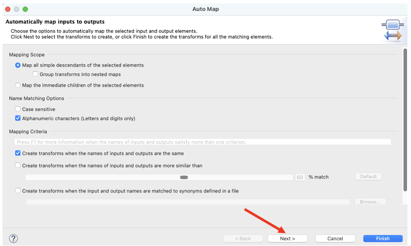

Notice that the Auto Mapping selected source and target fields. Click \<Finish\> <br>

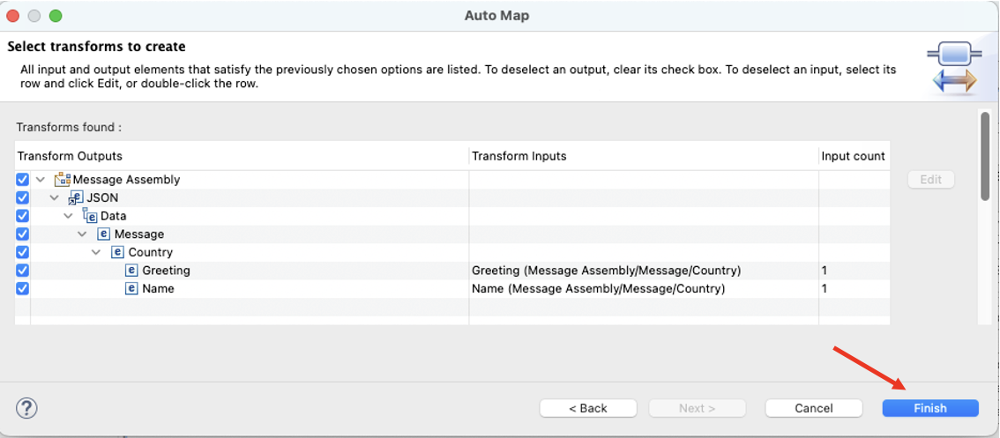

The map is now ready. <br>

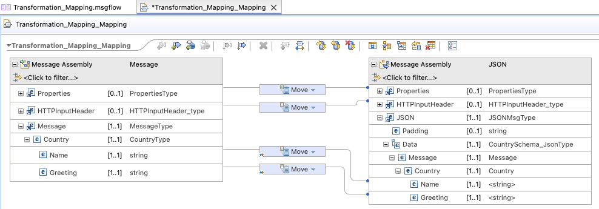

Hit Control + s keys to save the Map, then close the map. <br>

Hit Control + s keys to save the Message Flow<br>


## 4. Create Integration Server  <a name="is-create"></a>

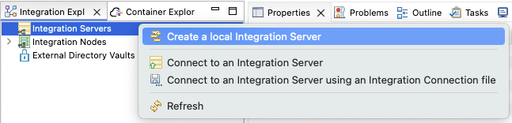

Keep the default Integration Server TEST_SERVER then click \<Finish\>.


## 5. Test the flow with the Flow Exerciser   <a name="testing"></a>

Click the Flow Exerciser button. <br>

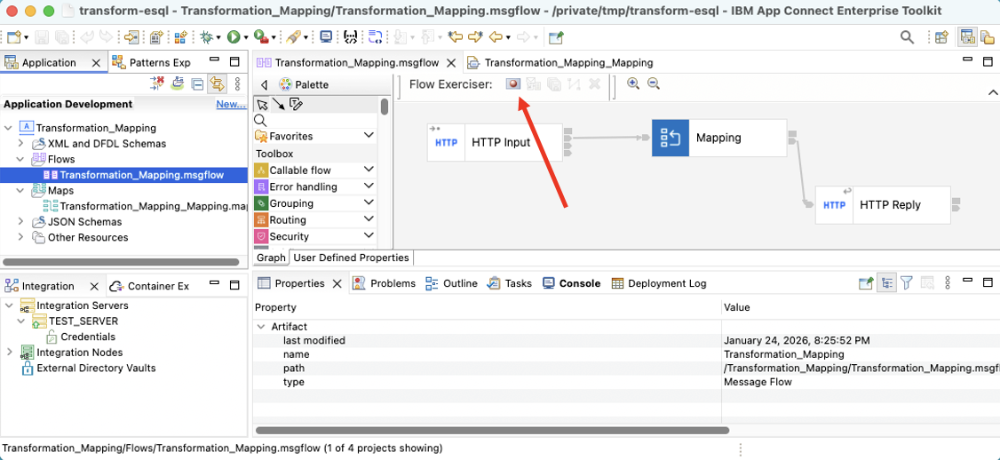


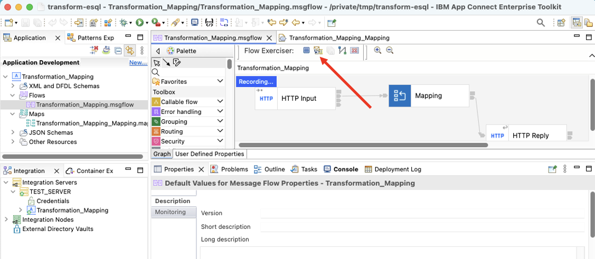

Click \<Ok\> to deploy. <br>

Click "New input message" button. <br>

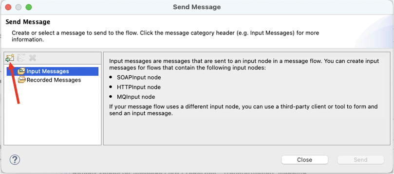


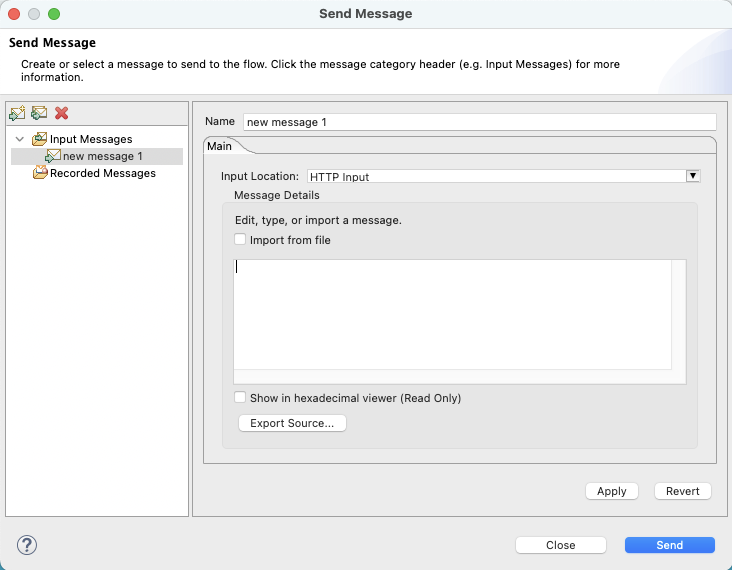

Copy and paste the below XML input message. This is the Input XML message and the format, and Compute node should transform it another XML format. <br>

```
<?xml version="1.0" encoding="UTF-8"?>
<Message>
  <Country>
    <Name>UK</Name>
	  <Greeting>Hello</Greeting>
  </Country>
</Message>
```

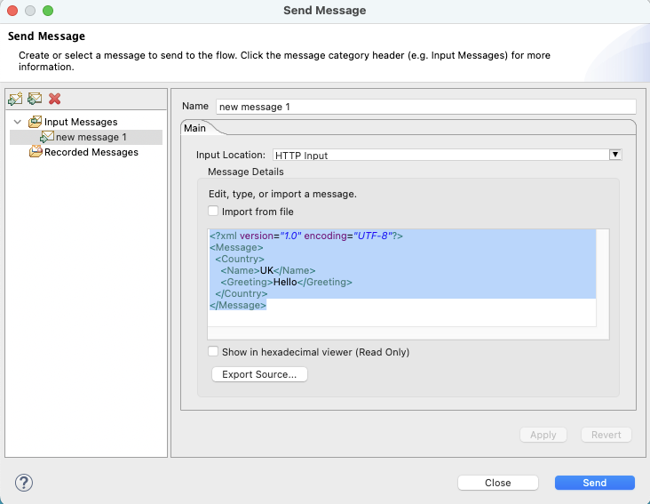

Click \<Send\> button. <br>


Check the reponse received. <br>

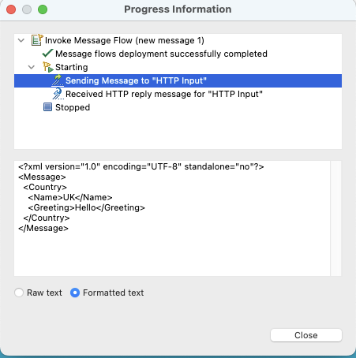

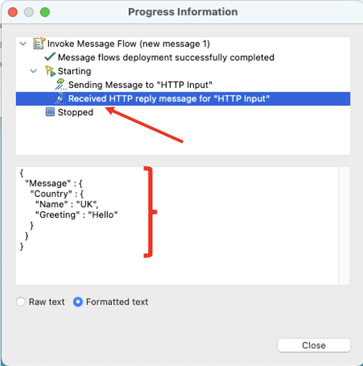

You should see the XML message is now transformed into JSON Object message. <br>


## 6. References <a name="references"></a>

There are number of Turorials that are provided. This lab is based on a tutorial. Navigate to the tutorial through Toolkit > Help > Tutorial Gallery, and search for Mapping. <br>

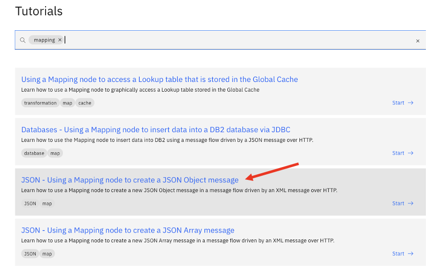

Project Interchange: <br>
**Download Project Interchange** from [<b><u>HERE</u></b>](./resources/Transformation_Mapping-PI.zip)
<br>

**Congratulations**
<br>

[Go to Top](#introduction)

<br>

[Return to App Connect labs page](../../index.md)