# Using RESTRequest node to invoke PetStore REST OpenApi 3.0

[Return to App Connect labs page](../../index.md)

---

# Table of Contents
- [1. Introduction](#introduction)
- [2. Workshop Environment ](#env)
- [3. App Connect Toolkit](#toolkit)
  * [3a. Open Workspace](#open-workspace)
  * [3b. Create Library ](#new-lib)
  * [3c. Create Application ](#new-app)
  * [3d. Create Message Flow](#new-msgflow)
- [4. Create Integration Server](#is-create)
- [5. Deployment](#deploy)
- [6. Test the API](#testing)
- [7. References ](#references)
- [8. Additional Material](#material)

---

<br>

## 1. Introduction <a name="introduction"></a>

This tutorial demonstrates how to invoke an external PetStore REST OpenAPI 3.0 from App Connect Enterprise Toolkit. In addition, you you will learn how to configure Truststore containing PetStore public certificate. <br>

In App Connect Enterprise, message flows can be used to invoke external API's such as REST. SOAP, GraphQL APIs.
 <br> <br>


## 2. Workshop environment <a name="env"></a>

You will be doing this lab from the Windows VM. <br>


<br>


## 3. App Connect Toolkit <a name="toolkit"></a>

From the Windows VM, open IBM App Connect Enterprise Toolkit from the desktop. <br>

### 3a. Open Workspace <a name="open-workspace"></a>

Workspace: C:\Users\techzone\IBM\ACET13\workspace\petstore-openapi-30 <br>

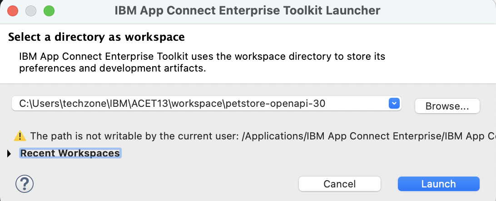

Launch the workspace, then close the welcome page. <br>


### 3b. Create Library <a name="new-lib"></a>

What is a Library? <br>
A library is a logical grouping of related code, data, or both. A library typically contains reusable helper routines and resources such as subflows, ESQL modules, message definitions, maps, and Java™ utilities. You can use a library to group resources of the same type or function, and to aid the management and reuse of such resources. <br>

Consider using libraries for the following functions:<br>
- To group common types of resource (such as all your ESQL routines)
- To group resources by function (such as all your error-handling routines)
- To share routines and definitions across multiple teams or projects
- To use different versions of a coherent set of routines and definitions
- Two types of library exist in IBM® App Connect Enterprise: shared libraries and static libraries.
Referencel <br>
https://www.ibm.com/docs/en/app-connect/13.0.x?topic=overview-libraries
<br>


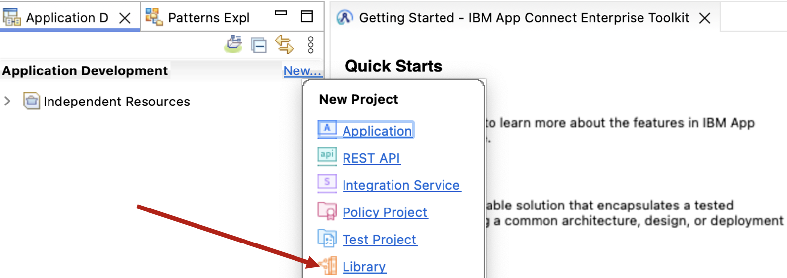

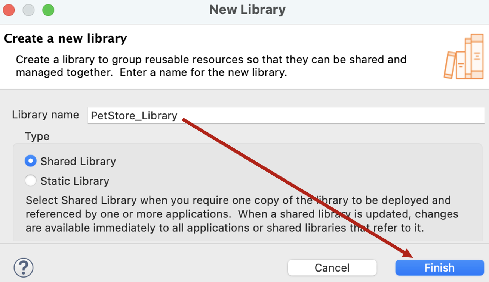

**Download PetStore_OpenApi.json from [<b><u>HERE</u></b>](./resources/PetStore_OpenApi.json)
<br>

PetStore_OpenApi.json file should be in the Downloads folder. Open File Explorer, and drag and drop PetStore_OpenApi.json into PetStore_library.  <br>

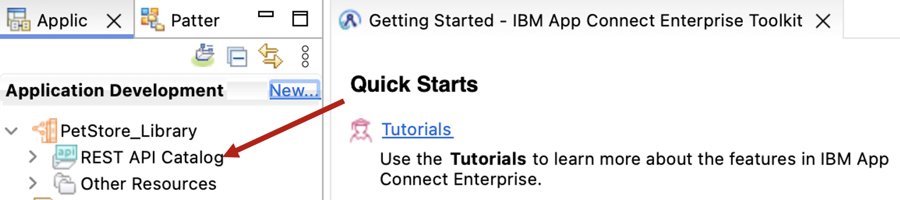

<br>


### 3c. Create Application <a name="new-app"></a>


Name the application as "PetStore_Application". <br>

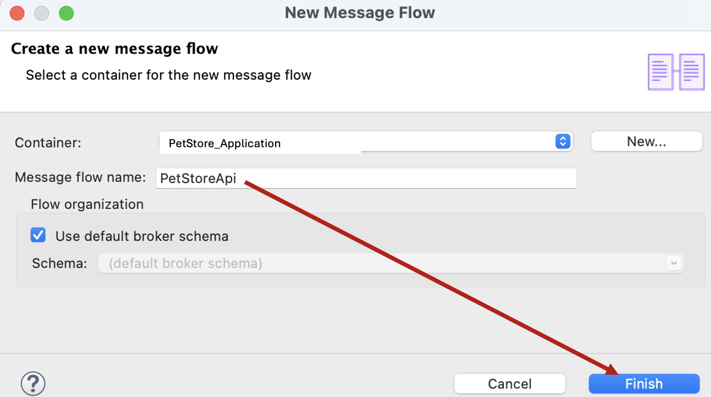


### 3d. Create Message Flow <a name="new-msgflow"></a>

New > Message Flow. <br>

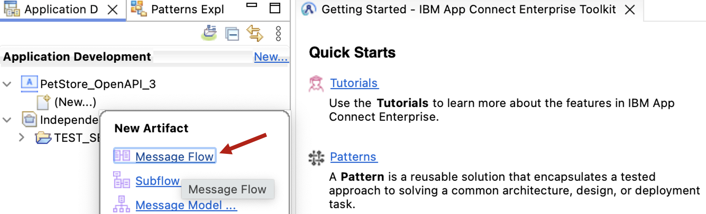

Name the Message FLow "PetStoreApi". <br>

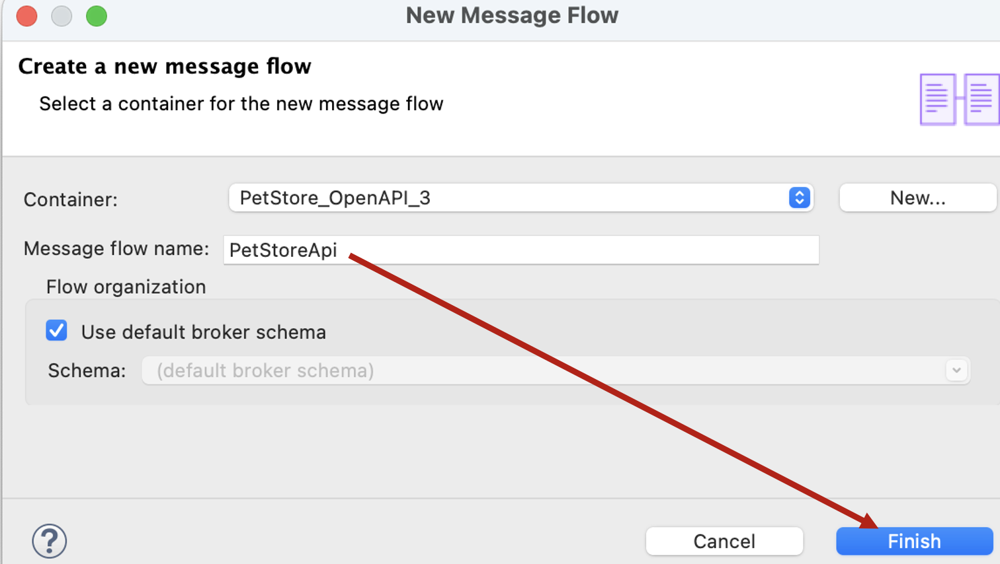

<br>

Let's drag HttpInput, HTTPReply nodes into the Message Flow canvas. <br>

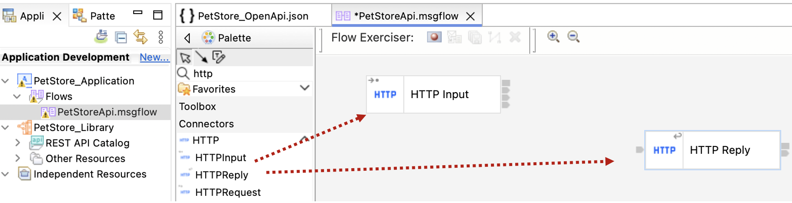

Now, locate and drag **getPetById** operation from the Petstore OpenApi specification. <br>

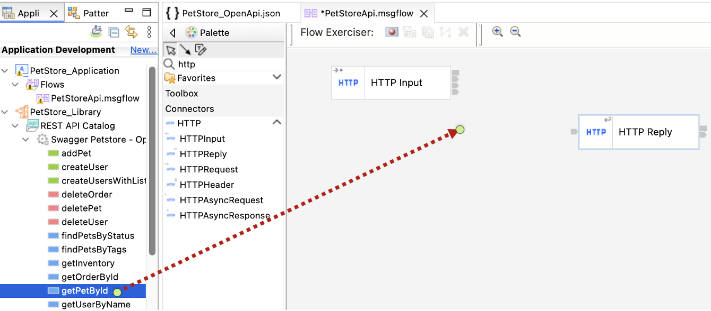

Click Yes to add the project reference. <br>

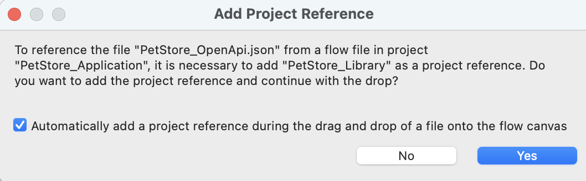

If nothing happens, drag getPetById operation again. It should create RESTRequest Node as below. <br>

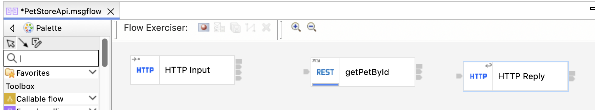

Wire the nodes as below. <br>

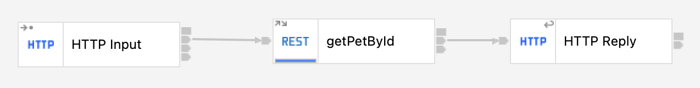


**Configure HTTPInput Node** <br>

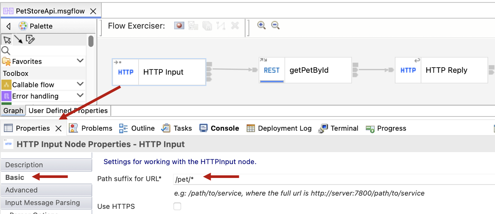

Check "Parse Query String" as below. <br>

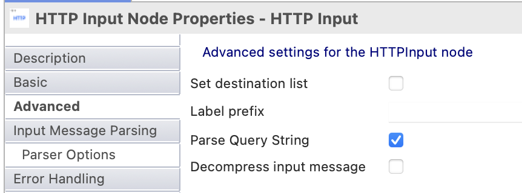

Set JSON for Error Handling. <br>

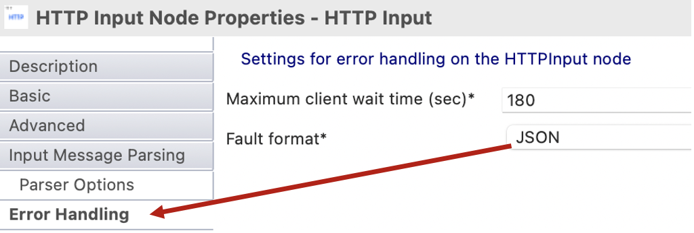

<br>

**Configure getPetById RESTRequest Node** <br>

Set "Base URL Override" as "https://petstore3.swagger.io/api/v3" without double quotes. <br>

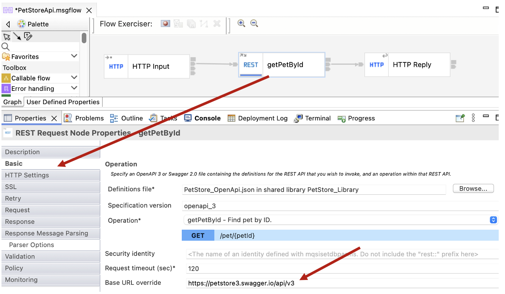

Set getPetById operation is expecting petId as a parameter, we will be passing as a query parameter in the URL, which will be set here. <br>

**$LocalEnvironment/HTTP/Input/QueryString/id**
Click on the 3 dots next to Expression, and navigate as below and double click *any then click \<Finish\>. <br
>
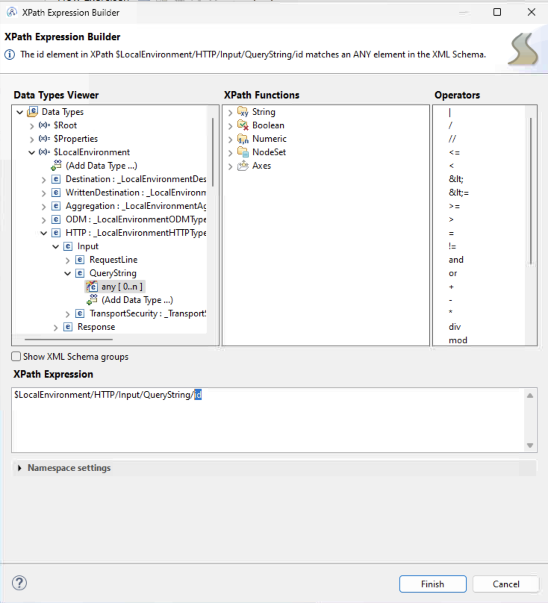

<br>
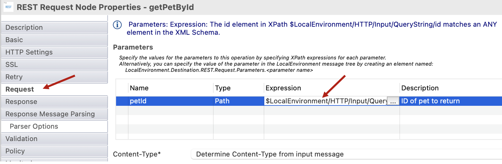

Hit Control +s to save the flow.<br>
<br>

## 4. Create Integration Server  <a name="is-create"></a>


Keep the default Integration Server TEST_SERVER then click \<Finish\>.

<br>

## 5. Deployment <a name="deploy"></a>

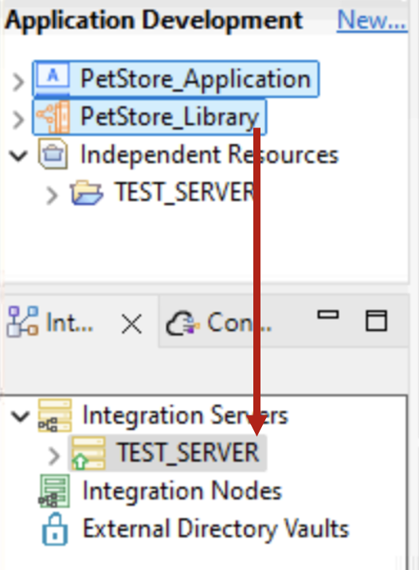


## 6. Test the API   <a name="testing"></a>

Open Command line from the Windows taskbar, then invoke your API. <br>

**curl http://localhost:7800/pet/?id=4**

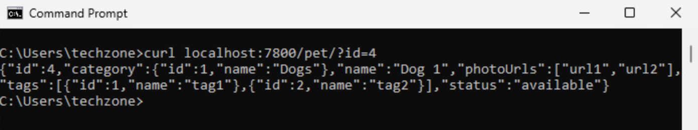

Congratulations, you have successfully invoked the external PetStore OpenAPI v3 from App Connect Toolkit using RESTRequest Node. <br>
<br>

## 7. References <a name="references"></a>

**Petstore OpenAPI 3.0:** <a href="https://petstore3.swagger.io/" target="_blank"> https://petstore3.swagger.io/ </a>
**HTTPInput Node:** <a href="https://www.ibm.com/docs/en/app-connect/13.0.x?topic=nodes-httpinput-node" target="_blank"> https://www.ibm.com/docs/en/app-connect/13.0.x?topic=nodes-httpinput-node </a>
**RESTRequest Node**:** <a href="https://www.ibm.com/docs/en/app-connect/13.0.x?topic=nodes-restrequest-node" target="_blank"> https://www.ibm.com/docs/en/app-connect/13.0.x?topic=nodes-restrequest-node </a>

Project Interchange: <br>
**Download Project Interchange** from [<b><u>HERE</u></b>](./resources/PetStoreApplication-PI.zip)
<br>


## 8. Additional Material  <a name="material"></a>

In real world scenario, the APIs being invoked are Certificate protected, hence you need to create a Truststore and refer the Truststore in server.conf.yaml JVM section. <br>

**Steps to create JKS** <br>
```
-- Get petstore3.swagger.io certificate

echo -n | openssl s_client -connect petstore3.swagger.io:443 -servername petstore3.swagger.io -showcerts | openssl x509 > petstore.crt

-- create p12 from crt
/usr/bin/keytool -import -noprompt -alias petstore -file petstore.crt -keystore petstore.p12 -storepass passw0rd

/usr/bin/keytool -importkeystore -srckeystore petstore.p12 \
        -srcstoretype PKCS12 \
        -destkeystore ace-petstore.jks \
        -deststoretype JKS \
        -srcstorepass passw0rd  \
        -deststorepass passw0rd \
        -noprompt
```

Update server.conf.yaml configuration:

```
JVM:
    truststoreType: 'JKS'
    truststoreFile: '/Users/sbodapati/xibm_ts/sb_demos/ace/samples/petstore/ace-petstore.jks'
    truststorePass: 'truststore_petstore::password'
```
You could use Vault or mqsisetdbparms to configure truststore passwrod. <br>
```
mqsisetdbparms ACENODE_LOCAL -n truststore_petstore::password -u dummy -p passw0rd
```

After JKS is created and server.conf.yaml is updated, you need to restart TEST_SERVER. <br>

<br><br><br>
**Congratulations**
<br>

[Go to Top](#introduction)

<br>

[Return to App Connect labs page](../../index.md)