# Using Basic Auth to send HTTP Requests to a back-end service with IBM App Connect Enterprise

[Return to App Connect labs page](../../index.md)

---

# Table of Contents
- [1. Introduction](#introduction)
- [2. Workshop Environment ](#env)
- [3. App Connect Toolkit](#toolkit)
  * [3a. Open Workspace](#open-workspace)
  * [3b. Create BACK_END Integration Server ](#create-is-backend)
  * [3c. Create FRONT_END Integration Server ](#create-is-frontend)
- [4. BACK_END Integration Server implementation](#backend-implement)
  * [4a. Enable Basic Auth for BACK_END Integration Server](#basicauth-enable-backend)
- [5. FRONT_END Integration Server implementation](#frontend-implement)
  * [5a. Create Vault](#create-vault)
  * [5b. Create Policy Project and Policy](#create-policy)  
  * [5c. Create FRONT_END Application](#new-app)  
  * [5d. Create Message Flow](#new-msgflow)  
- [6. Deployment](#deploy)
- [7. Test the API](#testing)
- [8. References ](#references)

---

<br>

## 1. Introduction <a name="introduction"></a>

This tutorial demonstrates how to send HTTP Request messages from a message flow running in ACE to a back-end web service which is secured using Basic Authentication. In ACE version 12.0.11 onwards a new policy type has been provided called HTTP Request and this can be used with the HTTP Request node. This is easier to use than the security profile, and the policy can be used to reference a credential in a vault if you are using Basic Auth or API Key credentials. The HTTP credential type can be dynamically be updated in a vault, and the new credential is used by a message flow without needing a restart of a flow or the Integration Server. <br>

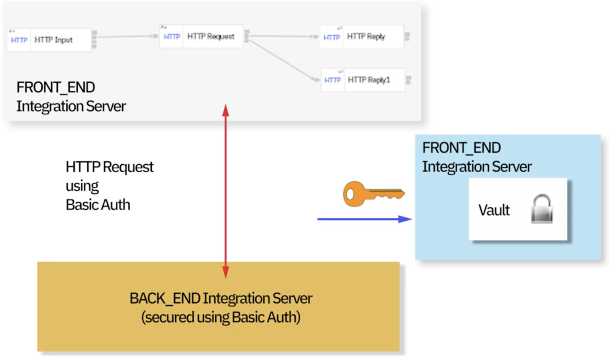

<br>


## 2. Workshop environment <a name="env"></a>

You will be doing this lab from the Windows VM. <br>


<br>


## 3. App Connect Toolkit <a name="toolkit"></a>

From the Windows VM, open IBM App Connect Enterprise Toolkit from the desktop. <br>

### 3a. Open Workspace <a name="open-workspace"></a>

Workspace: C:\Users\techzone\IBM\ACET13\workspace\HTTPRequest-BasicAuth <br>

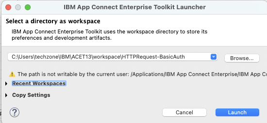

Launch the workspace, then close the welcome page. <br>


### 3b. Create BACK_END Integration Server <a name="create-is-backend"></a>

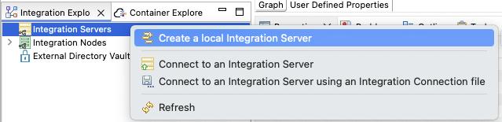

Set name to BACK_END, then click \<Finish\>. <br>

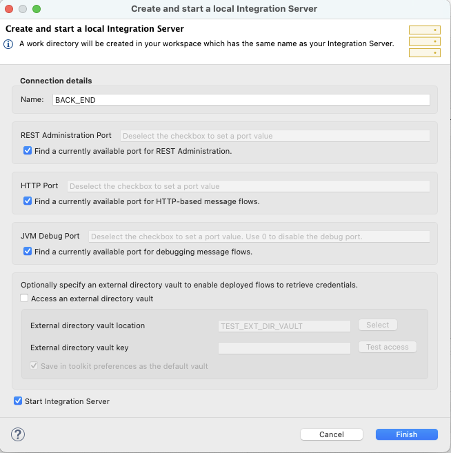


### 3c. Create FRONT_END Integration Server <a name="create-is-frontend"></a>

Repeat the above stepos, and create FRONT_END Integration server. <br><br>


## 4. BACK_END Integration Server Implementation <a name="backend-implement"></a>


### 4a. Enable Basic Auth for BACK_END Integration Server <a name="basicauth-enable-backend"></a>

Let's protect the BACK_END Integration Server with Basic Authentication. We first enable basicAuth to true, then create a credential. <br>

Open server.conf.yaml file. <br>

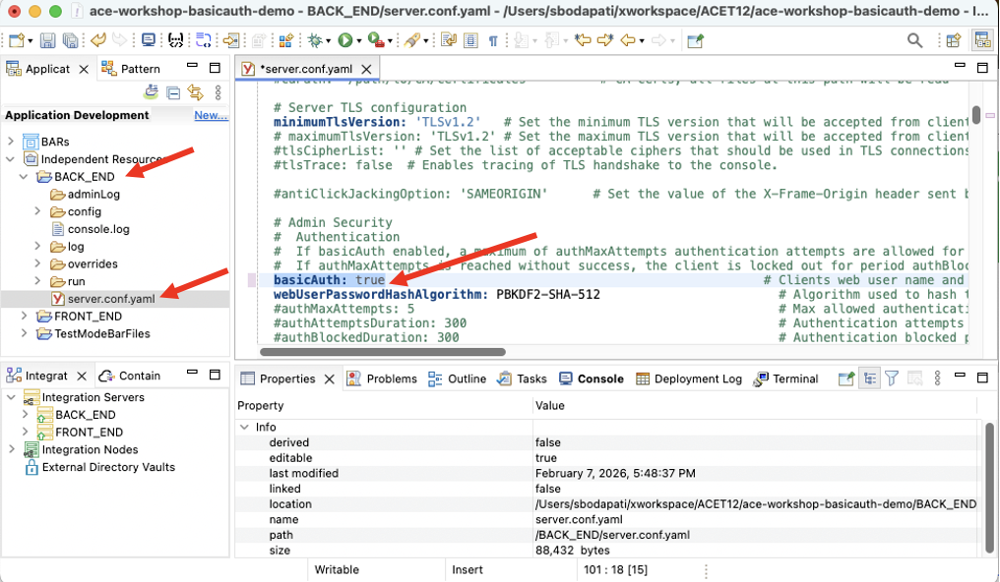

Uncomment basicAuth, and set the value to true, then save and close. <br>

Open a Terminal, navigate to Window > Show View > Other > Terminal, and click on Terminal to open. <br>

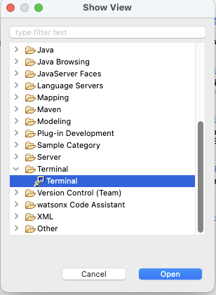

Click the Terminal icon to open a Terminal session. <br>

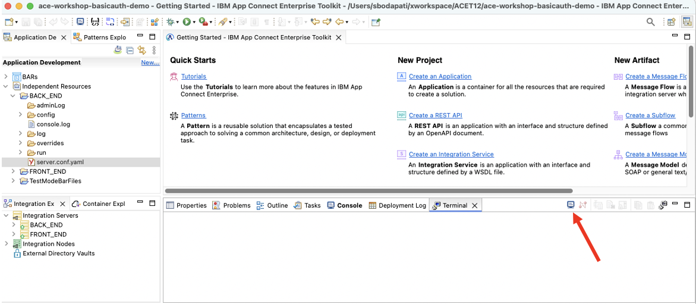

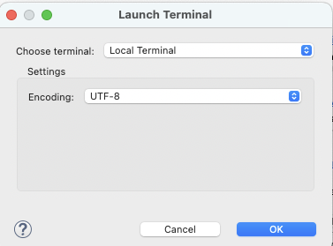

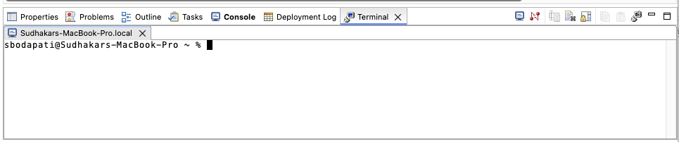

```
mqsiwebuseradmin -w C:\Users\techzone\IBM\ACET13\workspace\HTTPRequest-BasicAuth\BACK_END -u admin -a passw0rd -c
```

Restart BACK_END Integration server. <br>

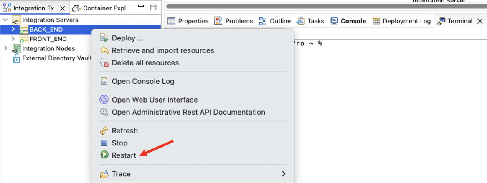

<br>
Open BACK_END Integration Server Web User Interface. <br>

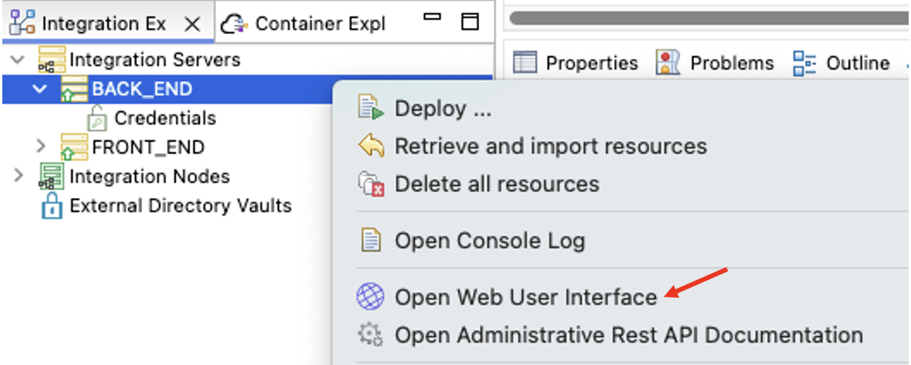

Login with the mqwebuseradmin credential you created above. <br>
Username: admin
Password: passw0rd. <br>

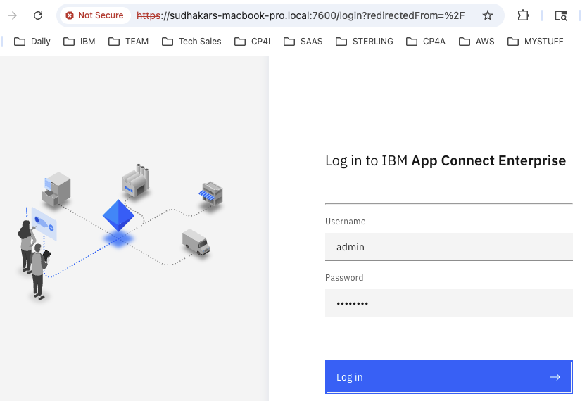

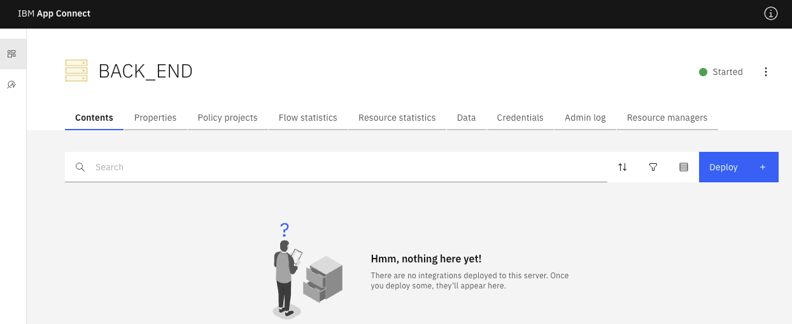

So, you have enable Basic Authentication for your Integration Server which was enabled with REST API's. <br>

Now, let's create FRONT_END Application, and an API to invoke the BACK)END. <br><br>


## 5. FRONT_END Integration Server Implementation <a name="frontend-implementation"></a>


### 5a. Create Vault <a name="create-vault"></a>

Stop the FRONT_END integration server. <br>

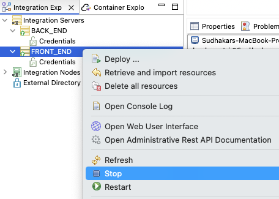


From the Terminal window, enter the below command. <br>
```
mqsivault --work-dir C:\Users\techzone\IBM\ACET13\workspace\HTTPRequest-BasicAuth/FRONT_END --create --vault-key myvaultkey
```

```
mqsicredentials --work-dir :\Users\techzone\IBM\ACET13\workspace\HTTPRequest-BasicAuth/FRONT_END --create --vault-key myvaultkey --credential-type http --credential-name basic_auth_cred --username admin --password passw0rd
```

Now, start the FRONT_END Integration Server. <br>

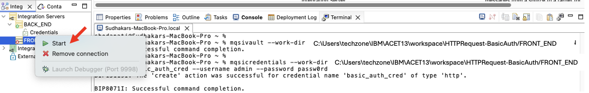
<br>
Enter "myvaultkey" for the password. <br>

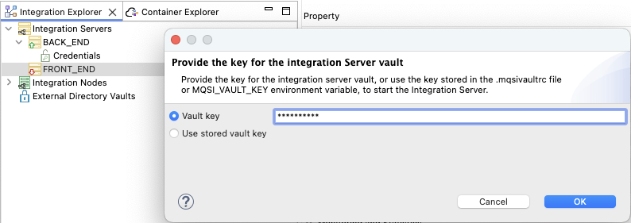


### 5b. Create Policy Project and Policy  <a name="create-policy"></a>

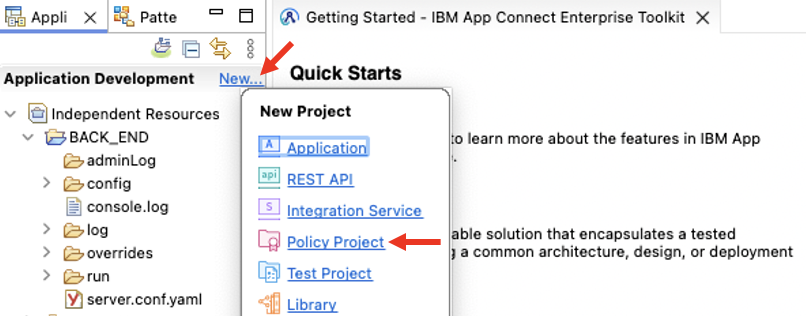

Call it MyPolicy_Project, then click \<Finish\>. <br>

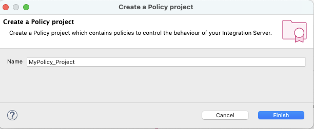

Create Policy. <br>

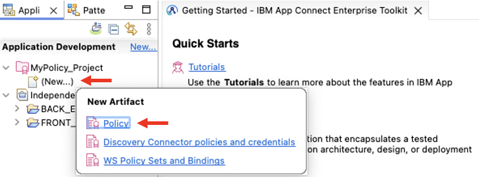

Call it HTTPRequest. <br>

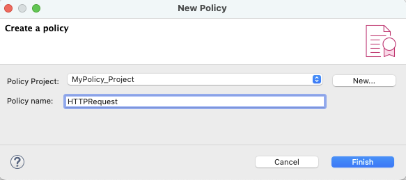

Pick HTTPRequest type, and set "Credential Name" to be basic_auth_cred. So, this policy will use the basic_auth_cred you created above. <br>

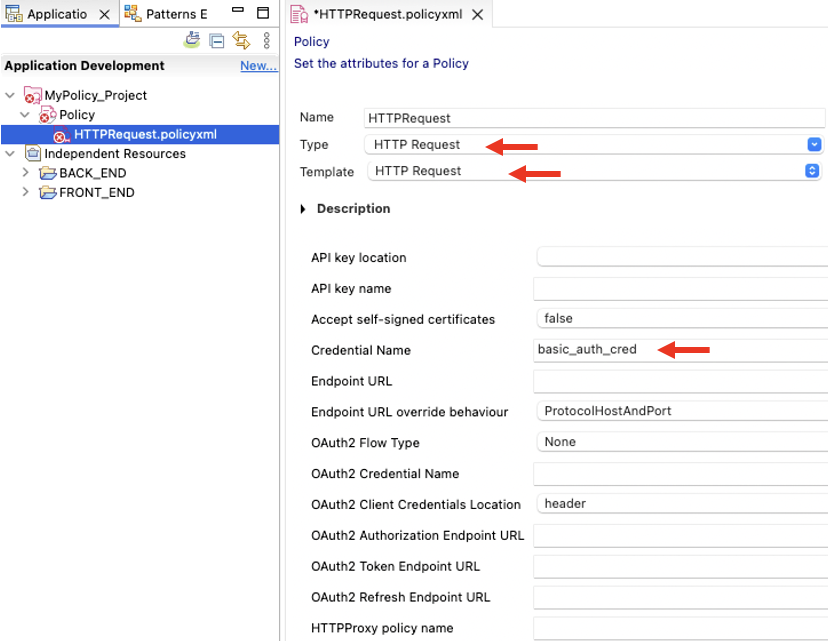


Save, and close the Policy. <br>


### 5c. Create FRONT_END Application <a name="new-app"></a>

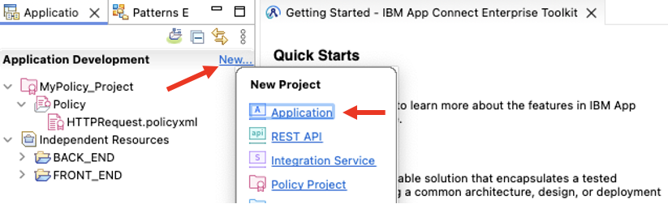

Name the application as "Basic_Auth_Demo". <br><br>


### 5d. Create Message Flow <a name="new-msgflow"></a>

New > Message Flow. <br>

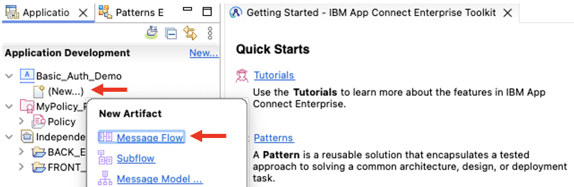

Name the Message FLow "Basic_Auth". <br>

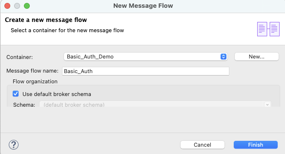

<br>

Let's drag HttpInput, HTTPRequest, HTTPReply, HTTPReply nodes into the Message Flow canvas, and wire them as below. <br>

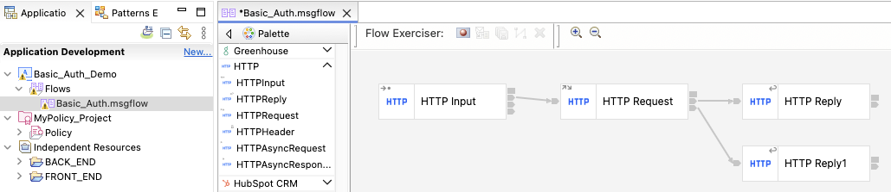


**Configure HTTPInput Node** <br>

Set the "Path Suffix for URL" as /basic_auth <br>

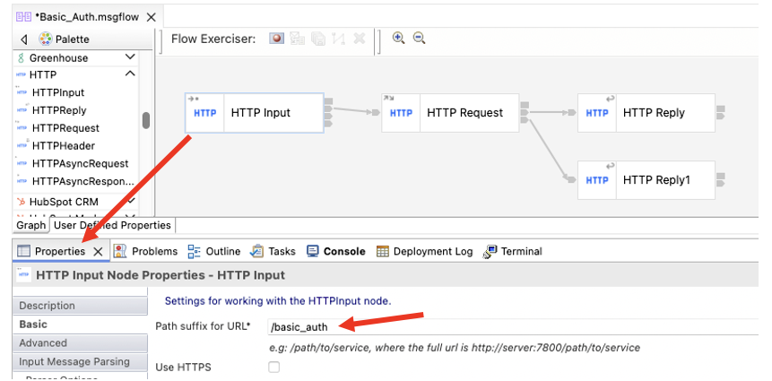


**Configure HTTPRequest Node** <br>

Basic tab, set "Web Service URL" as https://localhost:7600/apiv2 <br>

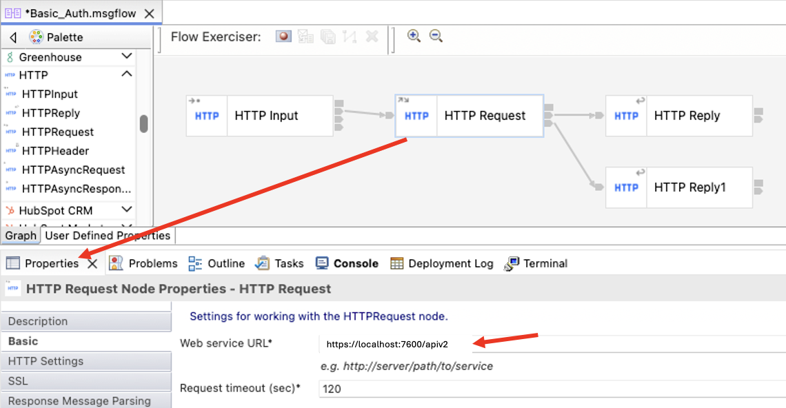

Click on "HTTP Settings" tab, then Select GET method. <br>

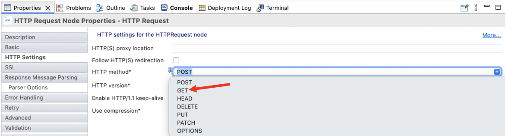

Click on SSL tab <br>

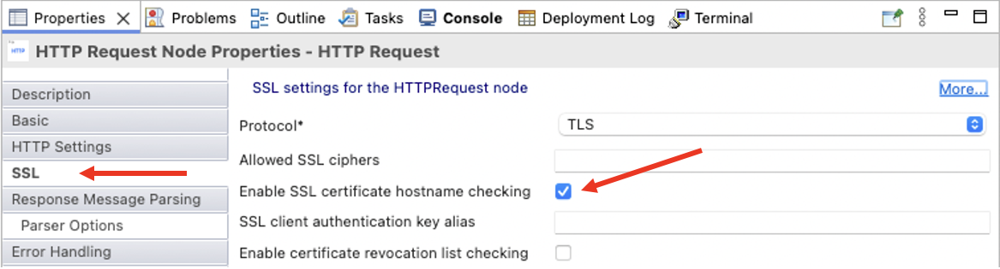


Click on "Policy" tab, and browse to choose HTTPRequest Policy that you created above. <br>

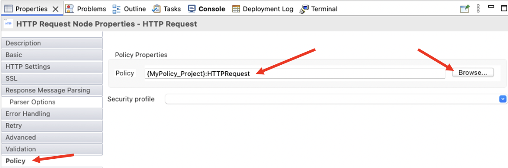

Save the flow by hitting Control + s. <br>

Hit Control +s to save the flow.<br>

<br>


## 6. Deployment   <a name="deploy"></a>

Drag and drop the Policy Project. <br>

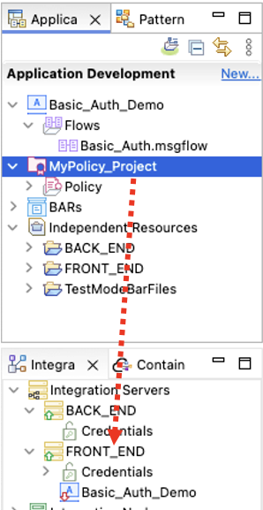
<br><br>


## 7. Test the API   <a name="testing"></a>

Use the Flow Exerciser to test the API. <br>

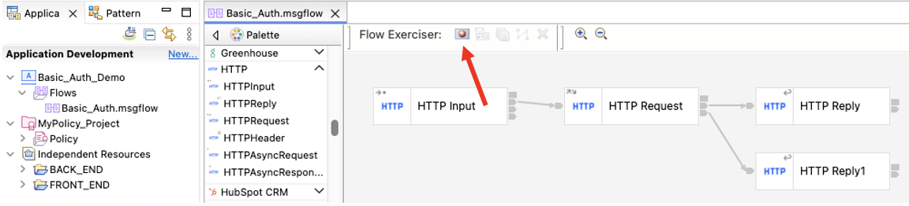

Pick FRONT_END Integration server as the runtime. <br>

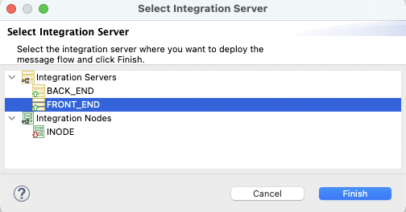

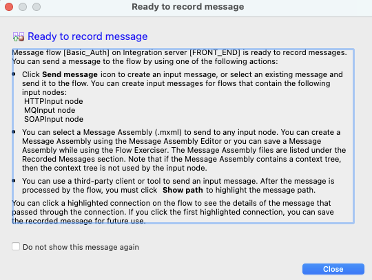

Click "New Message" icon. <br>

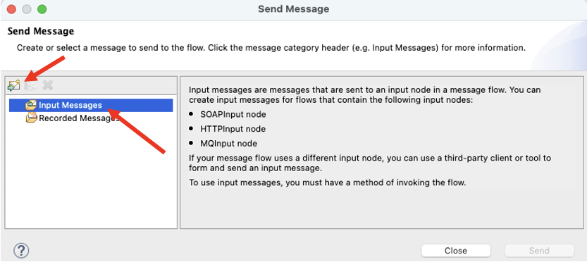

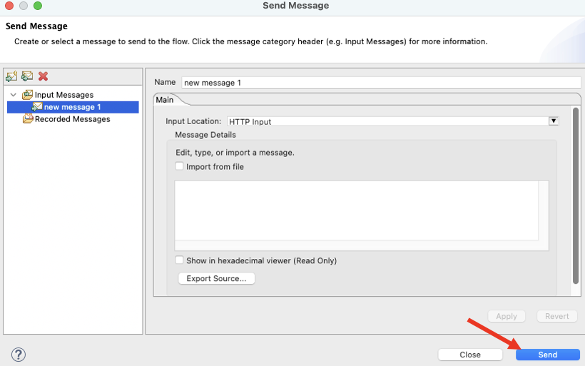


If successful, you should a response like below. <br>

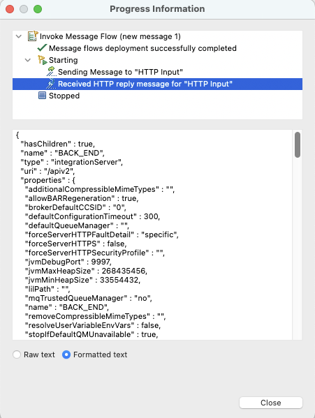

<br>


## 8. References <a name="references"></a>

Using Basic Auth to send HTTP Requests to a back-end service with IBM App Connect Enterprise 12.0.11:
<a href="https://www.youtube.com/watch?v=Tu3nfUmcvjU&list=PL_4RxtD-BL5tKxx9GiR2BH146ZUC21cOp&index=36" target="_blank"> https://www.youtube.com/watch?v=Tu3nfUmcvjU&list=PL_4RxtD-BL5tKxx9GiR2BH146ZUC21cOp&index=36 </a>


<br><br><br>
**Congratulations**
<br>

[Go to Top](#introduction)

<br>

[Return to App Connect labs page](../../index.md)