# App Connect Salesforce Discovery Connector

[Return to App Connect labs page](../../index.md)

---

# Table of Contents
- [1. Introduction](#introduction)
- [2. Workshop Environment](#workshop-env)
- [3. App Connect Toolkit](#toolkit)
  * [3a. Create new application](#new-application)
  * [3b. Configure HttpInput Node](#configure-httpinput)
  * [3c. Configure SalesforceRequest Node](#configure-sfrequest)
- [4. Deployment](#deployment)
- [5. Testing ](#testing)
- [6. Summary ](#summary)

---

<br>

## 1. Introduction <a name="introduction"></a>

In this lab, you will explore App Connect Enterprise (ACE) Toolkit's Salesforce Discovery Connector. A discovery connector node is a connector node that contains properties whose values are set through a process of connector discovery, by using the Connector Discovery wizard that is provided with the IBM® App Connect Enterprise Toolkit. <br>
Reference: https://www.ibm.com/docs/en/app-connect/13.0.x?topic=use-discovery-connector-nodes


## 2. Workshop Environments  <a name="workshop-env"></a>

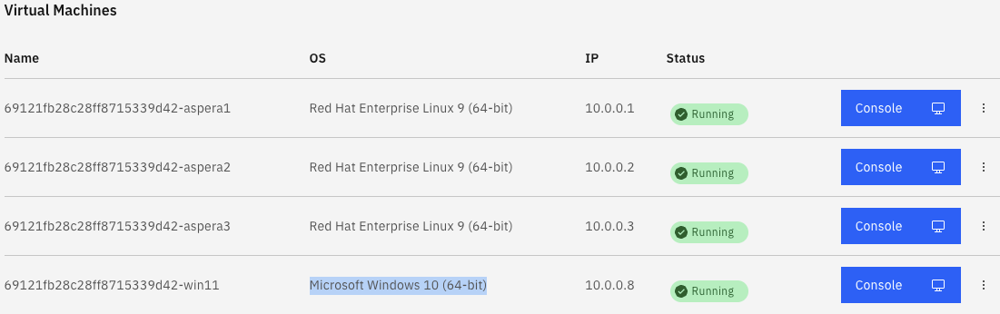

You will be doing this lab from the Windows VM. <br>


## 3. App Connect Toolkit <a name="toolkit"></a>

Open IBM App Connect Toolkit, create workspace discovery_connectors. <br>
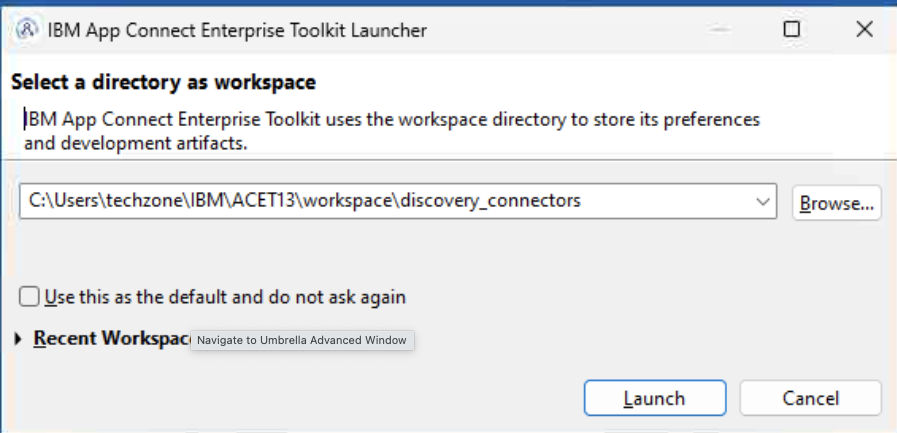

You will be greeted with the IBM App Connect Enterprise Toolkit Welcome page. <br>


### 3a. Create new application <a name="new-application"></a>

Application name: DiscoveryConnector_App <br>

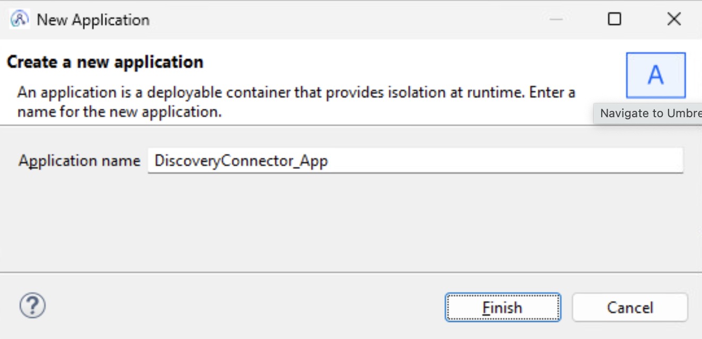

Create New Message Flow, call it Salesforce_Contacts_API <br>
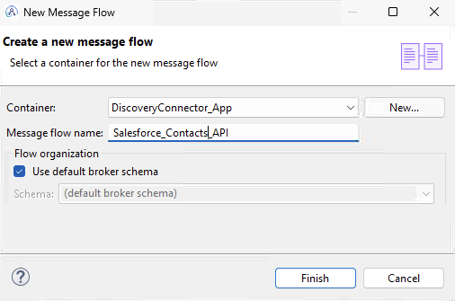

Drag HttpInput, HttpReply, and SalesforceRequest Nodes into the Message flow canvas, and wire them as below. <br>

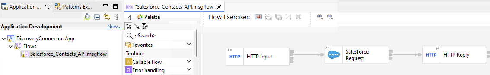


### 3b. Configure HttpInput Node <a name="configure-httpinput"></a>
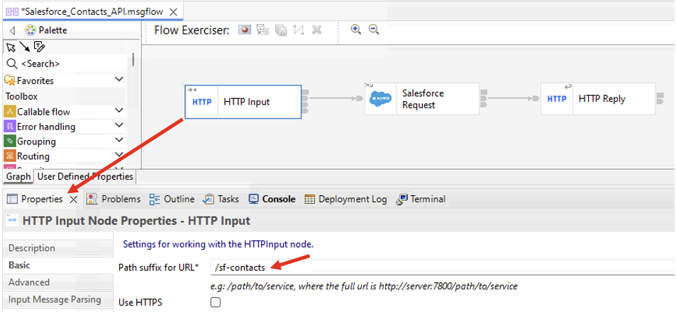

Under the Advanced Tab, check "Set destination list", "Parse query string" options. <br>
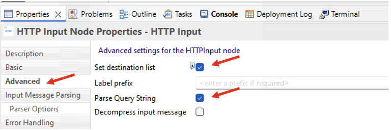


### 3c. Configure SalesforceRequest Node <a name="configure-sfrequest"></a>

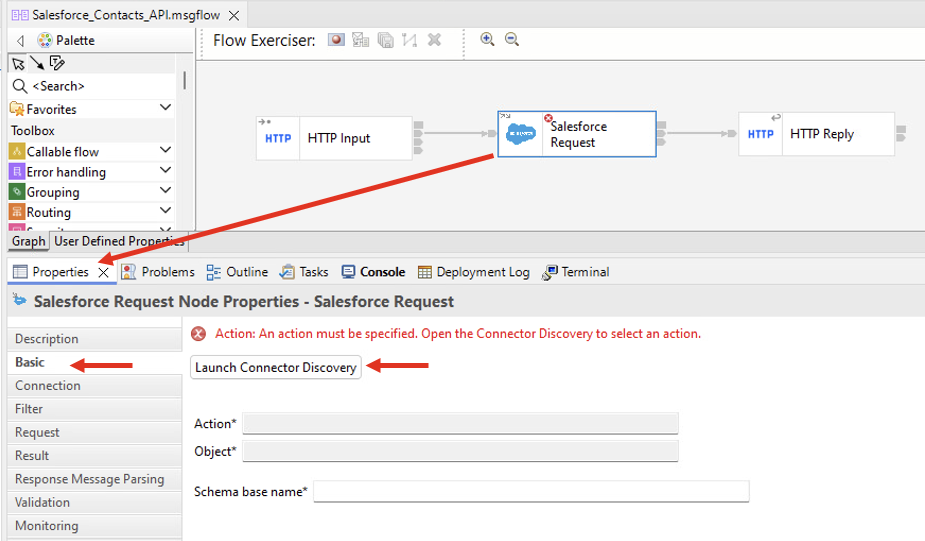

New Policy Project. <br>
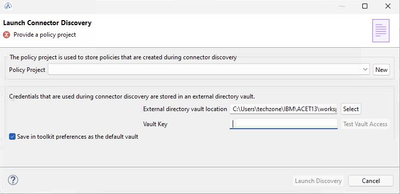

Call it MyPolicies Project. <br>
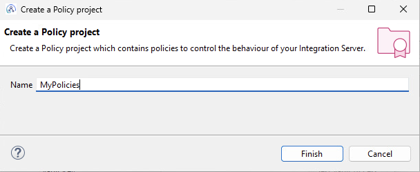

Setup Vault password as passw0rd then, hit "Create an external directory vault". <br>
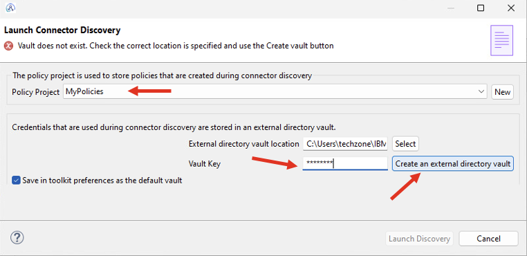

Hit "Launch Discovery" <br>
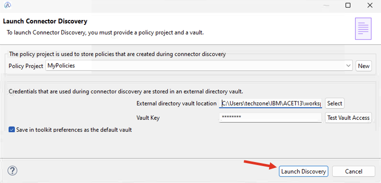

Salesforce Connector Discovery wizard should be opened. 
**Note:** If you see Allow websites, then just Allow. <br>
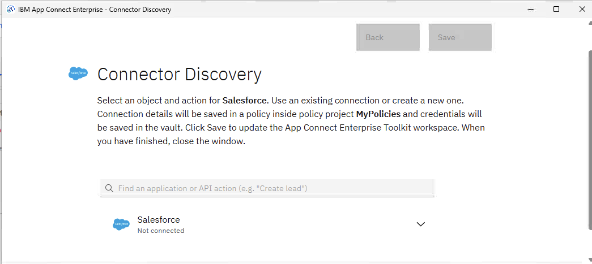

Now, expand Salesforce > Contacts, and then select "Retrieve Contacts". <br>
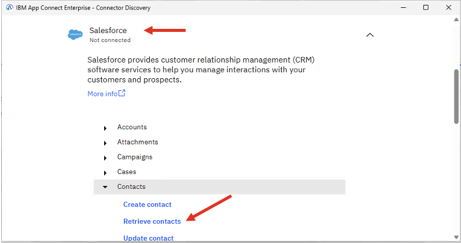

Click Connect. <br>
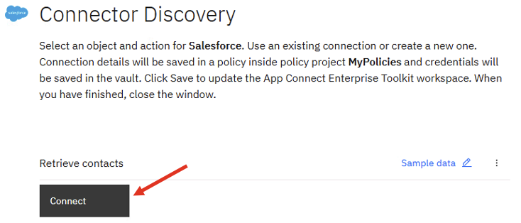

If you have Salesforce credentials you could use them, it not use instructor provided SF credentials. Configure as below. <br>
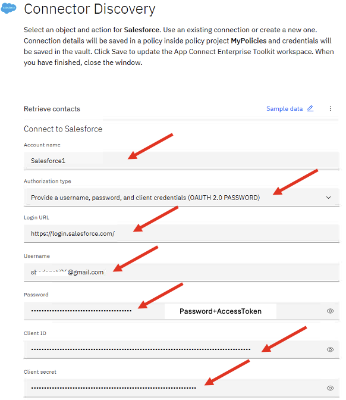
Scroll down, and click "Connect" in the bottom of the wizard. <br>

Now, click on "Add Condition" to add a filter criteria to select a contact by the Contact ID. <br>
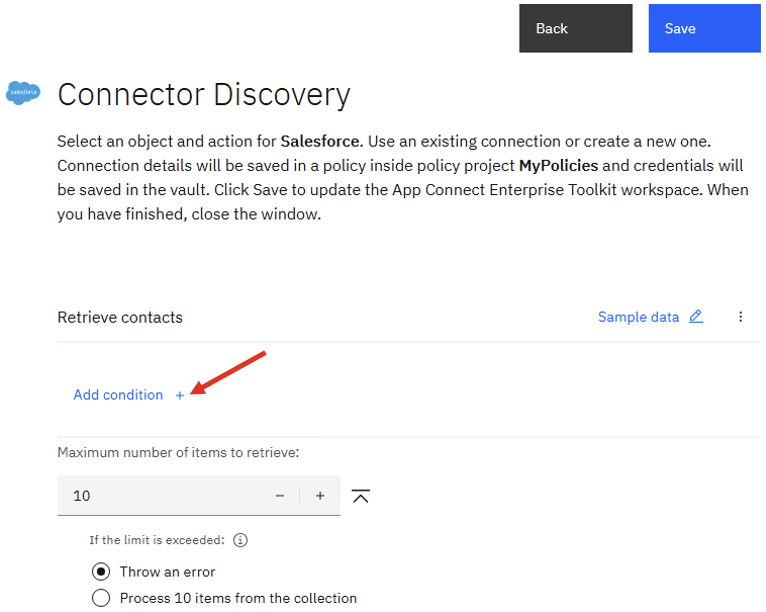

Select "Contact ID" from the dropdown then copy/paste the below. In the below path, "id" is the Salesforce Contact ID, which will be supplied as a Query parameter.
```
[[$LocalEnvironment/HTTP/Input/QueryString/id]]
```
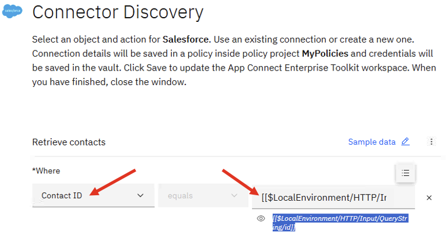

Click Save, then close the Connector Discovery wizard. <br>
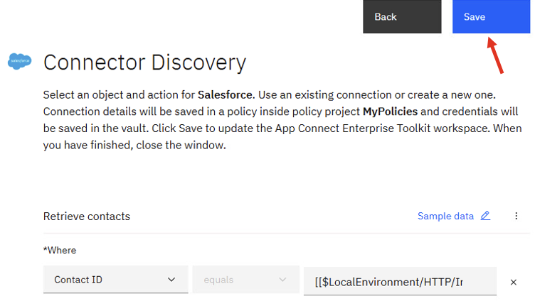
That should take you back to the Toolkit, SalesforceRequest node Properties. Just check the filter, and other tabs. <br>

SAVE the flow by using Ctrl+s or File > Save. <br>

Now our flow is ready to be deployed and tested. <br><br>


## 4. Deployment <a name="deployment"></a>

Create a Local Integration Server. <br>
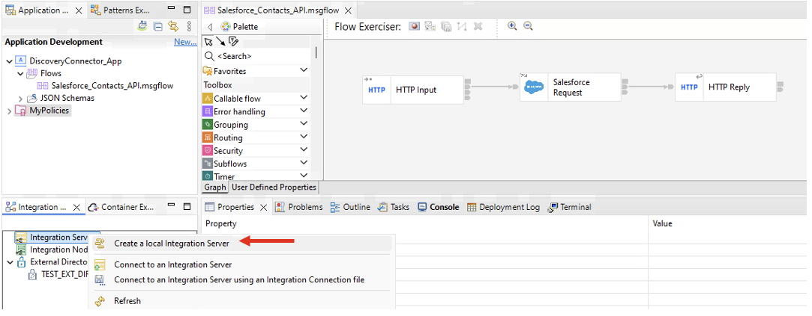

Choose the defaults, and click Finish. <br>
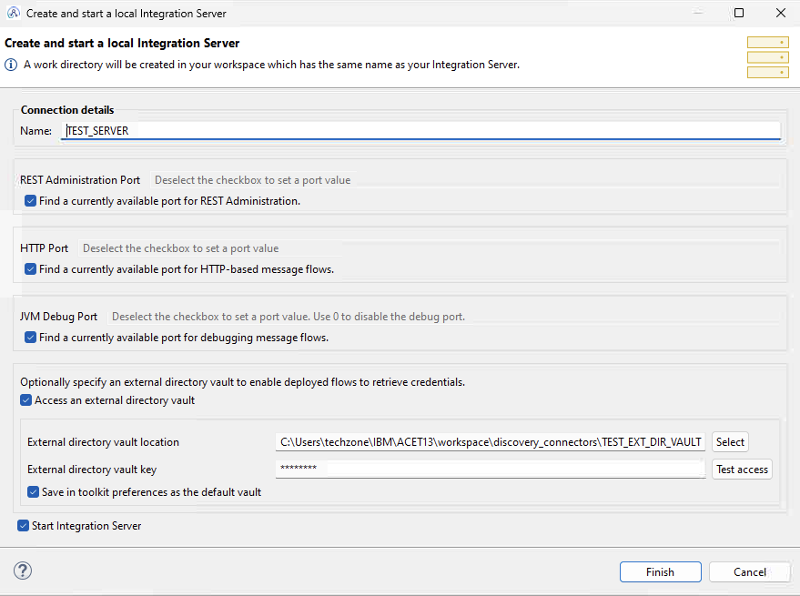

Drag and drop MyPolicies project into the Integration Server TEST_SERVER. <br>
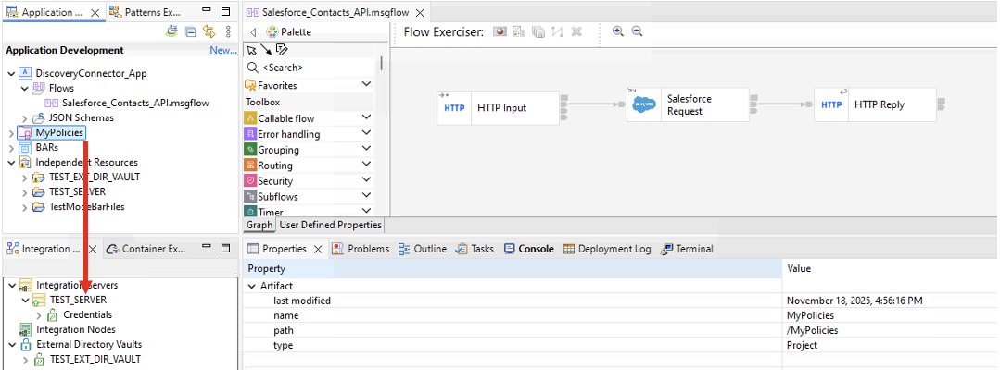
<br>

Similarly, drag and drop DiscoveryConnector_App project into the Integration Server TEST_SERVER as well. <br>


## 5. Testing <a name="testing"></a>
Now, lets use the curl command to test the API. <br>

Open a Terminal view by navigating the menu, Window > Show View > Other  > Terminal > Terminal and open. <br>

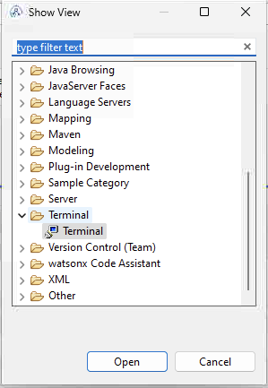

Click the Terminal button, then choose local terminal and then Ok.<br>

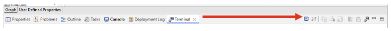


```
curl localhost:7800/sf-contacts?id=0034T000006ObRrQAK
```
Note: In above, it's a sample Contact ID, but you could use a different Contact ID that you can look in Salesforce. <br>

If successful, you should receive the Contact details as below. <br>
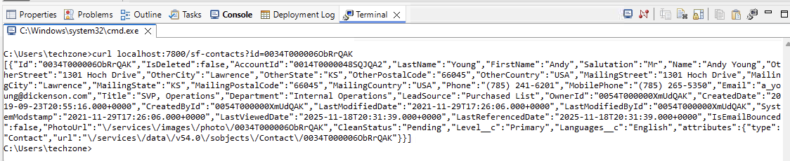

<!--
## 3. Test with Flow Exerciser <a name="create-application"></a>

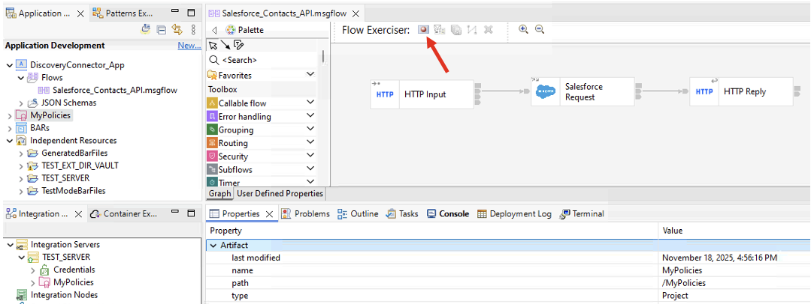

Now, click "Send message to the flow". <br>
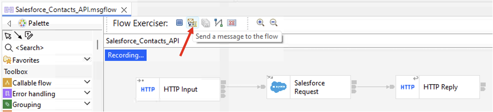

Select "Input Message", then click "New Message". <br>
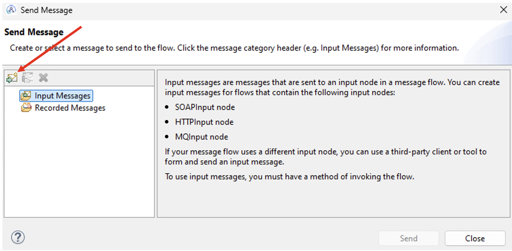
-->

## 6. Summary <a name="summary"></a>

Congratulations! You have successfully explored Salesforce Discovery Connector from IBM App Connect Toolkit.

<br>

[Go to Top](#introduction)

<br>

[Return to App Connect labs page](../../index.md)