# Databases - Using a Compute node to insert data into a MSSQL database via ODBC

[Return to App Connect labs page](../../index.md)

---

# Table of Contents
- [1. Introduction](#introduction)
- [2. Workshop Environment](#workshop-env)
- [3. MSSQL database setup](#mssql-db)
  * [3a. Install and run MSSQL container](#mssql-db-install)
  * [3b. Create HRDB DB and EMPLOYEES table](#hrdb-create)
  * [3c. Create HRDB ODBC datasource](#hrdb-datasource)
- [4. App Connect Toolkit](#toolkit)
  * [4a. Import Tutorial](#tutorial-import)
  * [4b. Configure Compute Node - Datasource](#config-compute)
  * [3c. Create HRDB ODBC datasource](#hrdb-datasource)
- [5. Integration Server & Vault](#is-vault)
  * [5a. Create Integration Server](#is-create)
  * [5b. Create ODBC Credential](#create-odbc-cred)
- [6. Deployment ](#deploy)
- [7. Test the Flow ](#testing)
  * [7a. Send a message ](#send-msg)
  * [7b. Verify the record in EMPLOYEES table](#verify)
- [8. Summary ](#summary)
- [9. CP4I - Deploying to Cloud Pak for Integration ](#cp4i-deploy)
  * [9a. Export Vault Archive](#export-vault-archive)
  * [9b. Logon to ACE Dashboard (CP4I)](#ace-dashboard)
  * [9c. Create odbc.ini Configuration](#odbcini-config)
  * [9d. Create Vault Archive Configuration](#vault-archive-config)
  * [9e. Create Vault Archive Key Configuration](#vault-archive-key-config)
  * [9f. Import BAR File](#import-barfile)
  * [9g. Create Integration Runtime](#is-create)
- [10. CP4I - Test the Flow](#cp4i-test-flow)
  * [10a. Insert sample records](#sample-records)
  * [10b. Verify records in MSSQL DB ](#verify-records-2)
- [11. Project Interchange](#pi)

---

<br>

## 1. Introduction <a name="introduction"></a>

In this lab, you will acquire the knowledge necessary to construct an App Connect Message Flow that interfaces with an MSSQL database via ODBC for the purpose of inserting records into the EMPLOYEES table.  <br>


## 2. Workshop Environment <a name="workshop-env"></a>


You will be doing the lab from the Windows Virtual Machine. <br>
<br>


## 3. MSSQL database setup <a name="mssql-db"></a>

In this step, you will install MSSQL database in podman as a container, then create HRDB and EMPLOYEES table. <br>

### 3a. Install and run MSSQL Container <a name="mssql-db-install"></a>

Use putty program and logon to acemq2 server with credentials ibmuser/engageibm. <br>

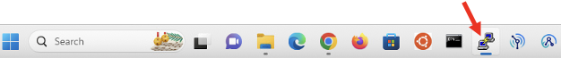

Run the following commands to install, and run MSSQL Container image.<br>

```
docker pull mcr.microsoft.com/mssql/server
```
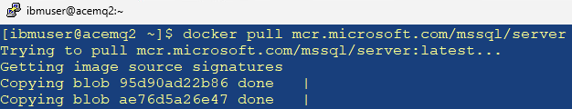

```
docker pull mcr.microsoft.com/mssql/server
```
```
docker images
```
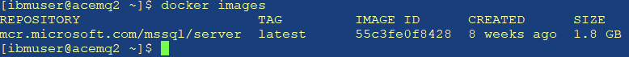

Let's run the MSSQL database as a Container. <br>
```
docker run -d --restart unless-stopped --name mssql -e "ACCEPT_EULA=Y" -e "SA_PASSWORD=engage@IBM" -e "MSSQL_PID=Enterprise" -p 1433:1433 -d mcr.microsoft.com/mssql/server
```
Note that the default user is "sa" and the password is engage@IBM. Port is 1433. <br>

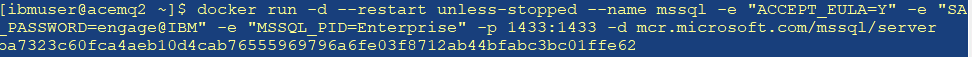


### 3b. Create HRDB DB and EMPLOYEES table <a name="hrdb-create"></a>

Run the following commands to create HRDB and EMPLOYEES table. <br>

```
docker exec -it --user root mssql bash 

-- sqlcmd command line
/opt/mssql-tools18/bin/sqlcmd -U sa -P engage@IBM -C
-- CREATE HRDB database
1> create database HRDB
2> Go
1> use HRDB
2> go
1> CREATE TABLE EMPLOYEES (PKEY INT PRIMARY KEY, FIRSTNAME VARCHAR(50) NOT NULL, LASTNAME VARCHAR(50) NOT NULL, COUNTRY VARCHAR(25));
6:46
1> quit
```
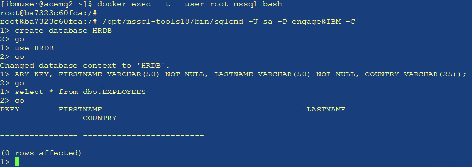

Now, the HRDB database and EMPLOYEES table are ready to be accessed. <br>


### 3c. Create HRDB ODBC datasource  <a name="hrdb-datasource"></a>

From the Windows Taskbar, search for ODBC then open "ODBC Data Sources (64-bit)" program. <br>


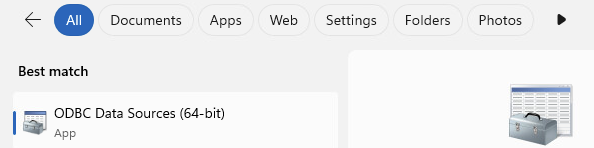

Click "System DSN" tab, then click \<Add\>. <br>

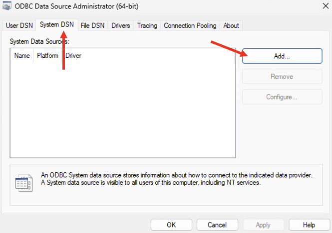

Click "ODBC Driver 18 for SQL Server". <br>

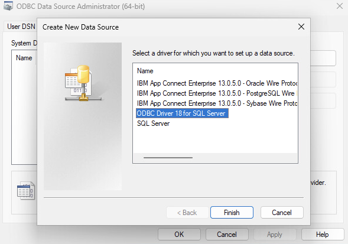

Enter acemq2,1433 for the Server field. <br>

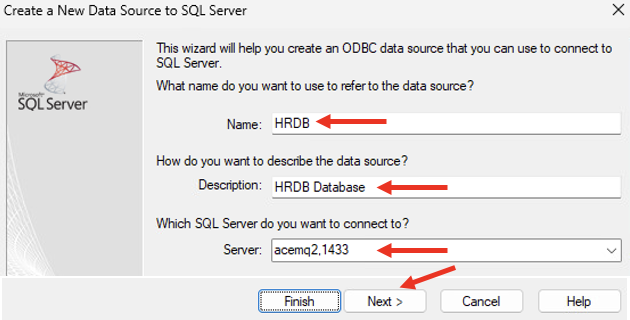

Enter sa,engage@IBM for user, password fields. This user/password is populated just to test the ODBC connectivity in here and they are not being used by the Application (ACE Flow). <br>

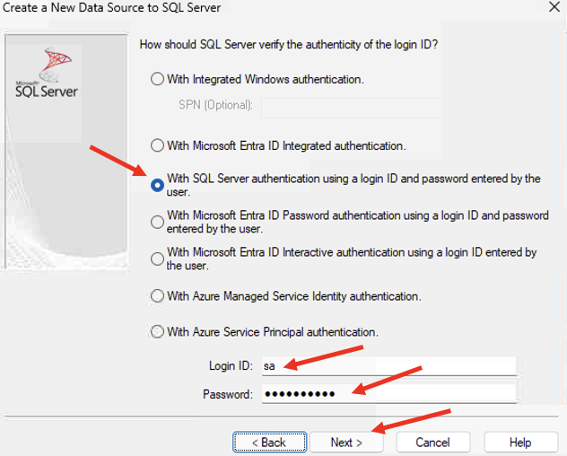

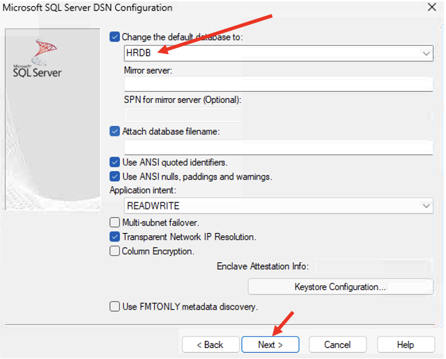

Click "Trust Certificate". <br>

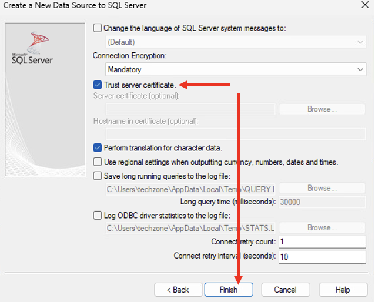


Test datasource. <br>

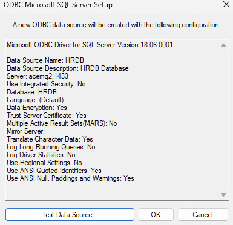

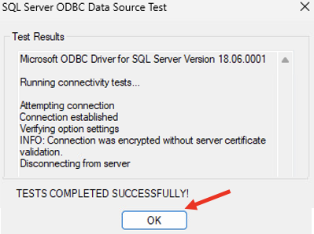

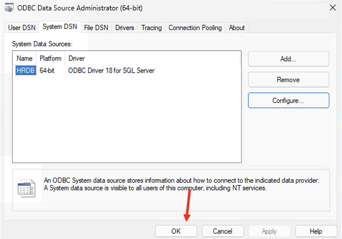

<br>


## 4. App Connect Toolkit <a name="toolkit"></a>

Open IBM App Connect Toolkit, and workspace /home/<user>/workspace/ace-workshop. <br>

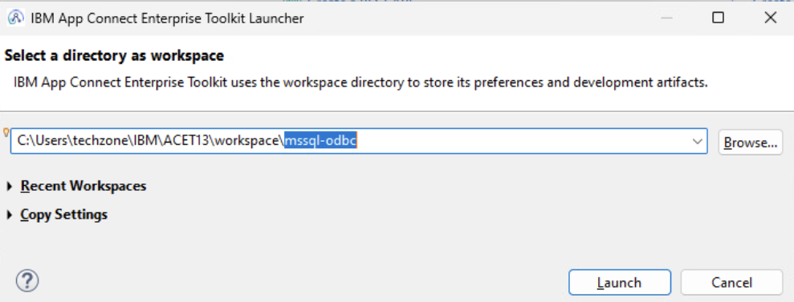


You will be greeted with the IBM App Connect Enterprise Toolkit Welcome page. Close it. <br>


### 4a. Import Tutorial <a name="tutorial-import"></a>

Let's reuse a Tutorial template and customize to access MSSQL database. <br>

Click on Tutorials. You can also navigate to Tutorials from the Toolbar menu Help > Tutorial Gallery. <br>

Search for ODBC. <br>
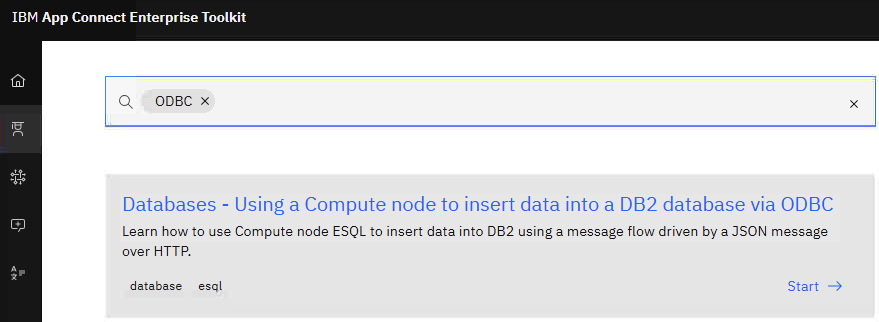

Select "Databases - Using a Compute node to insert data into a DB2 database via ODBC", then click \<Start\> button then <\Import\> button. <br>

It will open DatabaseCompute.msgflow as below. <br>

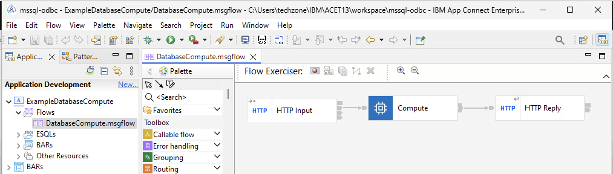


### 4b. Configure Compute Node - Datasource  <a name="config-compute"></a>

Change datasource to HRDB, that was configured in the previous step. <br>

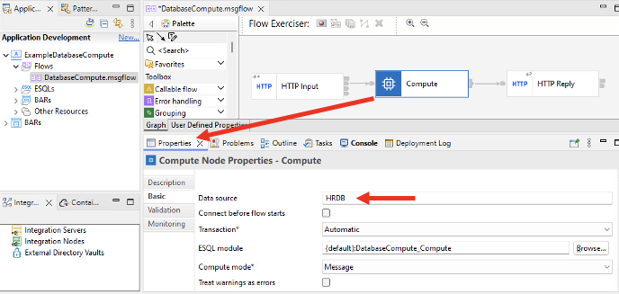

Change MYSCHEMA to dbo (the default MSSQL schema). <br>

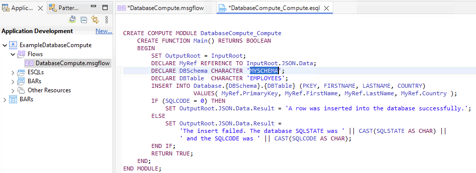

Changed to dbo schema. <br>

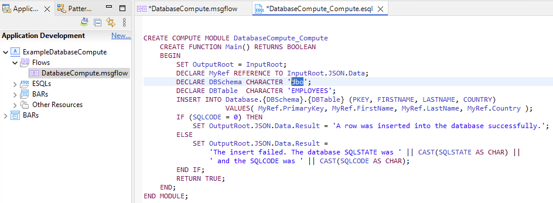

Save ESQL, and message flow. <br><br>


## 5. Integration Server & Vault <a name="is-vault"></a>

In this step, you will create an Integration Server and then create Vault to store the MSSQL database OBBC datasource credentials. These credentials will be used by the Datasource. <br>

### 5a. Create Integration Server <a name="is-create"></a>

Create TEST_SERVER with Vault. <br>

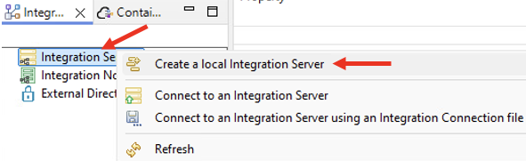

Enter Vault password as passw0rd. <br>

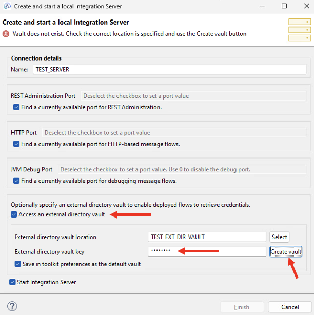

Click \<Finish\>. <br>


### 5b. Create ODBC Credential <a name="create-odbc-cred"></a>

Right click and create ODBC type credential as below. <br>


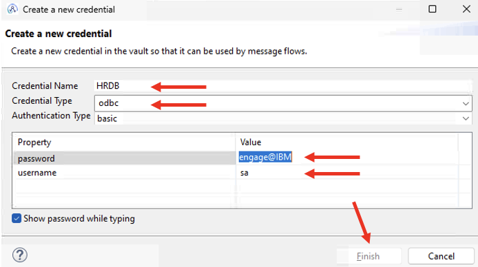

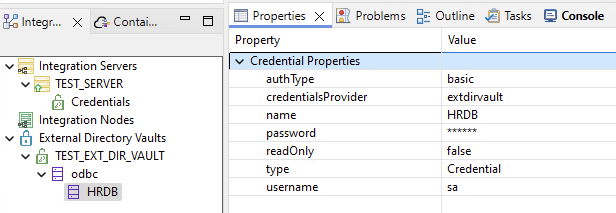

<br>


## 6. Deployment <a name="deploy"></a>

Drag-n-drop ExampleDatabaseCompute to TEST_SERVER integration server. <br>

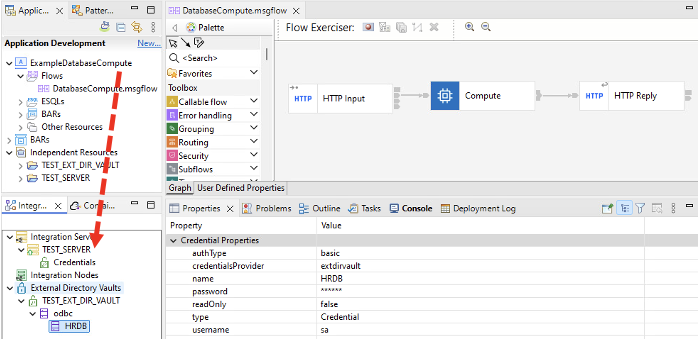


## 7. Test the Flow <a name="testing"></a>

Now, let's test and make sure the flow is working as expected. <br>

### 7a. Send a message <a name="send-msg"></a>

Let's use the Flow Exerciser to test the flow. <br>

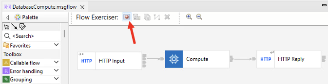

Confirm Yes to redeploy. <br>

Send a message to the flow. <br>

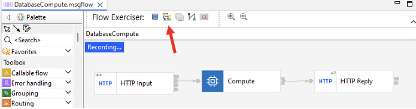

Send the first message to be inserted into the EMPLOYEES table. <br>

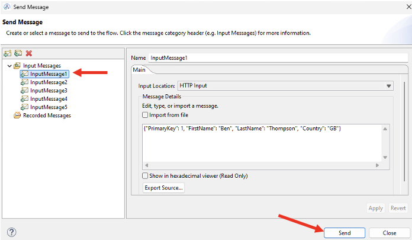

Check the results. <br>

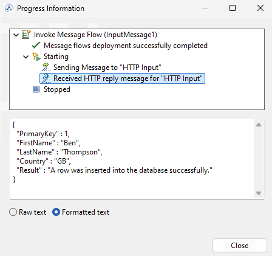
<br>


### 7b. Verify the record in EMPLOYEES table <a name="verify"></a>

From acemq2 (Putty), verify the records. <br>

```
select * from dbo.EMPLOYEES
go
```
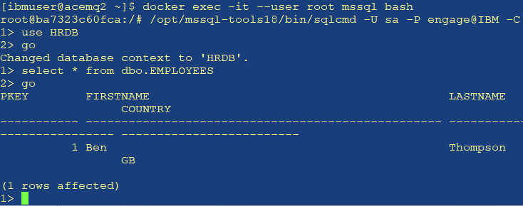

Send few more messages as above. <br>

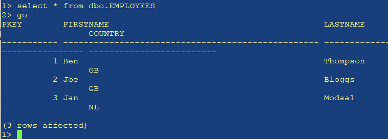

<br>


## 8. Summary <a name="summary"></a>

Congratulations! You have successfully connected to the MSSQL HRDB database and inserted records into the EMPLOYEES table utilizing ODBC within the APP Connect Toolkit Message flow. 
<br>

<br>

**NOTE:** Do the below steps if you are deploying to App Connect on Containers. <br>
<br>

## 9. CP4I - Deploying to Cloud Pak for Integration <a name="cp4i-deploy"></a>

Let's use the below steps to create configurations needed, then deploy our flow. <br>

### 9a. Export Vault Archive <a name="export-vault-archive"></a>

Close and reopen the Toolkit if already opened. This will stop the TEST_SERVER. TEST_SERVER must be stopped inorder to export Vault Credentials. <br> 

From the Toolkit's Terminal view, run the below commands. <br>

```
ibmint export credentials  --external-directory-vault C:\Users\techzone\IBM\ACET13\workspace\mssql-odbc\TEST_EXT_DIR_VAULT --external-directory-vault-key passw0rd --archive-location C:\Users\techzone\Downloads\extdir_archive.zip --archive-key passw0rd
```

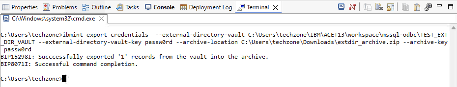


### 9b. Logon to ACE Dashboard (CP4I) <a name="ace-dashboard"></a>

Your lab instructor will provide Cloud Pak for Integration Portal URL. Use that URL and open App Connect Dashboard and login with your student credentials. 
<br>

### 9c. Create odbc.ini Configuration <a name="odbcini-config"></a>

Once you logon to ACE Dashboard, use the below steps to create an odbc.ini configuration. <br>

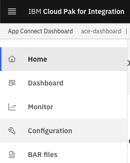

Click the Configurations tab on the left side bar. <br>

Click on \<Create configurations\> then create odbc.ini Configuration as below. <br>


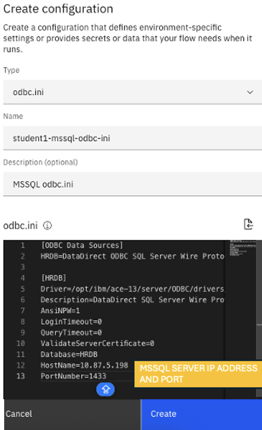

```
[ODBC Data Sources]
HRDB=DataDirect ODBC SQL Server Wire Protocol

[HRDB]
Driver=/opt/ibm/ace-13/server/ODBC/drivers/lib/UKsqls95.so
Description=DataDirect SQL Server Wire Protocol
AnsiNPW=1
LoginTimeout=0
QueryTimeout=0
ValidateServerCertificate=0
Database=HRDB
HostName=10.87.5.198
PortNumber=1433
```

### 9d. Create Vault Archive Configuration <a name="ault-archive-config"></a>

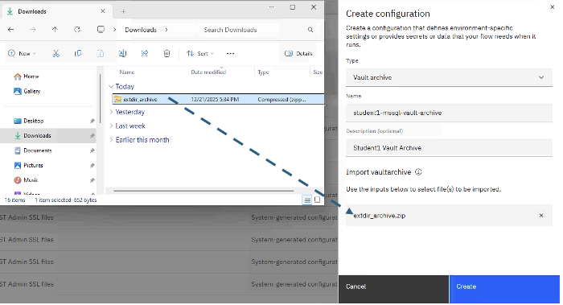


### 9e. Create Vault Archive Key Configuration <a name="vault-archive-key-config"></a>

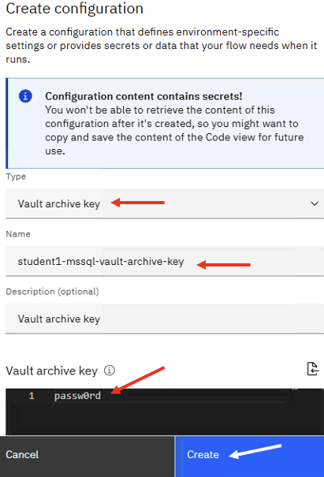

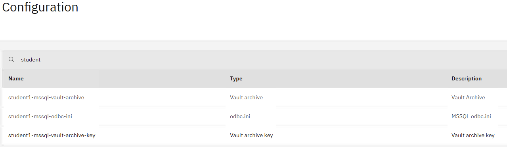

### 9f. Import BAR File <a name="import-barfile"></a>

On the App Connect Dashboard, click on Bar Files tab. <br>

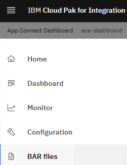

Click on \<Import BAR File\>. <br>

Now, drag-n-drop the generated bar file from the Toolkit. You can rename the Bar file in the Toolkit if you prefer a shorter name. <br>
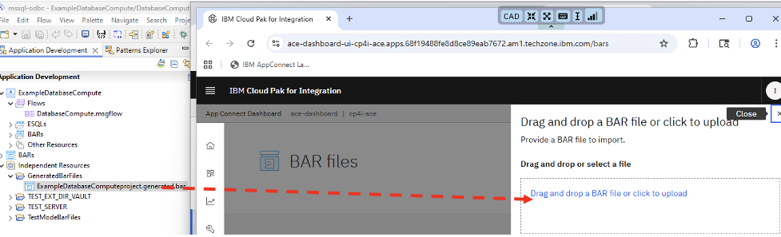
Click \<Import\> button. <br>

### 9g. Create Integration Runtime <a name="is-create"></a>

Click on Dashboard icon on the left side bar, then click on \<Deploy Integrations\> button. <br>

Select "Quick Start Integration", then click <\Next\>. <br>

Select the BAR file you uploaded earlier, then click <\Next\>. <br>

Next select the Configurations you created, search for student1 as below, then click <\Next\>.  <br>

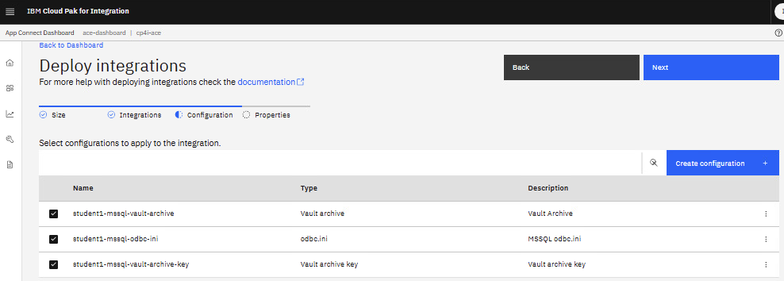

Give a name for example student1-mssql-odbc-demo, then click \<Create\>. <br>

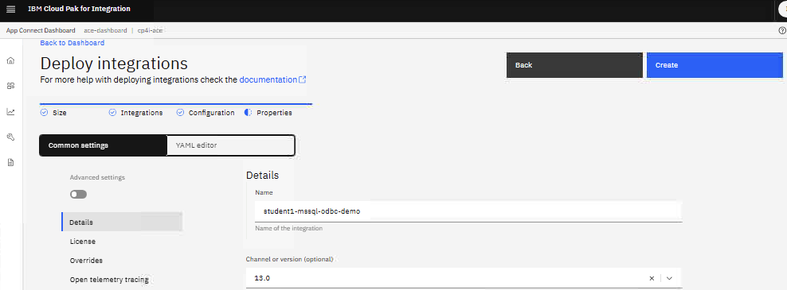

Refresh the page, and make sure your Integration Runtime is in Ready state. <br>

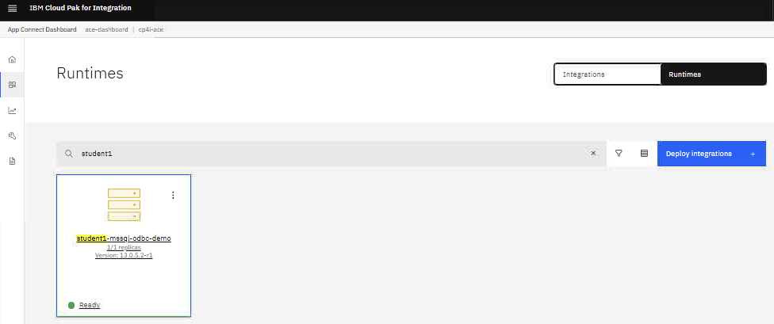

Drill down on each tile, and locate Endpoints and copy the endpoint of our API. <br>

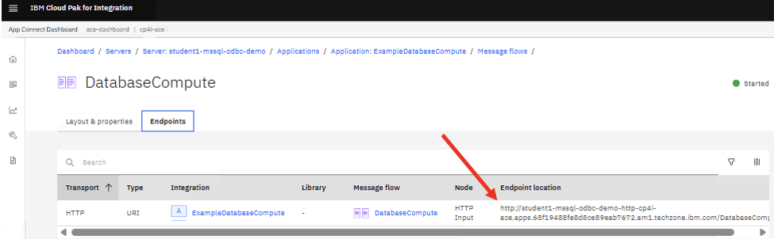


## 10. CP4I - Test the Flow <a name="cp4i-test-flow"></a>

Let's test the flow deployed into App Connect as a Container. <br>

### 10a. Insert sample records <a name="sample-records"></a>

```
curl THE_API_URL_YOU_COPIED_ABOVE -d "{\"PrimaryKey\": 4, \"FirstName\": \"Otto\", \"LastName\": \"Normalverbraucher\", \"Country\": \"DE\"}"

for example:
curl http://student1-mssql-odbc-demo-http-cp4i-ace.apps.68f19488fe8d8ce89eab7672.am1.techzone.ibm.com/DatabaseCompute -d "{\"PrimaryKey\": 4, \"FirstName\": \"Otto\", \"LastName\": \"Normalverbraucher\", \"Country\": \"DE\"}"
```

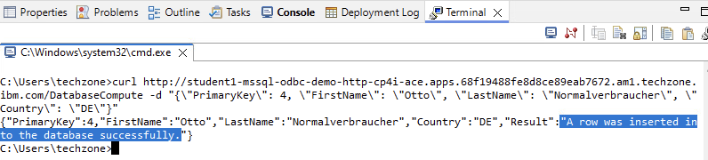

Similarly, insert another record. <br>

```
curl THE_API_URL_YOU_COPIED_ABOVE -d "{\"PrimaryKey\": 5, \"FirstName\": \"John\", \"LastName\": \"Doe\", \"Country\": \"US\"}"
```
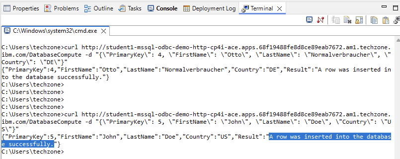

### 10b. Verify records in MSSQL DB <a name="verify-records-2"></a>

Now, verify the records in MSSQL database same as you checked earlier. <br>

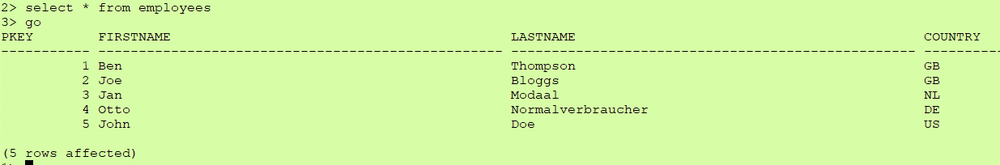

<br>


## 11. Project Interchange <a name="pi"></a>

**Project Interchange** from [<b><u>here</u></b>](./resources/ACE_MSSQL_ODBC_Compute.zip)</b>

<br>

**Congratulations!!!** <br>

You have successfully implemented "Using a Compute node to insert data into a MSSQL database via ODBC", and deployed to Cloud Pak for Integration as an App Connect Integration Runtime on OpenShift.
<br>

[Go to Top](#introduction)

<br>

[Return to App Connect labs page](../../index.md)